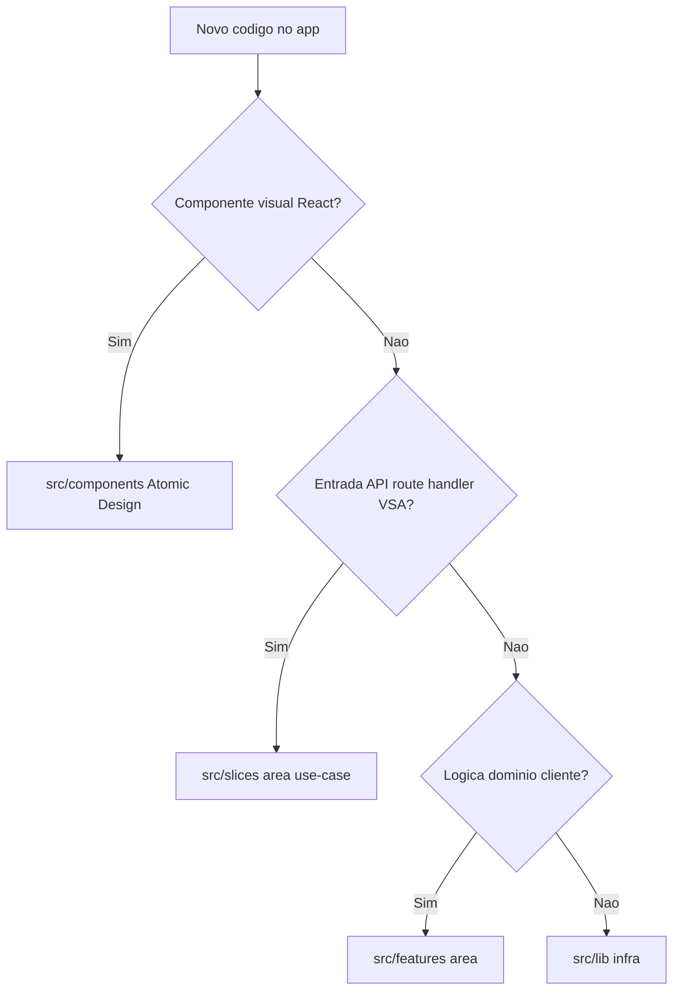

# Orientação para agentes (Muziks)

- **Escopo atual:** repositório em **fase de implementação** — monorepo Turborepo (`apps/`, `packages/`) além de `docs/` (specs e produto). Implementar código conforme as especificações; não reabrir decisões já fechadas sem PR que atualize a spec correspondente.
- **Antes de editar um app:** ler o `AGENTS.md` da pasta do app (tabela abaixo).
- **Stack e estrutura:** seguir [`docs/tech/ESPECIFICACAO-FRONTEND.md`](docs/tech/ESPECIFICACAO-FRONTEND.md) (PWA, React, TypeScript, Tailwind, shadcn) e [`docs/tech/ATOMIC-DESIGN.md`](docs/tech/ATOMIC-DESIGN.md) para componentes; API/backend em [`docs/tech/VERTICAL-SLICE-ARCHITECTURE.md`](docs/tech/VERTICAL-SLICE-ARCHITECTURE.md); stack, monorepo e fases em [`docs/tech/STACK-E-FASES-DE-MIGRACAO.md`](docs/tech/STACK-E-FASES-DE-MIGRACAO.md), [`docs/tech/MONOREPO-TURBOREPO.md`](docs/tech/MONOREPO-TURBOREPO.md) e [`docs/tech/PROCESSO-DESENVOLVIMENTO.md`](docs/tech/PROCESSO-DESENVOLVIMENTO.md).

## Apps e orientação local

| App | Host / papel | AGENTS |
|-----|----------------|--------|
| `apps/web` | `muziks.app` — participante, fila, votos | [`apps/web/AGENTS.md`](apps/web/AGENTS.md) |
| `apps/player` | `player.muziks.app` — master Spotify, playback | [`apps/player/AGENTS.md`](apps/player/AGENTS.md) |
| `apps/landing` | Landing institucional | [`apps/landing/AGENTS.md`](apps/landing/AGENTS.md) |
| `apps/spotify-bridge` | Bridge librespot + WS (VM/Docker) | [`apps/spotify-bridge/AGENTS.md`](apps/spotify-bridge/AGENTS.md) |
| `apps/playback-worker` | Worker Trigger.dev para estado em background | [`apps/playback-worker/AGENTS.md`](apps/playback-worker/AGENTS.md) |

## Onde colocar código (apps Next.js)

Regra geral ([`docs/specs/09-frontend-architecture.md`](docs/specs/09-frontend-architecture.md)):

| Tipo | Pasta |
|------|--------|
| Componente visual React (Atomic Design) | `src/components/` (`ui/`, `atoms/`, …, `pages/`) |
| Hook, service ou lib de **domínio no cliente** | `src/features/<área>/` — **sem** subpasta `components/` |
| Handler de caso de uso HTTP (VSA) | `src/slices/<área>/<use-case>/` (hoje principalmente em `apps/player`) |
| Infra transversal (Supabase, cookies, realtime) | `src/lib/` |

**Não confundir:** `landing-feature-section` (organismo da landing) com a pasta `src/features/` dos apps de produto.

**Anti-padrões:** pasta global `src/services/`; UI em `src/features/*/components/`. Orquestração de playback no player: `src/features/playback/services/`.
- **Pacote:** usar **`pnpm`** para dependências e scripts.
- **Git (obrigatório):** [GitFlow e git workflow no GitHub](docs/tech/PROCESSO-DESENVOLVIMENTO.md) (branches, PRs, proteção de `main`) **em vigor** — ver §0 e §2 do processo. Trabalho em **`feature/MUZ-<n>-<slug-curto>`** a partir da branch de integração correta (`develop` no bootstrap; depois `staging` para `apps/web`/`apps/player`). **Não** commitar direto em `main`. PRs de código **devem** referenciar issue Linear (`MUZ-n`). **GitHub Actions** (CI/CD em `.github/workflows/`) é escopo futuro (§5), não confundir com git workflow.
- **Testes:** não criar arquivos de teste automatizados neste repo, salvo pedido explícito em contrário.
- **Execução local:** não rodar `pnpm dev` nem servidores long-running — o mantenedor valida no ambiente dele.
- **Feedback in-app:** widget, Linear e elegibilidade do backlog — [`docs/specs/17-feedback-in-app-e-linear.md`](docs/specs/17-feedback-in-app-e-linear.md).
