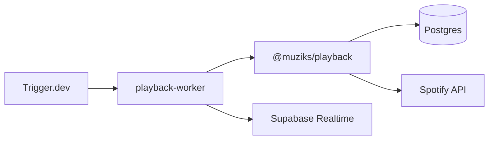

# Muziks Playback Worker

Worker Trigger.dev que agenda `playback-tick` e executa o orquestrador **no próprio processo** (`@muziks/playback` + `@muziks/db`), sem request HTTP ao player.

## Fluxo



## Env vars

Copie de [`apps/player/.env`](../player/.env) — o worker usa as **mesmas** credenciais:

```bash
TRIGGER_SECRET_KEY=tr_dev_xxx
TRIGGER_PROJECT_REF=proj_bhvoyepszbvxvbginzgh
DATABASE_URL=...
SUPABASE_URL=...
SUPABASE_SERVICE_ROLE_KEY=...
SPOTIFY_TOKEN_ENCRYPTION_KEY=...
NEXT_PUBLIC_SPOTIFY_CLIENT_ID=...
SPOTIFY_CLIENT_SECRET=...
```

Ver [`.env.example`](./.env.example).

## Dev

```bash
pnpm dev:playback-worker
```

## Deploy (Trigger.dev **Production** apenas)

Staging do Trigger.dev é pago. **Muziks staging e prod** usam o mesmo ambiente **Production** no Trigger; a separação é pelas **env vars** (Supabase/Spotify do projeto certo), não por ambiente Trigger.

### 1. Dashboard — GitHub

Em [trigger.dev](https://cloud.trigger.dev) → projeto `proj_bhvoyepszbvxvbginzgh` → **Deploy** / Git:

| Campo | Valor |
|--------|--------|
| **Production** (branch) | `develop` enquanto o worker só estiver em `develop`/features; depois `main` |
| **Staging** (branch) | `none` — não usar |
| **Preview PRs** | off (opcional; preview também consome cota) |
| **Trigger config file** | `apps/playback-worker/trigger.config.ts` |
| **Install command** | `pnpm install --frozen-lockfile` |
| **Pre-build command** | *(vazio ou)* `pnpm --filter @muziks/playback-worker lint` |

> **Bloqueio comum:** com Production em `main` e o worker ainda só em `develop`, a tela fica em “Waiting for tasks to deploy” — não há `trigger.config.ts` em `main` hoje. Use branch `develop` no tracking **ou** faça merge do worker para `main` antes do deploy automático.

### 2. Env vars — ambiente **Production** (Trigger)

Copiar do Supabase/Spotify do **ambiente Muziks que o worker deve atender** (staging *ou* prod):

| Variável | Uso |
|----------|-----|
| `DATABASE_URL` | Postgres (pooler) do projeto Supabase |
| `SUPABASE_URL` | URL do projeto |
| `SUPABASE_SERVICE_ROLE_KEY` | Realtime broadcast + admin |
| `NEXT_PUBLIC_SUPABASE_URL` | Igual ao `SUPABASE_URL` se o worker precisar |
| `SPOTIFY_TOKEN_ENCRYPTION_KEY` | Mesmo valor do `apps/player` |
| `NEXT_PUBLIC_SPOTIFY_CLIENT_ID` | App Spotify |
| `SPOTIFY_CLIENT_SECRET` | App Spotify |

Opcionais: `PLAYBACK_WORKER_SUPERVISOR_CRON`, `PLAYBACK_WORKER_REALTIME_WATCHER_CRON`, `PLAYBACK_REALTIME_WATCHER_*`.

**Trocar staging ↔ prod:** alterar essas vars no ambiente **Production** do Trigger e fazer **Redeploy** (não é preciso ambiente Staging do Trigger).

O player (Vercel) continua com `PLAYBACK_WORKER_SECRET` só para rotas internas/bridge; o worker fala direto com DB/Spotify.

### 3. Disparar deploy

**Automático:** push na branch de Production configurada (`develop` ou `main`).

**Manual (mesmo ambiente Production):**

```bash
# na raiz do monorepo
pnpm deploy:playback-worker

# ou dentro do app
cd apps/playback-worker && pnpm run trigger:deploy
```

Antes: `pnpm exec trigger login` (uma vez por máquina).

Use `TRIGGER_ACCESS_TOKEN` (Personal Access Token no dashboard) em CI, se preferir GitHub Actions depois.

### 4. Validar

No dashboard: **Runs** → disparar ou aguardar `playback-supervisor` / `playback-realtime-watcher`. Logs devem mostrar conexão ao Postgres sem `DATABASE_URL` missing.

### Troubleshooting — `docker-credential-desktop` not found

O script `trigger:deploy` usa **`--native-build-server`** (build na nuvem do Trigger, sem Docker local).

Se ainda falhar com credencial Docker, remova `"credsStore": "desktop"` de `%USERPROFILE%\.docker\config.json`, ou use deploy via **GitHub** no dashboard (build nos servidores deles).

## Paridade com o player

| Camada | Onde |
|--------|------|
| Listar players, poll cursors, upsert sessão, Spotify sample | `@muziks/playback` |
| Broadcast `session.snapshot` | `apps/playback-worker/src/lib/realtime` |
| Lifecycle, dequeue, mirror near-end | `apps/player` (`afterSample` hook) — **ainda não no worker** |

A rota `POST /api/internal/playback-tick` no player usa o **mesmo** `@muziks/playback` + hook do player — só para bridge/Edge/manual; agendamento é **Trigger.dev**.
