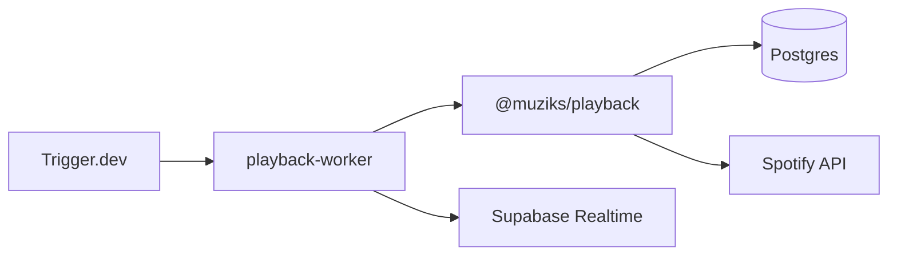

# Muziks Playback Worker

Worker Trigger.dev que agenda `playback-tick` e executa o orquestrador **no próprio processo** (`@muziks/playback` + `@muziks/db`), sem request HTTP ao player.

## Fluxo



## Env vars

Copie de [`apps/player/.env`](../player/.env) — o worker usa as **mesmas** credenciais:

```bash
TRIGGER_SECRET_KEY=tr_dev_xxx
TRIGGER_PROJECT_REF=proj_bhvoyepszbvxvbginzgh
DATABASE_URL=...
SUPABASE_URL=...
SUPABASE_SERVICE_ROLE_KEY=...
SPOTIFY_TOKEN_ENCRYPTION_KEY=...
NEXT_PUBLIC_SPOTIFY_CLIENT_ID=...
SPOTIFY_CLIENT_SECRET=...
```

Ver [`.env.example`](./.env.example).

## Dev

```bash
pnpm dev:playback-worker
```

## Paridade com o player

| Camada | Onde |
|--------|------|
| Listar players, poll cursors, upsert sessão, Spotify sample | `@muziks/playback` |
| Broadcast `session.snapshot` | `apps/playback-worker/src/lib/realtime` |
| Lifecycle, dequeue, mirror near-end | `apps/player` (`afterSample` hook) — **ainda não no worker** |

A rota `POST /api/internal/playback-tick` no player usa o **mesmo** `@muziks/playback` + hook do player (útil para Vercel Cron sem Trigger).
