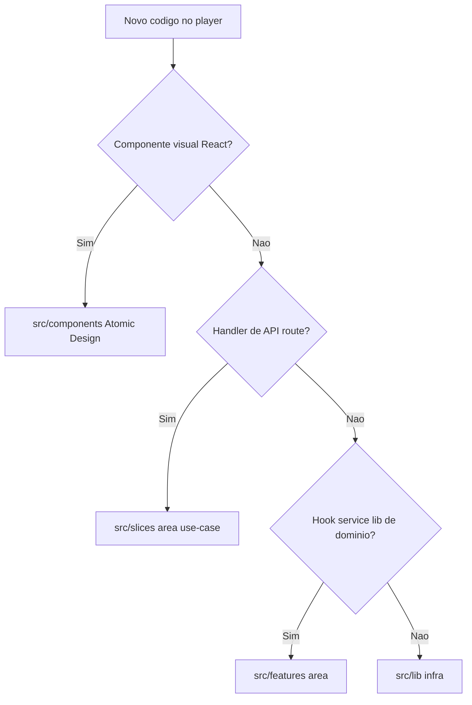

# Orientação para agentes — `apps/player`

App **master Spotify** em `player.muziks.app/{slug}`. Playback, login Spotify, fila do dono e sessão.

Leitura obrigatória do monorepo: [`AGENTS.md`](../../AGENTS.md). Specs: [09-frontend-architecture.md](../../docs/specs/09-frontend-architecture.md), [ATOMIC-DESIGN.md](../../docs/tech/ATOMIC-DESIGN.md), [06-arquitetura-playback-spotify.md](../../docs/mvp/06-arquitetura-playback-spotify.md).

**Playback no browser (implementado):** fluxo SDK + reconciliação API pontual + Realtime (`session.snapshot`, `spotify.queue.snapshot`) + fila «Próximas no Spotify» + debug — [`docs/tech/PLAYBACK-MASTER-CLIENT-SYNC.md`](../../docs/tech/PLAYBACK-MASTER-CLIENT-SYNC.md). ADRs: [ADR-playback-hybrid-realtime.md](../../docs/tech/ADR-playback-hybrid-realtime.md), [ADR-spotify-state-sync.md](../../docs/tech/ADR-spotify-state-sync.md).

## Árvore `src/`

```
src/
├── components/     # Atomic Design — ÚNICO lugar para .tsx de UI
│   ├── ui/         # shadcn (não colocar regra de negócio)
│   ├── atoms/
│   ├── molecules/
│   ├── organisms/
│   ├── templates/
│   └── pages/
├── features/       # Lógica de domínio no cliente (sem .tsx de UI)
│   ├── auth/hooks/
│   ├── playback/{hooks,services,lib}/
│   └── queue/hooks/
├── slices/         # Handlers de API (VSA server), ex.: slices/playback/get-playback-session/
├── lib/            # Infra transversal (Supabase, auth, realtime, crypto)
├── config/
└── types/          # Declarações locais (ex. SDK Spotify)
```

Rotas Next.js em `app/` (App Router). Alias de import: `@/src/...` (`@/*` → raiz do app).

## Onde colocar código novo



## Proibido

- **`src/features/*/components/`** — UI não fica em `features/`.
- **`src/services/`** (pasta global) — orquestração de playback em `features/playback/services/`.
- Regra de negócio em `components/ui/` (shadcn).

## Paridade backend

| Cliente | Servidor (este app) |
|---------|---------------------|
| `features/playback/` | `slices/playback/*` + `app/api/...` |
| `features/queue/` | `app/api/players/[slug]/queue/...` |

## Hooks compartilhados com `apps/web`

`useMuziksCustomerQueue` no player aceita `transport: "realtime"` e `playerId`; no web é polling simples. **Não unificar** sem spec — implementações distintas.

## Qualidade

- `pnpm lint` no escopo `@muziks/player` após alterações.
- Não criar arquivos de teste automatizados (política do repo).
