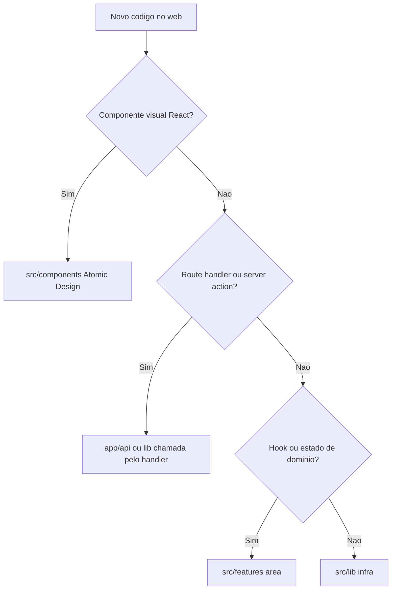

# Orientação para agentes — `apps/web`

App **participante** em `muziks.app/{slug}` — hero, fila, votos, descoberta, telão.

Leitura obrigatória do monorepo: [`AGENTS.md`](../../AGENTS.md). Layout: [16-ui-player-e-fila.md](../../docs/specs/16-ui-player-e-fila.md). Pastas: [09-frontend-architecture.md](../../docs/specs/09-frontend-architecture.md), [ATOMIC-DESIGN.md](../../docs/tech/ATOMIC-DESIGN.md).

## Árvore `src/`

```
src/
├── components/     # Atomic Design — toda UI React
│   ├── ui/         # shadcn
│   ├── atoms/
│   ├── molecules/
│   ├── organisms/
│   ├── templates/
│   └── pages/
├── features/       # Hooks e estado de cliente (sem .tsx de UI)
│   ├── auth/{hooks,pending-vote.ts}
│   ├── participant/hooks/
│   └── queue/hooks/
├── lib/            # Supabase, auth, spotify helpers
└── config/
```

API PoC em `app/api/` (sem `src/slices/` neste app por enquanto). Alias: `@/src/...`.

## Onde colocar código novo



## Proibido

- **`src/features/*/components/`** — UI só em `components/`.
- Inventar `src/slices/` até a spec prever extração para `apps/api`.
- Playback master / SDK Spotify — isso é `apps/player`.

## Playback e fila (espelho do master)

- Estado de UI: `@muziks/playback-client` — `usePublicPlaybackStore`, `useMuziksQueueStore`.
- Realtime: `session.snapshot` e `queue.snapshot` em `src/lib/realtime/` (canal `player:{playerId}`); poll HTTP ~30 s como fallback.
- `ParticipantPlayerPage` recebe `playerId` do SSR (`app/[slug]/page.tsx`).

## Qualidade

- `pnpm lint` no escopo `@muziks/web`.
- Não criar arquivos de teste automatizados.
