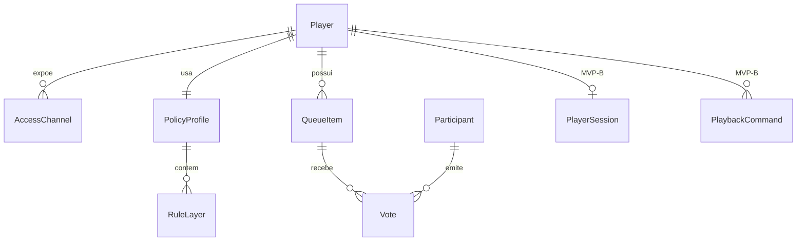
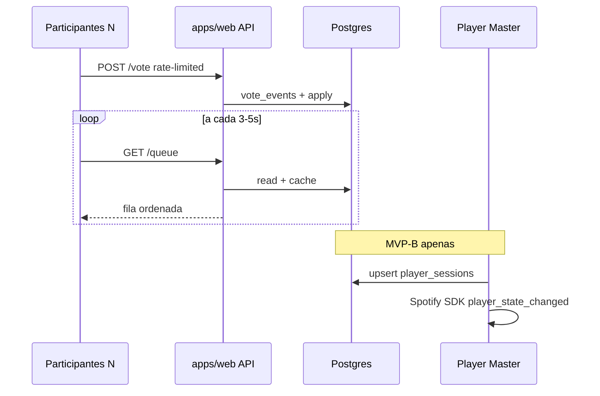

# Arquitetura Muziks — visão consolidada

**Propósito:** documento **único de entrada** que consolida as decisões de arquitetura e produto acordadas até aqui (manifesto, MVP congelado, viabilidade técnica, stack, integrações e organização de código). Os detalhes normativos permanecem nos documentos especializados — este arquivo **sintetiza** e **aponta** para eles.

**Público:** contribuidores, agentes de implementação e revisores que precisam entender o sistema inteiro antes de mergulhar em specs ou pastas `mvp/` e `tech/`.

**Última consolidação:** maio/2026.

---

## 1. Como usar este documento

| Se você precisa de… | Comece em… |
|---------------------|------------|
| Visão de produto e princípios | §2 + [MANIFESTO.md](MANIFESTO.md) |
| O que entra no primeiro release | §3 + [mvp/congelamento-mvp-e-arquitetura.md](mvp/congelamento-mvp-e-arquitetura.md) |
| Stack, infra e migração | §8 + [tech/STACK-E-FASES-DE-MIGRACAO.md](tech/STACK-E-FASES-DE-MIGRACAO.md) |
| Playback com som no espaço | §7 + [mvp/06-arquitetura-playback-spotify.md](mvp/06-arquitetura-playback-spotify.md) |
| Modelo de domínio e regras | §5 + [specs/03-domain-model.md](specs/03-domain-model.md) |
| Onde colocar código no monorepo | §9 + [tech/MONOREPO-TURBOREPO.md](tech/MONOREPO-TURBOREPO.md) |
| UI do player (fila, hero, hosts) | [specs/16-ui-player-e-fila.md](specs/16-ui-player-e-fila.md) |
| Feedback in-app e Linear | [specs/17-feedback-in-app-e-linear.md](specs/17-feedback-in-app-e-linear.md) |
| Identidade e sistema visual | [DESIGN.md](DESIGN.md) |
| Comportamentos de produto (normativo) | [specs/README.md](specs/README.md) |

**Regra de manutenção:** mudanças de escopo MVP, stack ou integrações **devem** atualizar o documento especializado correspondente e, em seguida, este resumo (§ relevante + §12).

---

## 2. Visão e princípios arquiteturais

### 2.1 O que é o Muziks

Player democrático para **espaços físicos e contextos móveis** (bares, eventos, caronas): o **público participa** da fila (voto, proposta dentro da política); o **dono do player manda na política** — não na anarquia de votos soltos.

Base normativa: [MANIFESTO.md](MANIFESTO.md), [specs/01-vision-and-scope.md](specs/01-vision-and-scope.md).

### 2.2 Princípios que orientam decisões técnicas

| Princípio | Implicação arquitetural |
|-----------|-------------------------|
| **Política antes de volume** | Firewall gênero → artista → faixa (+ dia da semana); domínio no Postgres, não no cliente |
| **Fonte de verdade no Muziks** | Fila, votos e regras vivem no **nosso** banco; Spotify/Deezer são **adaptadores** de catálogo e (MVP-B) execução |
| **ISRC como língua comum** | Política, fila e votos ancorados em ISRC quando disponível; IDs de provedor como fallback |
| **Rajada > média** | Dimensionar por pico (“50 votos em 2 min”), não por média diária — [analytics/reports/03-ponte-pedidos-e-sazonalidade.md](analytics/reports/03-ponte-pedidos-e-sazonalidade.md) |
| **Cardinalidade baixa = Realtime; massa = polling** | Fila pública: HTTP 3–5 s; sessão de playback: Supabase Realtime só no Master/telão |
| **Fosso proporcional** | Ver fila/explorar sem login; OAuth só ao **comprometer** voto ou pedido vinculante — [mvp/05-identidade-fosso-participante-voto.md](mvp/05-identidade-fosso-participante-voto.md) |
| **Portabilidade desde a PoC** | Schema em migrations Drizzle; contratos HTTP estáveis; extração futura para `apps/api` / AWS sem reescrever domínio |
| **Open source e BR** | Stack comum (Next.js, Supabase, pnpm, Turborepo) para atrair contribuidores |

---

## 3. Fases de produto e escopo congelado

### 3.1 Fases do MVP (playback)

| Fase | Valida | Playback |
|------|--------|----------|
| **MVP-A** | Fila, votos, política, telão visual, link/QR | **Sem** áudio orquestrado pelo app |
| **MVP-B** | Piloto com som no espaço (ICP) | **Com** Spotify Web Playback SDK — [mvp/06-arquitetura-playback-spotify.md](mvp/06-arquitetura-playback-spotify.md) |

### 3.2 Incluído no MVP (obrigatório)

- Player com **slug** + link/QR (GPS documentado, pós-MVP imediato).
- **Política** extensível (gênero, artista, faixa, dia da semana — pode começar simplificado).
- **Fila com votos** (ranking por quantidade).
- **Feedback cortês** quando bloqueado.
- **Auth dono** para admin, política e moderação.
- **Participante:** OAuth (Google/Apple/Meta) para votar/pedir — **sem** exigir Spotify/Deezer.
- **PWA** (React, TypeScript, Tailwind, shadcn) — [tech/ESPECIFICACAO-FRONTEND.md](tech/ESPECIFICACAO-FRONTEND.md).
- **Telão básico** — fila pública visível — [specs/12-telao-display-publico.md](specs/12-telao-display-publico.md).

### 3.3 Fora do MVP (adiar)

Fichas/economia de chips, GPS completo, push avançado, anti-fraude enterprise, reprodução no MVP-A.

### 3.4 Critério de saída e piloto

**Saída técnica:** dono cria player → define política → compartilha link/QR → participantes votam e veem fila atualizada com latência aceitável (polling na borda).

**Piloto de negócio (PoC):** 3–5 estabelecimentos ICP; métrica **≥50 participantes distintos numa noite** com votação válida; backend blindado (rate-limit + fila de escritas); painel firewall obrigatório. Evidência: [analytics/reports/05-insights-para-muziks-hoje.md](analytics/reports/05-insights-para-muziks-hoje.md).

Detalhe completo: [mvp/congelamento-mvp-e-arquitetura.md](mvp/congelamento-mvp-e-arquitetura.md).

---

## 4. Contexto do sistema

### 4.1 Diagrama de contexto (C4 — nível 1)

```mermaid
flowchart TB
  subgraph usuarios [Usuarios]
    Dono[Dono do player]
    Pub[Participante]
    Telao[Telao / kiosk]
  end

  subgraph muziks [Muziks - apps/web]
    PWA[PWA participante]
    Painel[Painel dono]
    Master[Player Master - MVP-B]
  end

  subgraph plataforma [Plataforma PoC]
    CF[Cloudflare DNS CDN SSL]
    Vercel[Vercel Next.js]
    SB[(Supabase Postgres Auth Storage)]
    CF --> Vercel
    Vercel --> SB
  end

  subgraph externos [Integracoes]
    Spotify[Spotify API + SDK]
    Deezer[Deezer API - secundario]
    IdP[OAuth Google Apple Meta]
  end

  Pub --> PWA
  Dono --> Painel
  Dono --> Master
  Telao --> Master
  PWA --> CF
  Painel --> CF
  Master --> CF
  Master --> Spotify
  Vercel --> Spotify
  Vercel --> Deezer
  Pub --> IdP
  Dono --> IdP
  SB --> IdP
```



### 4.2 Atores e papéis

| Ator | Papel | Auth | Playback (MVP-B) |
|------|-------|------|------------------|
| **Dono** | Política, moderação, ativa som, pode ser Master | Conta admin Muziks + OAuth Spotify (Premium) | Pode hospedar SDK |
| **Participante** | Vota, propõe (dentro da política), comandos limitados | OAuth Muziks (não streaming) | Não reproduz áudio |
| **Telão** | Display público; opcionalmente **é** o Master | Leitura pública; Master se `isPlaybackMaster` | SDK se for o dispositivo ativo |
| **Sistema** | Rate-limit, fila de votos, política, EDA interna | Service role server-side | Orquestra domínio, não o áudio |

Separação **dono ≠ participante** em dados e permissões (RLS).

---

## 5. Domínio e dados

### 5.1 Entidades centrais



- **Player:** contexto de reprodução (bar, evento…).
- **PolicyProfile / RuleLayer:** firewall de som.
- **QueueItem:** fila com votos; **ISRC** quando existir.
- **Participant:** identidade OAuth (`sub` + issuer).
- **PlayerSession / PlaybackCommand** (MVP-B): estado Spotify e comandos remotos.

Modelo completo: [specs/03-domain-model.md](specs/03-domain-model.md). Regras de firewall: [specs/04-rules-firewall.md](specs/04-rules-firewall.md).

### 5.2 Chave de catálogo

| Camada | Chave | Uso |
|--------|-------|-----|
| Ideal | **ISRC** | Política, deduplicação, agregação cross-provider |
| Operacional | `spotify:track:…`, Deezer id | Busca, playback, enriquecimento |
| Secundário | Metadados Deezer | ML, busca semântica futura — [mvp/04-viabilidade-integracao-secundaria-deezer.md](mvp/04-viabilidade-integracao-secundaria-deezer.md) |

### 5.3 Persistência

- **PostgreSQL** via Supabase (PoC); schema e migrations em **`packages/db`** (Drizzle).
- Migrations versionadas — **nunca** só no Dashboard.
- Ambientes separados: dev / staging / prod.

---

## 6. Arquitetura de comunicação e tempo real

Decisão central para custo e escala na rajada:

| Dado / fluxo | Mecanismo | Assinantes típicos |
|--------------|-----------|-------------------|
| **Fila + ranking** | `GET` HTTP + polling **3–5 s** + cache curto | N participantes no salão |
| **Voto / proposta** | `POST` HTTP + rate-limit + fila de eventos | Um por ação |
| **Estado playback** (MVP-B) | **Supabase Realtime** canal `player:{id}:session` | Master, telão display, painel dono |
| **Comandos play/pause/skip** | Realtime ou poll curto no Master | Master consome e executa no SDK |
| **WebSocket por participante** | **Não** na PoC | Adiar até Fase infra C se métrica justificar |



Rajada e custos: [mvp/02-viabilidade-custos-comparativo.md](mvp/02-viabilidade-custos-comparativo.md), [tech/STACK-E-FASES-DE-MIGRACAO.md](tech/STACK-E-FASES-DE-MIGRACAO.md) §3.

---

## 7. Integrações e playback

### 7.1 Spotify (primário)

| Camada | MVP-A | MVP-B |
|--------|-------|-------|
| **Catálogo** (Caminho A) | Busca, metadados, URI, ISRC | Igual |
| **Execução** (Caminho B) | Fora do app ou manual | **Web Playback SDK** no Master + Web API |

- Domínio emite eventos (`QueueHeadChanged`, `SpotifyCommandRequested`, …); adaptadores traduzem para API.
- **Não** usar `<audio>` próprio nem embed como orquestrador de fila.
- Viabilidade e EDA: [mvp/03-viabilidade-integracao-spotify-eda.md](mvp/03-viabilidade-integracao-spotify-eda.md).

### 7.2 Playback MVP-B (resumo)

| Responsabilidade | Onde |
|------------------|------|
| Áudio, gapless, preload | **Spotify Web Playback SDK** no browser Master (Chrome/kiosk) |
| Fila lógica, votos, política | **Postgres** (fonte de verdade) |
| Sync estado sessão | **Supabase Realtime** (baixa cardinalidade) |
| Próxima faixa automática | **Cliente** `PlaybackManager` (~5 s antes do fim) |
| Premium | Só conta do **dono** / estabelecimento |

**Fila dupla:** Muziks é verdade; espelhar 2–3 faixas na queue nativa Spotify; reconciliar divergências (`PlaybackOutOfSync`).

Abstrações front: `SpotifyService`, `PlaybackManager`, `QueueService` em `apps/web/src/features/playback/`.

**Especificação completa:** [mvp/06-arquitetura-playback-spotify.md](mvp/06-arquitetura-playback-spotify.md).

**Sincronização de estado (diagramas):** [tech/ADR-spotify-state-sync.md](tech/ADR-spotify-state-sync.md) — Master → `player_sessions` → Broadcast; bridge Docker (proposto).

**Preload / transição gapless:** [tech/PLAYBACK-NEAR-END-AND-QUEUE-MIRROR.md](tech/PLAYBACK-NEAR-END-AND-QUEUE-MIRROR.md) — near-end, fila dupla, `mirror-next`.

### 7.3 Deezer (secundário)

Busca, metadados, prototipagem Python/ML — **não** substitui execução Spotify no MVP. [mvp/04-viabilidade-integracao-secundaria-deezer.md](mvp/04-viabilidade-integracao-secundaria-deezer.md).

### 7.4 Identidade participante

Fluxo **valor → por quê → dados** antes do OAuth. IdPs: Google, Apple, Meta. Sinais secundários (IP, device id) para rate-limit — não substituem `sub`. [mvp/05-identidade-fosso-participante-voto.md](mvp/05-identidade-fosso-participante-voto.md).

---

## 8. Stack, infraestrutura e fases

### 8.1 Stack fechada (PoC / Fase infra A)

| Camada | Tecnologia |
|--------|------------|
| Monorepo | **Turborepo** + `pnpm` |
| App participante | **Next.js** App Router — `apps/web` → `muziks.app/{slug}` |
| App master (Spotify) | **Next.js** — `apps/player` → `player.muziks.app/{slug}` |
| Blog | **Next.js** — `apps/blog` → `blog.muziks.com.br` |
| Banco / Auth / Storage | **Supabase** (Free) + **Drizzle** em `packages/db` |
| API (PoC) | API Routes / Server Actions em `apps/web` |
| Borda | **Cloudflare** (DNS + proxy) → **Vercel** |
| Deploy | Vercel (Hobby interno; Pro piloto comercial) |
| Releases | Docker Hub (`muziks/web`, …) — [tech/DOCKER-REGISTRY-E-RELEASES.md](tech/DOCKER-REGISTRY-E-RELEASES.md) |
| Processo | Linear, GitHub Actions — [tech/PROCESSO-DESENVOLVIMENTO.md](tech/PROCESSO-DESENVOLVIMENTO.md) |

**PoC 100% free tier** quando piloto for validação interna.

### 8.2 Fases de infraestrutura

| Fase | Gatilho típico | Infra |
|------|----------------|-------|
| **A — PoC free** | 3–5 pilotos ICP | Vercel + Supabase Free + Cloudflare |
| **B — Preparação** | **5 players constantes** | Staging, runbooks, inventário quotas |
| **B+ — Pro estável** | 8–10 players ou SLA | Supabase Pro, PITR |
| **C — Escala própria** | Centenas concurrent / compliance | AWS RDS + WS seletivo |

**Player constante:** sessão com participação em ≥3 das últimas 4 semanas.

Detalhe, Cloudflare opcional (R2, Workers), CI/CD de dados: [tech/STACK-E-FASES-DE-MIGRACAO.md](tech/STACK-E-FASES-DE-MIGRACAO.md). Custos: [mvp/02-viabilidade-custos-comparativo.md](mvp/02-viabilidade-custos-comparativo.md).

### 8.3 Alternativas conscientes (não escolhidas agora)

| Perfil | Stack |
|--------|-------|
| Máxima velocidade MVP | Supabase BaaS + Next fullstack |
| Máxima portabilidade OSS | NestJS + Drizzle + Postgres + Socket.io |
| Escala grande | Redis, fila de mensagens, AWS |

Extração: `apps/api` ou NestJS mantendo `packages/db` e contratos HTTP (strangler).

---

## 9. Organização do código (quando existir)

### 9.1 Monorepo

```
muziks/
├── apps/web/          ← muziks.app — PWA, fila, telão, participante
├── apps/player/       ← player.muziks.app — master Spotify (placeholder)
├── apps/blog/
├── apps/admin/        ← placeholder
├── apps/api/          ← placeholder (pós-gatilho 5 players)
├── packages/db/       ← Drizzle, migrations
├── packages/types/
├── packages/ui/         ← shadcn + Atomic Design
├── packages/spotify/    ← adaptador HTTP (sem secrets)
└── packages/utils/
```

[tech/MONOREPO-TURBOREPO.md](tech/MONOREPO-TURBOREPO.md).

### 9.2 Frontend — Atomic Design

Componentes por camada (átomo → página); features em `apps/web/src/features/`. Layout do player participante (hero, fila, avatares) e split **muziks.app** / **player.muziks.app**: [specs/16-ui-player-e-fila.md](specs/16-ui-player-e-fila.md). Convenções: [tech/ATOMIC-DESIGN.md](tech/ATOMIC-DESIGN.md), [specs/09-frontend-architecture.md](specs/09-frontend-architecture.md).

### 9.3 Backend — Vertical Slice Architecture

Código por **caso de uso** (`slices/vote-on-queue-item/`, `slices/playback/publish-session-state/`), não por camada horizontal. Packages só para kernel compartilhado (`db`, `types`, adaptadores).

Na PoC: `apps/web/src/slices/`. Pós-extração: `apps/api/src/slices/`.

[tech/VERTICAL-SLICE-ARCHITECTURE.md](tech/VERTICAL-SLICE-ARCHITECTURE.md), [specs/15-backend-architecture.md](specs/15-backend-architecture.md).

### 9.4 Mapa de slices (alvo)

| Domínio | Exemplos de slices |
|---------|-------------------|
| **queue** | votar, listar fila pública, propor faixa |
| **policy** | avaliar firewall, negar com copy |
| **player** | CRUD player, canais de acesso |
| **playback** (MVP-B) | sessão, comandos, consumo no Master |
| **catalog** | busca Spotify, enriquecimento Deezer |

Integrações abertas: [specs/11-backend-and-integrations-open.md](specs/11-backend-and-integrations-open.md).

---

## 10. Segurança, privacidade e compliance

| Tema | Direção |
|------|---------|
| **RLS Supabase** | Participante só escreve o permitido; Master atualiza `player_sessions` |
| **Rate-limit** | Voto, comandos playback, chamadas Web API (debounce no Master) |
| **Tokens Spotify** | Refresh do dono só no servidor (cofre); nunca ao cliente público |
| **LGPD** | Retenção curta de IP/device; transparência — [specs/08-nfr-privacy-accessibility.md](specs/08-nfr-privacy-accessibility.md) |
| **Direitos autorais / uso comercial** | Muziks não licencia obras; termos do provedor — [specs/14-fronteiras-legais-direitos-autorais.md](specs/14-fronteiras-legais-direitos-autorais.md) |

---

## 11. Eventos de domínio (EDA — visão)

O backend evolui com **eventos internos** (outbox, handlers ou fila leve na PoC):

| Origem | Eventos exemplares |
|--------|-------------------|
| Fila / voto | `VoteRecorded`, `QueueHeadChanged`, `PolicyDeniedTrack` |
| Participante | `ParticipantAuthenticated`, `VoteRejectedRateLimit` |
| Spotify | `SpotifyCommandRequested`, `SpotifyStateUpdated`, `PlaybackOutOfSync` |
| Catálogo | `CatalogEnrichmentRequested`, `DeezerMetadataResolved` |

A API REST pode permanecer síncrona (`POST /vote`); o bus interno carrega integrações e projeções.

---

## 12. Trilhas futuras (fora da PoC)

| Trilha | Objetivo | Documento |
|--------|----------|-----------|
| **Hub local WebRTC** | Fan-out local da leitura da fila; votos continuam HTTP | [disruption/hub-local-webrtc-e-fanout.md](disruption/hub-local-webrtc-e-fanout.md) |
| **AWS + WebSocket** | Escala e latência painel/telão | [tech/STACK-E-FASES-DE-MIGRACAO.md](tech/STACK-E-FASES-DE-MIGRACAO.md) §2.2 |
| **Fichas / economia** | Pós-MVP | [specs/06-queue-voting-and-chips.md](specs/06-queue-voting-and-chips.md) |
| **Disrupção / IA** | Curadoria, karaoke, artista ao vivo | [disruption/README.md](disruption/README.md) |

Essas trilhas **não alteram** a Fase infra A até spike + ADR.

---

## 13. Mapa completo de documentos

### 13.1 Pacote MVP (`docs/mvp/`)

| Doc | Conteúdo |
|-----|----------|
| [congelamento-mvp-e-arquitetura.md](mvp/congelamento-mvp-e-arquitetura.md) | Escopo, stack, critérios de saída |
| [02-viabilidade-custos-comparativo.md](mvp/02-viabilidade-custos-comparativo.md) | Custos Supabase × AWS, rajada |
| [03-viabilidade-integracao-spotify-eda.md](mvp/03-viabilidade-integracao-spotify-eda.md) | Spotify catálogo + EDA |
| [04-viabilidade-integracao-secundaria-deezer.md](mvp/04-viabilidade-integracao-secundaria-deezer.md) | Deezer secundário |
| [05-identidade-fosso-participante-voto.md](mvp/05-identidade-fosso-participante-voto.md) | OAuth participante |
| [06-arquitetura-playback-spotify.md](mvp/06-arquitetura-playback-spotify.md) | Playback MVP-B (normativo) |

### 13.2 Tech (`docs/tech/`)

| Doc | Conteúdo |
|-----|----------|
| [STACK-E-FASES-DE-MIGRACAO.md](tech/STACK-E-FASES-DE-MIGRACAO.md) | Stack, fases, Cloudflare, migração DB |
| [MONOREPO-TURBOREPO.md](tech/MONOREPO-TURBOREPO.md) | Pastas, domínios, deploy |
| [VERTICAL-SLICE-ARCHITECTURE.md](tech/VERTICAL-SLICE-ARCHITECTURE.md) | Backend por caso de uso |
| [ESPECIFICACAO-FRONTEND.md](tech/ESPECIFICACAO-FRONTEND.md) | PWA, stack UI |
| [ATOMIC-DESIGN.md](tech/ATOMIC-DESIGN.md) | Componentes |
| [PROCESSO-DESENVOLVIMENTO.md](tech/PROCESSO-DESENVOLVIMENTO.md) | Linear, CI, ambientes |
| [DOCKER-REGISTRY-E-RELEASES.md](tech/DOCKER-REGISTRY-E-RELEASES.md) | Imagens e releases |
| [ADR-spotify-state-sync.md](tech/ADR-spotify-state-sync.md) | Estado playback: Master, Realtime, bridge librespot |
| [ADR-playback-hybrid-realtime.md](tech/ADR-playback-hybrid-realtime.md) | SDK + API híbrido, Broadcast |
| [ADR-librespot-playback-sidecar.md](tech/ADR-librespot-playback-sidecar.md) | Sidecar track-ended, dequeue |
| `apps/spotify-bridge/` | Serviço Docker ( **só plano pago** ): librespot + WebSocket → API interna |
| [04-playback-bridge-e-tiering.md](business/04-playback-bridge-e-tiering.md) | Freemium = SDK Master; pagante = bridge |
| [PLAYBACK-NEAR-END-AND-QUEUE-MIRROR.md](tech/PLAYBACK-NEAR-END-AND-QUEUE-MIRROR.md) | Preload near-end, espelho queue Spotify, dequeue separado |

### 13.3 Specs de produto (`docs/specs/`)

Índice: [specs/README.md](specs/README.md). Arquiteturas irmãs: [09-frontend-architecture.md](specs/09-frontend-architecture.md), [15-backend-architecture.md](specs/15-backend-architecture.md).

### 13.4 Negócio, analytics, disrupção

- [business/README.md](business/README.md) — receita, go-to-market  
- [analytics/reports/00-resumo-executivo.md](analytics/reports/00-resumo-executivo.md) — dados históricos  
- [disruption/README.md](disruption/README.md) — experimentos  

---

## 14. Checklist de coerência arquitetural

Antes de implementar um incremento grande, validar:

- [ ] Comportamento está em **spec** ou neste doc / `mvp/`?
- [ ] Escrita de voto passa por **rate-limit + fila**?
- [ ] Leitura pública da fila usa **polling**, não Realtime em massa?
- [ ] MVP-B: áudio só no **Master** com SDK; fila lógica no **Postgres**?
- [ ] Schema alterado via **`packages/db` migrations**?
- [ ] Participante autentica com **OAuth Muziks**, não Spotify, para votar?
- [ ] ISRC usado em política/fila quando disponível?

---

## 15. Manutenção

1. Decisão nova de arquitetura → documento especializado + atualizar seção correspondente **aqui**.
2. Escopo MVP muda → [mvp/congelamento-mvp-e-arquitetura.md](mvp/congelamento-mvp-e-arquitetura.md) + §3 deste arquivo.
3. Playback muda → [mvp/06-arquitetura-playback-spotify.md](mvp/06-arquitetura-playback-spotify.md) + §7.
4. Stack ou gatilho de fase → [tech/STACK-E-FASES-DE-MIGRACAO.md](tech/STACK-E-FASES-DE-MIGRACAO.md) + §8.
5. Comportamento de produto normativo → specs em [specs/](specs/) (não duplicar regra de negócio longa neste arquivo).

Este documento **não substitui** specs de produto; **consolida** a visão de sistema para implementação e revisão.
