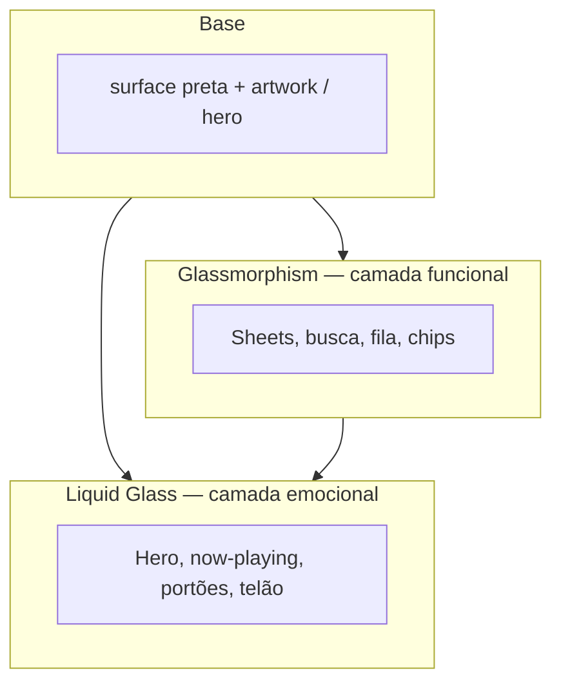
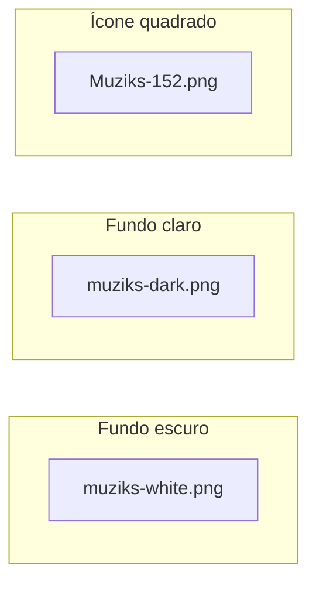

# Design Muziks — identidade e sistema visual

**Propósito:** consolidar a **identidade de marca** e as **regras visuais** do Muziks para produto, marketing e implementação (PWA, telão, blog). Complementa o [Manifesto](MANIFESTO.md) (intenção) e as specs de **layout/comportamento** (ex.: [16-ui-player-e-fila.md](specs/16-ui-player-e-fila.md)).

**Público:** design, front-end, agentes de implementação e quem produz copy ou assets.

**Normativo:** trechos com “deve” / “não deve” são requisitos de marca e UI acordados neste repositório.

**Última consolidação:** maio/2026.

---

## 1. Como usar este documento

| Se você precisa de… | Vá para… |
|---------------------|----------|
| Intenção e princípios de produto | [MANIFESTO.md](MANIFESTO.md) |
| Layout da fila, hero, avatares | [specs/16-ui-player-e-fila.md](specs/16-ui-player-e-fila.md) |
| Tom de voz e estados de UI | [specs/07-ux-copy-and-states.md](specs/07-ux-copy-and-states.md) |
| Stack (React, shadcn, Tailwind, MD3) | [tech/ESPECIFICACAO-FRONTEND.md](tech/ESPECIFICACAO-FRONTEND.md) |
| Onde colocar componentes | [tech/ATOMIC-DESIGN.md](tech/ATOMIC-DESIGN.md) |
| Assets de logo | [images/identity/](images/identity/) |
| Telas legadas (referência) | [images/screens/README.md](images/screens/README.md) |
| Glassmorphism vs Liquid Glass | §3 deste doc |

---

## 2. Essência da marca

### 2.1 Posicionamento

O Muziks é **música compartilhada com regras claras** — democracia da fila **com política**, não anarquia. A marca deve transmitir:

- **Convite**, não confronto (cortesia quando algo é bloqueado).
- **Controle fino** para quem manda no som, **participação real** para o público.
- **Presença social** no espaço (fila visível, quem escolheu, telão) sem humilhar quem participa.

### 2.2 Personalidade (adjetivos-guia)

| Somos | Não somos |
|-------|-----------|
| Diretos, humanos, confiáveis | Corporativos frios ou “startup genérica” |
| Modernos, técnicos com propósito | Cyberpunk barulhento ou infantil |
| Energéticos no **acento**, sóbrios na **base** | Neon em todo lugar; poluição visual |
| Inclusivos no tom (sem culpar o usuário) | Sarcásticos, punitivos, “erro 403” na cara |

### 2.3 Promessa visual em uma frase

**Fundo escuro e camadas de vidro — tipografia limpa, azul Muziks só onde importa — a música e as pessoas em destaque; a interface flutua, não compete.**

---

## 3. Bases de material: Glassmorphism e Liquid Glass

O Muziks adota **duas linguagens de vidro** como fundamento de toda a identidade visual (app, telão, marketing). Não são “efeitos opcionais”: definem como superfícies, hierarquia e profundidade aparecem em cima do **dark-first** e do artwork da música.



### 3.1 Glassmorphism (vidro funcional)

**O que é:** painéis **semi-transparentes** com **desfoque do fundo** (`backdrop-filter`), borda clara fina e preenchimento neutro escuro. Leitura rápida, baixo ruído — a UI “flutua” sobre o conteúdo sem roubar o hero.

| Propriedade | Diretriz Muziks |
|-------------|-----------------|
| **Preenchimento** | `rgba(255,255,255,0.06)` – `0.10` sobre fundo escuro; evitar branco puro sólido |
| **Blur** | `12px` – `20px` (`backdrop-blur-md` / `lg`) |
| **Borda** | `1px solid rgba(255,255,255,0.10)` – `0.14` (“aresta de vidro”) |
| **Raio** | `12px` – `16px` (cards, sheets); inputs `8px` – `12px` |
| **Sombra** | Mínima ou nenhuma; profundidade vem do blur + borda, não de drop-shadow pesada |
| **Saturação** | `saturate(1.1)` – `1.25` opcional no backdrop para “vida” sem cor extra |

**Onde deve aparecer (normativo):**

- Barra de **busca** e campos sobre o hero.
- **Sheet** de selecionadores, portões OAuth, toasts e banners de estado.
- Linhas da **fila** em hover/foco; chips de política; barras fixas inferiores/superiores.
- Painéis do **master** (`player.muziks.com`) e cards de configuração.
- **Telão:** legendas, QR, rodapé de informação — nunca o artwork central da faixa.

**Onde não deve aparecer:**

- Texto longo diretamente sobre blur forte sem scrim (legibilidade).
- Toda a tela em vidro empilhado (vira “gelatina”, perde contraste).

### 3.2 Liquid Glass (vidro líquido / emocional)

**O que é:** evolução do vidro com sensação **mais orgânica e premium**: bordas mais suaves, **reflexo especular** (highlight que acompanha movimento ou scroll), leve **gradiente** na borda e no fill, transições mais fluidas. Remete a “objeto molhado” sobre luz e cor — ideal para momentos de **destaque musical**, não para listas densas.

| Propriedade | Diretriz Muziks |
|-------------|-----------------|
| **Preenchimento** | Gradiente sutil: ex. `linear-gradient(135deg, rgba(255,255,255,0.14) 0%, rgba(255,255,255,0.04) 50%, rgba(0,102,178,0.08) 100%)` — calibrar |
| **Blur** | `20px` – `40px` (`backdrop-blur-xl` / `2xl`) |
| **Borda** | Gradiente ou dupla: highlight superior `rgba(255,255,255,0.25)` + contorno `rgba(255,255,255,0.08)` |
| **Raio** | `20px` – `28px`; círculos do hero mantêm `rounded-full` onde couber |
| **Specular** | Faixa/clipe animado no topo do painel (opacidade baixa); **desligar** com `prefers-reduced-motion` |
| **Profundidade** | Parallax do hero + liquid glass no **card** now-playing reforçam a mesma linguagem |

**Onde deve aparecer (normativo):**

- **Hero / now-playing** — card ou disco central sobre artwork desfocado ([16-ui-player-e-fila.md](specs/16-ui-player-e-fila.md) §7).
- **Primeira impressão** — splash PWA, onboarding, telão em modo “faixa em destaque”.
- **CTAs de alto valor** — portão de identidade, confirmação de voto importante (um painel, não cada botão).
- **Marketing** — key visuals, social, blog hero (pode combinar com fundo claro + `muziks-dark`).

**Onde não deve aparecer:**

- Cada linha da fila (usar Glassmorphism §3.1).
- Formulários longos ou tabelas admin (legibilidade e performance).

### 3.3 Matriz de decisão rápida

| Pergunta | Glassmorphism | Liquid Glass |
|----------|---------------|--------------|
| É lista, formulário ou chrome frequente? | **Sim** | Não |
| É o “momento da música” ou da sala? | Não | **Sim** |
| Precisa de leitura densa / scan rápido? | **Sim** | Não |
| É telão ou hero com artwork atrás? | Rodapé/chip | **Card central** |
| Performance mobile crítica? | **Preferir** | Usar **um** bloco por tela |

**Regra de ouro:** no máximo **um** elemento Liquid Glass **dominante** por viewport (ex.: card do hero); o resto em Glassmorphism ou superfície sólida `surface-container`.

### 3.4 Tokens de vidro (complemento à paleta §5)

| Token | Glassmorphism | Liquid Glass |
|-------|---------------|--------------|
| `--glass-fill` | `rgba(255,255,255,0.08)` | gradiente §3.2 |
| `--glass-border` | `rgba(255,255,255,0.12)` | highlight + `rgba(255,255,255,0.08)` |
| `--glass-blur` | `16px` | `28px` |
| `--glass-saturate` | `1.15` | `1.2` |
| `--glass-radius` | `14px` | `24px` |

Sobre fundo **claro** (blog): inverter lógica — fill escuro semitransparente `rgba(0,0,0,0.06)`, borda `rgba(0,0,0,0.08)`; manter **azul Muziks** só em acentos.

### 3.5 Fallbacks e acessibilidade

- Sem suporte a `backdrop-filter`: degradar para `surface-container` sólido (`#121212`) + borda `outline` — **deve** manter contraste de texto.
- `prefers-reduced-motion`: sem specular animado; blur pode reduzir um degrau.
- Contraste de texto sobre vidro: **deve** passar WCAG AA; se falhar, aumentar scrim escuro atrás do painel (`rgba(0,0,0,0.45)` local) sem remover o vidro por completo.

### 3.6 Relação com MD3 e legado

- **MD3** continua regendo densidade tátil, tipografia e estados — o vidro é a **camada de material** Muziks por cima.
- Telas **2017–2018** já usavam hero atmosférico + UI escura flutuante; Glassmorphism e Liquid Glass **formalizam** essa profundidade para o MVP.

---

## 4. Análise da identidade atual

### 4.1 Ativos no repositório

| Arquivo | Uso | Leitura visual |
|---------|-----|----------------|
| [muziks-dark.png](images/identity/muziks-dark.png) | Fundos **claros** (ex.: manifesto em light mode) | Wordmark **MUZIKZ** em caixa alta; **Z** final maior e em **azul**; ícone de **três quadrados** azuis (disposição em V); texto branco |
| [muziks-white.png](images/identity/muziks-white.png) | Fundos **escuros** (ex.: manifesto em dark mode) | Wordmark **muziks** em minúsculas; ícone de **três faders** verticais (mesa de som); monocromático branco |
| [Muziks-152.png](images/identity/Muziks-152.png) | Ícone de app / PWA (152×152) | Apenas o **marcador** dos três quadrados azuis sobre preto |

O [Manifesto](MANIFESTO.md) já alterna `muziks-white` / `muziks-dark` com `prefers-color-scheme`.

### 4.2 Produto legado (2017–2018)

Screenshots em [images/screens/](images/screens/) mostram a UI histórica em `app.muziks.com.br`:

- **Dark-first:** fundo preto, texto branco, hierarquia por peso e opacidade.
- **Hero atmosférico** com artwork circular da faixa (não do usuário).
- **Listas** com miniaturas circulares, separadores finos, botão **+** circular à direita.
- Sensação de **player mobile nativo**, não de dashboard web.

Esses padrões **permanecem válidos** para o MVP; a evolução da fila (capa à esquerda, avatares agrupados) está em [16-ui-player-e-fila.md](specs/16-ui-player-e-fila.md).

### 4.3 Coerências

- **Alto contraste** preto/branco + **um acento azul** no logo.
- **Geometria simples** (círculos, quadrados, faders) — nada ornamental.
- **Música como protagonista visual** (capa, hero); pessoas como camada social (avatares), não confundidas com a faixa.
- **Profundidade por vidro** (Glassmorphism + Liquid Glass) alinha o legado “UI flutuante sobre hero” ao MVP — ver §3.

### 4.4 Tensões a resolver (decisão de produto)

| Tema | Situação | Recomendação para o MVP |
|------|----------|-------------------------|
| **Caixa do nome** | `MUZIKZ` (marca histórica) vs `muziks` (wordmark alternativo) | **Marcador:** três quadrados ([Muziks-152.png](images/identity/Muziks-152.png)). **Wordmark institucional:** `muziks-dark` / `muziks-white` conforme fundo. Unificar grafia em copy para **Muziks** (Z final) salvo no asset histórico. |
| **Ícone** | Quadrados vs faders | **App icon e favicon:** quadrados (já em 152px). Faders podem virar **motivo decorativo** em telão ou marketing, não logo primário. |
| **Azul do Z vs UI** | Z do logo é protagonista | Na UI, o azul é **ação** (botão +, links, foco), não título de faixa — artwork e tipografia branca lideram. |

---

## 5. Paleta de cores

Valores abaixo são **referência** extraída do logo e do app legado; **devem** ser calibrados em `theme.css` / Tailwind na implementação (amostragem do PNG master). Tokens de vidro: §3.4.

### 5.1 Cores de marca

| Token | Hex (ref.) | Uso |
|-------|------------|-----|
| `brand-black` | `#000000` | Fundo principal dark-first; ícone 152 |
| `brand-white` | `#FFFFFF` | Texto primário, wordmark em fundo escuro |
| `brand-blue` | `#0066B2` | Acento de marca (Z do logo, quadrados, **primary** da UI) |

### 5.2 Superfícies (UI — espelho MD3 dark)

| Token semântico | Hex (ref.) | Uso |
|-----------------|------------|-----|
| `surface` | `#000000` | Fundo da página / PWA |
| `surface-container` | `#121212` | Cards, sheets, barras |
| `surface-container-high` | `#1E1E1E` | Hover, linhas elevadas |
| `on-surface` | `#FFFFFF` | Títulos, labels principais |
| `on-surface-variant` | `#B3B3B3` | Artista, metadados, placeholders |
| `outline` | `#2A2A2A` | Separadores de fila |
| `primary` | `brand-blue` | CTA, + ativo, links, anel de foco |
| `on-primary` | `#FFFFFF` | Texto/ícone sobre primary |
| `error` | `#CF6679` | Erros (tom legível em fundo escuro) |
| `success` | `#81C784` | Confirmações discretas (uso parcimonioso) |

### 5.3 Regras de uso

- **Deve** manter **dark-first** no player participante e telão (coerência com legado e contraste em bares/eventos).
- **Pode** oferecer tema claro no blog institucional (`blog.muziks.com.br`) usando `muziks-dark` sobre fundo claro.
- **Não deve** usar o azul de marca como fundo de página inteira (perde hierarquia e cansa).
- **Não deve** introduzir cores saturadas por provedor (verde Spotify, etc.) como cor **primária** da UI Muziks — ícones de integração são permitidos nos controles de login.

### 5.4 Contraste e acessibilidade

- Texto principal sobre `surface`: relação **≥ 4.5:1** (WCAG AA).
- `on-surface-variant` só para texto **secundário**, nunca único canal de informação crítica.
- Estados de foco **devem** ser visíveis (anel `primary` ou equivalente) — [08-nfr-privacy-accessibility.md](specs/08-nfr-privacy-accessibility.md).

---

## 6. Tipografia

### 6.1 UI (app)

| Papel | Família (alvo) | Peso | Tamanho (mobile ref.) |
|-------|----------------|------|------------------------|
| **Display / hero** | Sans geométrica (ex.: **Inter**, **DM Sans** ou system-ui) | 600–700 | 22–28px — título da faixa |
| **Título de linha** | Mesma família | 600 | 16–17px — nome da música na fila |
| **Corpo / artista** | Mesma família | 400 | 14–15px — artista, mensagens |
| **Label / badge** | Mesma família | 500 | 12–13px — +N, chips, hints |
| **Botão** | Mesma família | 500–600 | 14px — CTAs textuais |

- **Deve** usar **uma família** (+ mono opcional para código/admin futuro).
- **Não deve** usar a fonte customizada do wordmark no corpo do app (legibilidade e licenciamento).

### 6.2 Wordmark

- O logotipo é **asset raster/SVG** — não recriar com fonte genérica na UI.
- Grafia oficial na comunicação: **Muziks** (Z final em destaque no asset `MUZIKZ`).

---

## 7. Logotipo e ícone

### 7.1 Variações



| Contexto | Asset | Fundo mínimo |
|----------|-------|----------------|
| App escuro, telão, manifesto dark | `muziks-white.png` | `#000000` ou foto escura com overlay |
| Blog, PDF claro, imprensa | `muziks-dark.png` | Branco ou cinza muito claro |
| Favicon, home screen, notificação | `Muziks-152.png` | Sistema aplica máscara; safe area ~10% |

### 7.2 Área de respiro

- **Deve** manter margem livre em torno do logo ≥ **altura do ícone** (quadrados ou faders) em todos os lados.
- **Não deve** colocar o logo sobre fotos sem **overlay** escuro (40–60% opacidade) que garanta contraste.

### 7.3 Usos proibidos

- Distorcer proporções, inclinar ou aplicar gradiente no wordmark.
- Alterar a cor do **Z** azul no asset oficial (exceto versão monocromática aprovada para silk screen).
- Usar o ícone de quadrados menor que **24px** de altura em UI crítica (perde legibilidade).

---

## 8. Voz, tom e microcopy

Alinhado a [07-ux-copy-and-states.md](specs/07-ux-copy-and-states.md):

- **Humano e respeitoso** — regras do espaço, não “erro do usuário”.
- **Uma ideia por mensagem** + ação sugerida.
- **Sem jargon** de API na superfície primária.

Exemplos de **tom Muziks**:

| Situação | Evitar | Preferir |
|----------|--------|----------|
| Faixa bloqueada | `POLICY_DENIED_GENRE` | “Este espaço não aceita este estilo hoje. Quer ver o que está liberado?” |
| Portão OAuth | “Login required” | “Para votar, precisamos saber quem é você — evita abuso na fila.” |
| Fila vazia | Tela em branco | “Ninguém pediu música ainda. Seja o primeiro.” |

---

## 9. Princípios de interface

### 9.1 Hierarquia

1. **O que toca / o que está em destaque** (hero, artwork grande).
2. **Fila e ações** (título, voto, +).
3. **Quem participou** (pilha de avatares — social, não confundir com capa).
4. **Chrome** (busca, navegação) — discreto.

### 9.2 Forma e densidade

| Elemento | Regra |
|----------|--------|
| **Capas e avatares** | Circulares ou `rounded-full` (legado + MD3) |
| **Botão + / −** | Circular, ícone claro, área tátil ~44×44px |
| **Listas** | Separador `outline`; linhas com **Glassmorphism** em hover — não Liquid Glass |
| **Hero** | Parallax **opcional**; card now-playing em **Liquid Glass** sobre artwork com blur |
| **Sheets / busca** | **Glassmorphism**; borda de vidro visível |
| **Elevação** | Profundidade via blur + borda, não drop-shadow pesada |

### 9.3 Motion

- Transições **curtas** (150–250ms) em hover/focus e abertura de sheet.
- Reordenação da fila: animação **suave** sem piscar lista inteira ([16-ui-player-e-fila.md](specs/16-ui-player-e-fila.md)).
- **Não** usar motion que impeça leitura (WCAG `prefers-reduced-motion` respeitado).

### 9.4 Stack de implementação

| Camada | Escolha |
|--------|---------|
| Primitivos | **shadcn/ui** (Radix) |
| Estilo | **Tailwind CSS** + tokens deste doc |
| Referência | **Material Design 3** (elevação, densidade, motion) — **sem** MUI |
| Organização | [ATOMIC-DESIGN.md](tech/ATOMIC-DESIGN.md) |

---

## 10. Motivos visuais (decoração)

Podem aparecer em telão, onboarding ou marketing — **não** competir com capas de álbum:

| Motivo | Origem | Uso |
|--------|--------|-----|
| **Três quadrados** | Logo | Loading, marca d’água, ícone |
| **Faders verticais** | `muziks-white` | Ilustração “mesa de som / democracia” |
| **Círculos concêntricos** | Hero legado | Fundo de palco / blur do artwork |
| **Pilha de avatares** | Produto | Prova social na fila |
| **Camadas de vidro** | §3 | Profundidade em toda a UI; não misturar liquid em lista densa |

---

## 11. Superfícies do produto

| Superfície | Identidade | Material |
|------------|------------|----------|
| **muziks.app** (participante) | Dark-first; hero + fila; azul só em ações | Hero: **Liquid Glass**; fila/sheets: **Glassmorphism** |
| **player.muziks.com** (master) | Mesma base; status de sessão e Spotify | Predominante **Glassmorphism** |
| **Telão** | Tipografia **maior**; rostos só com consentimento ([12-telao-display-publico.md](specs/12-telao-display-publico.md)) | Faixa em destaque: **Liquid Glass**; legendas: **Glassmorphism** |
| **blog.muziks.com.br** | Fundo claro + `muziks-dark` | Glass invertido (§3.4); hero marketing pode usar Liquid Glass |

---

## 12. Implementação técnica (quando houver código)

### 12.1 Tailwind / CSS variables

Mapear tokens §5 (paleta) e §3.4 (vidro) para variáveis shadcn, por exemplo:

```css
:root {
  --background: 0 0% 0%;
  --foreground: 0 0% 100%;
  --primary: 207 100% 35%;        /* ~ #0066B2 — calibrar */
  --primary-foreground: 0 0% 100%;
  --muted-foreground: 0 0% 70%;
  --border: 0 0% 16%;
  --radius: 0.5rem;

  /* Glassmorphism */
  --glass-fill: 255 255 255 / 0.08;
  --glass-border: 255 255 255 / 0.12;
  --glass-blur: 16px;

  /* Liquid Glass */
  --liquid-blur: 28px;
  --liquid-radius: 1.5rem;
}
```

Classes utilitárias sugeridas (Tailwind + `@layer components`):

```css
@layer components {
  .muziks-glass {
    background: rgb(var(--glass-fill));
    border: 1px solid rgb(var(--glass-border));
    backdrop-filter: blur(var(--glass-blur)) saturate(1.15);
    -webkit-backdrop-filter: blur(var(--glass-blur)) saturate(1.15);
  }
  .muziks-liquid-glass {
    border-radius: var(--liquid-radius);
    background: linear-gradient(
      135deg,
      rgb(255 255 255 / 0.14) 0%,
      rgb(255 255 255 / 0.04) 45%,
      rgb(0 102 178 / 0.08) 100%
    );
    border: 1px solid rgb(255 255 255 / 0.12);
    box-shadow: inset 0 1px 0 rgb(255 255 255 / 0.2);
    backdrop-filter: blur(var(--liquid-blur)) saturate(1.2);
    -webkit-backdrop-filter: blur(var(--liquid-blur)) saturate(1.2);
  }
}
@supports not (backdrop-filter: blur(1px)) {
  .muziks-glass,
  .muziks-liquid-glass {
    background: #121212;
    backdrop-filter: none;
  }
}
```

### 12.2 PWA manifest

| Campo | Valor sugerido |
|-------|----------------|
| `name` | Muziks |
| `short_name` | Muziks |
| `theme_color` | `#000000` |
| `background_color` | `#000000` |
| `display` | `standalone` |
| Ícones | Derivados de [Muziks-152.png](images/identity/Muziks-152.png) (192, 512) |

### 12.3 Onde vive no monorepo

- Tokens globais: `packages/ui` ou `apps/web/src/styles/globals.css`.
- Utilitários `.muziks-glass` / `.muziks-liquid-glass`: mesmo arquivo ou `glass.css` importado no app.
- Átomo `MuziksLogo`: `components/atoms/` — variantes `light` | `dark` | `iconOnly`.
- Moléculas: `GlassPanel` (glassmorphism), `LiquidGlassCard` (liquid) — ver [ATOMIC-DESIGN.md](tech/ATOMIC-DESIGN.md).

---

## 13. O que não fazer

- Tratar Spotify/Deezer como “marca Muziks”.
- Avatar de usuário no lugar da **capa** da faixa na fila.
- Gradientes multicoloridos no hero que competem com artwork.
- **Liquid Glass** em cada linha da fila ou em listas longas (performance e legibilidade).
- Empilhar muitas camadas de blur sem hierarquia (tudo “vidro” = nada legível).
- Copy agressivo ou culpabilizante em bloqueios de política.
- Logo sobre imagem de público sem consentimento (telão/mobile).

---

## 14. Pendências e evolução

| Item | Status |
|------|--------|
| SVG master do wordmark + ícone | Pendente — hoje só PNG em `images/identity/` |
| Amostragem formal do `brand-blue` (espectro) | Calibrar na implementação |
| Guia de ilustração / fotografia para marketing | Fora do MVP |
| Arquivo `DESIGN-TOKENS` machine-readable (JSON) | Opcional quando existir `apps/web` |
| Componentes `GlassPanel` / `LiquidGlassCard` no `packages/ui` | Pendente — classes CSS em §12.1 |

---

## 15. Documentação relacionada

| Documento | Relação |
|-----------|---------|
| [MANIFESTO.md](MANIFESTO.md) | Por que a marca existe |
| [specs/16-ui-player-e-fila.md](specs/16-ui-player-e-fila.md) | Layout e componentes do player |
| [specs/07-ux-copy-and-states.md](specs/07-ux-copy-and-states.md) | Tom e estados |
| [tech/ESPECIFICACAO-FRONTEND.md](tech/ESPECIFICACAO-FRONTEND.md) | PWA e stack |
| [tech/ATOMIC-DESIGN.md](tech/ATOMIC-DESIGN.md) | Pastas de componentes |
| [images/screens/README.md](images/screens/README.md) | Referência visual legada |
| [disruption/design-thinking-evidence-and-inferences.md](disruption/design-thinking-evidence-and-inferences.md) | Contexto de pesquisa |

---

<p align="center">
  <picture>
    <source media="(prefers-color-scheme: dark)" srcset="images/identity/muziks-white.png">
    <source media="(prefers-color-scheme: light)" srcset="images/identity/muziks-dark.png">
    
  </picture>
</p>
