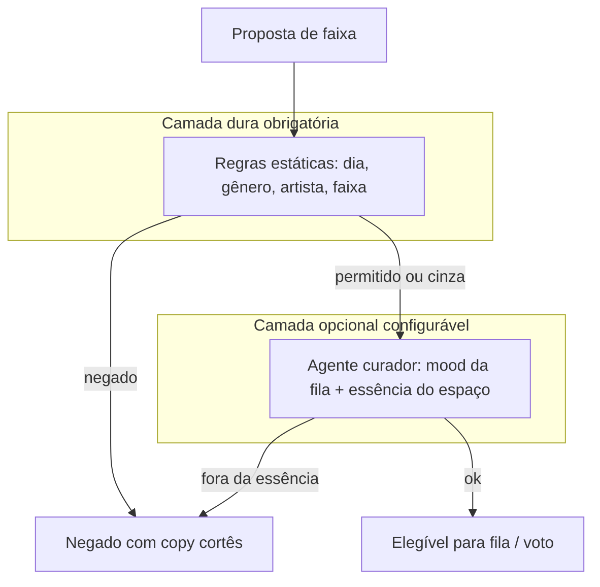

# Firewall de som: curador com agentes (hipótese)

**Estado:** hipótese de produto e arquitetura **futura** — texto de intenção, encaixe no manifesto e limites; **não** constitui requisito normativo do MVP. O mapa geral liga esta nota em [mapa-dores-e-solucoes.md](./mapa-dores-e-solucoes.md).

**Nota de nomenclatura:** “**Agent-first**” aqui refere-se a **fluxos de produto** em que agentes autônomos (ou semi-autônomos) participam da **decisão de elegibilidade** e da **mediação** da fila — distinto do modo **IA-first** do [roadmap](../ROADMAP.md) e do [AGENTS.md](../../AGENTS.md), que orientam **como o repositório** é escrito e revisado.

---

## Ideia em uma frase

Complementar o **firewall estático** (gênero → artista → música → dia) com um **curador assistido por agentes** que interpreta o **clima da fila no momento** e julga pedidos **inusitados** à luz da **essência do espaço** — sem anular a política do dono nem a promessa de **democracia com regras claras**.

---

## Por que faz sentido no Muziks

O manifesto já separa duas coisas que costumam ser confundidas:

1. **Política do dono** — define o universo em que o público pode agir ([MANIFESTO.md](../MANIFESTO.md), princípios 1–2; [04-rules-firewall.md](../specs/04-rules-firewall.md)).
2. **Democracia na fila** — votação e priorização **dentro** desse universo ([06-queue-voting-and-chips.md](../specs/06-queue-voting-and-chips.md)).

Na prática, listas estáticas resolvem a maior parte dos casos, mas deixam **zonas cinzentas**:

- Uma faixa **tecnicamente permitida** pelo gênero/artista que **quebra o clima** da noite (ex.: transição de “happy hour” para “after” sem o dono reconfigurar tudo).
- Pedidos **no limite** da política que o dono **queria** delegar (“confio no tom do lugar, não quero bloquear artista X linha a linha”).
- **Sobrecarga** do dono: microgerenciar exceções vira trabalho de DJ, contrário ao objetivo de [01-vision-and-scope.md](../specs/01-vision-and-scope.md) (“não microgerenciar cada pedido se a política estiver bem calibrada”).

Um agente que atua como **curador invisível** — sempre **subordinado** à política explícita e **auditável** — pode **mediar** esses casos e reforçar a promessa: *o público participa; o espaço manda na política; ninguém é humilhado quando a escolha não cabe* (cortesia em [07-ux-copy-and-states.md](../specs/07-ux-copy-and-states.md)).

Isto **complementa**, e não substitui, a hipótese de **temperatura ao vivo** para o artista no palco ([artista-ao-vivo-temperatura-e-fila.md](./artista-ao-vivo-temperatura-e-fila.md)): aqui o foco é o **firewall do player** no dia a dia do espaço, não só o modo apresentação.

---

## O que **não** pode acontecer (limites)

| Risco | Por que quebra o produto | Mitigação de desenho |
|-------|-------------------------|----------------------|
| IA **substitui** o dono | Viola princípio 1 do manifesto | Agente só opera **dentro** de limites configurados; veto e desligar curador são do dono |
| Decisão **opaca** | Destrói confiança e previsibilidade ([04](../specs/04-rules-firewall.md)) | Toda negação com **motivo em linguagem natural** + regra ou sinal que fundamentou; log para o dono |
| “Curador” vira **pay-to-win** ou viés comercial | Corrói democracia percebida | Curador **não** altera ranking por pagamento; fichas continuam só no mecanismo de voto ([06](../specs/06-queue-voting-and-chips.md)) |
| Julgamento de **obra/licença** | Fora do escopo do Muziks | Agente não “licencia” música; só elegibilidade **de produto** — ver [14-fronteiras-legais-direitos-autorais.md](../specs/14-fronteiras-legais-direitos-autorais.md) |
| **Alucinação** ou drift de tom | Bar perde identidade sonora | *Guardrails* estáticos sempre vencem conflito; agente só para faixas já **não bloqueadas** em camadas duras |

**Conclusão:** a hipótese **faz sentido** como **camada opcional pós-MVP**, desde que o firewall **determinístico** permaneça a **espinha dorsal** e o agente seja **curador mediador**, não legislador.

---

## Dor (abstração)

1. **Filtros estáticos sozinhos** não capturam **mood** nem **contexto da sessão** (hora, fila atual, votos recentes, política do dia).
2. **Exceções manuais** não escalam para donos que querem abrir a fila sem virar moderadores em tempo real.
3. **Pedidos inusitados** geram choque social ([mapa-dores-e-solucoes.md](./mapa-dores-e-solucoes.md)) mesmo quando “passam” na lista — a promessa do produto é **convivência**, não só **metadado correto**.

---

## Solução (direção Muziks — futura)

Modelo em **duas camadas** (sempre nesta ordem):

| Elemento | Papel |
|----------|--------|
| **Firewall estático** | Bloqueios e liberações explícitas; resultado **previsível**; base legal e operacional do dono. |
| **Essência do espaço** | Briefing configurável pelo dono (texto + exemplos permitidos/proibidos), não inferido só pela IA. |
| **Sinais de mood** | Agregados da **fila e votos** na janela da sessão (e metadados de catálogo — BPM, energia, gênero — quando existirem); **não** exige inferência de áudio no MVP desta hipótese. |
| **Agente curador** | Para propostas **já não bloqueadas** na camada dura, avalia se o pedido **respeita a essência**; pode **sugerir alternativas** alinhadas à cortesia do produto. |
| **Modo desligado** | Espaços que preferem **100% determinístico** mantêm só a camada dura — sem penalizar quem não confia em IA. |

---

## Sinais e decisões em aberto (para futura spec)

- Definir o que é **“cinza”** (ex.: passou no gênero mas artista nunca tocou no espaço; pedido com baixo histórico de votos na sessão).
- **Latência** e custo: avaliação síncrona no pedido vs fila assíncrona de revisão.
- **Onde corre** o agente (servidor gerenciado vs borda) e impacto em [08-nfr-privacy-accessibility.md](../specs/08-nfr-privacy-accessibility.md).
- **Auditoria** para o dono: amostra de decisões do curador e taxa de override.
- Relação com **moderação** e anti-fraude em [11-backend-and-integrations-open.md](../specs/11-backend-and-integrations-open.md).

---

## Onde isto encaixa no material existente

- **Normativo hoje:** [04-rules-firewall.md](../specs/04-rules-firewall.md) (semântica determinística; motor de áudio continua fora de escopo).
- **Fora do MVP:** [01-vision-and-scope.md](../specs/01-vision-and-scope.md).
- **Decisões técnicas abertas:** [11-backend-and-integrations-open.md](../specs/11-backend-and-integrations-open.md) (item sobre agentes de política).
- **Evolução operacional:** [ROADMAP.md](../ROADMAP.md) fase 5 (produto maduro + revisão de agentes).

Quando houver decisão de investimento, **migrar** requisitos fechados para uma spec em `docs/specs/` (ex.: extensão do doc 04 ou spec dedicada) e reduzir este ficheiro a contexto histórico.

---

## Texto de referência (síntese da intenção original)

> Além disso, a introdução de fluxos *Agent-First* tem potencial para revolucionar a mecânica do Firewall de Som. Em vez de o dono do estabelecimento depender apenas de filtros estáticos (bloqueando ou liberando artistas manualmente), agentes autônomos poderiam analisar o *mood* da fila no momento e decidir se uma solicitação inusitada respeita a essência do local. A IA atuaria como um curador invisível para mediar a “Democracia na Fila”, garantindo que a promessa do produto nunca seja quebrada.

Este parágrafo é **visão**; os parágrafos anteriores deste documento fixam **condições** para essa visão não contradizer o manifesto.
