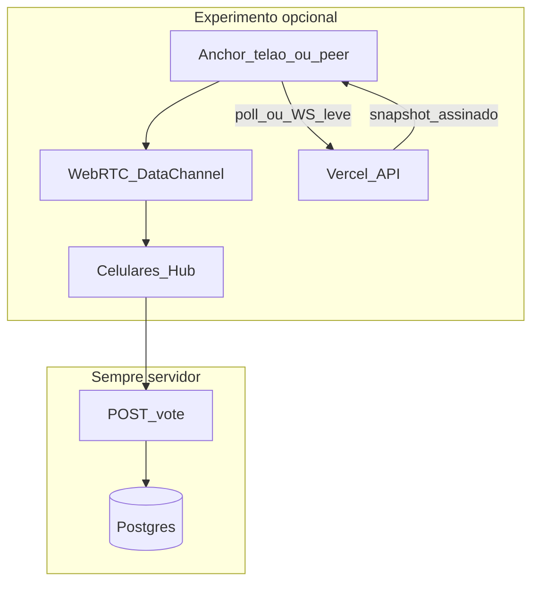

# Hub local: WebRTC e fan-out da fila (experimento)

**Status:** hipótese de disrupção — **fora do MVP / PoC**. Não altera a decisão fechada de `GET` inicial + Broadcast `queue.snapshot` na Fase infra A ([STACK-E-FASES-DE-MIGRACAO.md](../tech/STACK-E-FASES-DE-MIGRACAO.md) §3).

**Propósito:** avaliar se, quando muitas pessoas estão **fisicamente no mesmo player** (mesmo bar, mesma festa), dá para **distribuir o estado de leitura da fila** entre pontos locais (celulares + telão) via **WebRTC**, reduzindo tráfego repetido cliente↔servidor e melhorando latência percebida — **sem** descentralizar votos, política nem fonte de verdade.

---

## 1. Problema e evidência

### 1.1 O que acontece hoje (PoC)

Cada participante assina `queue.snapshot` e faz **GET** inicial/fallback da fila. Com **N** pessoas no salão, o mesmo snapshot é entregue a N conexões Realtime; em modo degradado, volta a existir GET periódico por participante.

Ordem de grandeza (referência para experimento, não meta de produto):

| Cenário | Cálculo | Leituras de fila/min ao origin (aprox.) |
|---------|---------|------------------------------------------|
| Sem Hub | 50 participantes conectados ao Broadcast | 50 conexões Realtime + 1 mensagem por mutação |
| Com Hub (âncora) | 1 conexão/GET da âncora + fan-out local | ~1 conexão upstream (+ signaling marginal) |

O ganho real depende de quota Realtime, cache hit em fallback e estabilidade do Wi‑Fi local — o spike E1 **deve** medir os três cenários.

### 1.2 Por que importa

- Rajadas históricas concentram tráfego em poucas horas ([03-ponte-pedidos-e-sazonalidade](../analytics/reports/03-ponte-pedidos-e-sazonalidade.md)).
- Decisão PoC: usar `queue.snapshot` por participante, com kill switch para polling quando quota degradar ([02-viabilidade-custos-comparativo.md](../mvp/02-viabilidade-custos-comparativo.md)).
- ICP: dezenas de *concurrent* por player (≤50–80) — exatamente onde fan-out local teria maior ROI.

**Escritas (voto, proposta, fichas) não economizam** com WebRTC: continuam **POST** no servidor.

---

## 2. Definição de Hub

**Hub** = conjunto de clientes ligados ao **mesmo `player_id`** na **mesma sessão física** (mesmo QR, mesmo estabelecimento, mesma noite).

- **Não** é mesh global de todos os players do mundo.
- **Não** substitui descoberta por slug/link/GPS ([05-discovery-and-access.md](../specs/05-discovery-and-access.md)).
- Pode incluir: celulares dos participantes + **telão** ([12-telao-display-publico.md](../specs/12-telao-display-publico.md)) + opcional painel do dono.

---

## 3. Invariantes (normativo do experimento)

| Caminho | Onde roda | Motivo |
|---------|-----------|--------|
| **Voto, proposta, fichas, auth** | Sempre servidor | Rate-limit, OAuth, firewall, anti-fraude ([06-queue-voting-and-chips.md](../specs/06-queue-voting-and-chips.md)) |
| **Snapshot da fila (leitura)** | Servidor = fonte de verdade; réplica local opcional | Telão e celulares devem convergir |
| **Fan-out P2P** | Só payload **já validado** pelo servidor | Evitar fila “fantasma” ou manipulação entre pares |

### 3.1 Payload sugerido (`QueueSnapshot`)

```json
{
  "version": 42,
  "playerId": "uuid",
  "items": [],
  "issuedAt": "ISO-8601",
  "sig": "HMAC_ou_assinatura_edge"
}
```

- `version` monotônica por player.
- Peers **rejeitam** snapshots com `version` menor ou `sig` inválida.
- Conteúdo = mesmo dado que `GET /queue` público (sem dados sensíveis além do já exibido no telão).

### 3.2 Relação com Realtime público

O experimento é um **canal paralelo de leitura** na LAN, não:

- substituto de POST de voto;
- substituto obrigatório de Supabase Realtime por participante;
- streaming de áudio/vídeo WebRTC (fora de escopo do Muziks).

---

## 4. Arquitetura de referência



### 4.1 Fluxo de leitura (com Hub)

1. **Âncora** obtém snapshot do servidor (1× por intervalo ou push leve só para âncora).
2. **Âncora** propaga via **WebRTC DataChannel** (unidirecional preferível) aos subscribers do room.
3. **Participantes** atualizam UI local; em falha P2P → **fallback** para Broadcast `queue.snapshot` ou polling HTTP degradado (obrigatório).

### 4.2 Fluxo de escrita (inalterado)

Participante → `POST /vote` (ou equivalente) → servidor valida política → incrementa versão → próximo snapshot reflete mudança (via âncora ou poll individual).

---

## 5. Duas hipóteses comparadas

### 5.A — Hub com âncora no telão (prioridade spike E1)

| Aspeto | Avaliação |
|--------|-----------|
| **Modelo** | Telão (browser fullscreen / mini-PC) faz **1** poll (ou 1 WS leve) ao servidor; distribui via **WebRTC DataChannel** para participantes na mesma sala |
| **Prós** | Topologia estrela previsível; alinha ao telão central na spec; um ponto para logs e debug; escala **1:N** sem SFU pago |
| **Contras** | Depende de telão ligado e na mesma rede; falha do telão exige fallback |
| **Escala realista** | Dezenas de subscribers (ICP ≤50–80) — viável se fan-out for **unidirecional** |
| **Viabilidade** | **Alta** para protótipo (`simple-peer`, `peerjs`, ou WebRTC nativo + signaling mínimo) |

**Nota:** `BroadcastChannel` só funciona no **mesmo browser** — não serve para cross-device; usar WebRTC DataChannel.

### 5.B — Mesh entre pares (spike E2)

| Aspeto | Avaliação |
|--------|-----------|
| **Modelo** | Vários celulares formam malha; **leader** eleito ou gossip de snapshots |
| **Prós** | Funciona **sem** telão; resiliente com reeleição de leader |
| **Contras** | Custo **O(N²)** ou muitos relays; bateria/CPU mobile; NAT/TURN; consistência difícil em 50+ nós |
| **Escala realista** | Mesh full impraticável além de ~10–15 nós; híbrido “cluster 5–8 + uplink” mais realista |
| **Viabilidade** | **Média-baixa** para produção no ICP; **aceitável** como experimento limitado |

**Recomendação:** spike **E1 (telão)** primeiro; **E2 (mesh)** com 8–10 peers apenas para documentar falhas (AP isolation, TURN).

### 5.C — Tabela de decisão

| Critério | Telão âncora | Mesh peers |
|----------|--------------|------------|
| Implementação PoC | Viável | Complexa |
| Escala 50–80 users | Viável (star) | Difícil sem SFU |
| Custo infra | Baixo (signaling + 1 poller) | Médio-alto (TURN) |
| Segurança | Mais controlável | Mais superfície |
| Alinhamento produto | Alto | Médio |
| **Veredito preliminar** | **Experimentar primeiro** | Documentar; spike pequeno depois |

---

## 6. Stack técnica candidata

| Componente | Opções | Notas |
|------------|--------|-------|
| **Transporte** | WebRTC **DataChannel** (não mídia) | JSON compacto ou MessagePack |
| **Signaling** | Endpoint leve em `apps/web` ou Cloudflare Worker | Room por `player_id` + token curto TTL; **não elimina** servidor |
| **TURN** | Cloudflare, Twilio, self-host | Necessário se P2P falhar (4G, NAT simétrico); **custo** em escala |
| **Join ao room** | QR do telão com token rotativo | Evita participante remoto entrar no Hub sem proximidade |
| **Fallback** | Broadcast `queue.snapshot` ou polling HTTP degradado | Automático se DataChannel não conectar em X s |

---

## 7. Barreiras e mitigações

| Barreira | Impacto | Mitigação |
|----------|---------|-----------|
| **Client isolation** no Wi‑Fi do bar | P2P bloqueado | Fallback Broadcast/polling; testar em piloto real |
| **NAT / 4G** no mesmo espaço | Sem conexão direta | TURN (custo); ou só Hub quando em Wi‑Fi do venue |
| **Signaling** obrigatório | Ainda há servidor | Aceitar como custo fixo baixo vs N×GET |
| **Abuso** (entrar no room remoto) | Snapshot vazado | Token de join via scan QR / prova de proximidade |
| **Privacidade** | Mesmo dado do telão | Payload = snapshot público; opt-in foto já em [12](../specs/12-telao-display-publico.md) |
| **PWA iOS** | Background / lock | Telão como âncora estável; testar Safari |
| **Cache CDN alto** | ROI P2P baixo | Medir antes de productizar |

---

## 8. Fases do experimento

| Fase | Entrega | Critério de sucesso |
|------|---------|---------------------|
| **E0 — Documentação** | Este ficheiro + mapa de dores | Hipóteses e riscos registrados |
| **E1 — Spike telão** | Branch `experiment/webrtc-hub` ou repo à parte | ≥20 clientes recebem snapshot &lt;500 ms após âncora; fallback automático |
| **E2 — Spike mesh** | 8–10 peers | Latência e bateria aceitáveis; falhas de AP documentadas |
| **E3 — Decisão** | ADR em `docs/tech/` ou “não perseguir” | Redução mensurável de egress **ou** UX **sem** TURN &gt; economia |

**Gatilho para sair de E0:** PoC estável **ou** métricas de Realtime/egress/fallback polling no piloto; alinhar ao gatilho **5 players constantes** ([STACK](../tech/STACK-E-FASES-DE-MIGRACAO.md) §2.1).

**Tracking sugerido:** issue Linear `infra`, label `experiment`.

---

## 9. Checklists de spike

### E1 — Telão âncora

- [ ] Room por `player_id` com token de join (QR telão).
- [ ] Âncora: 1 assinatura Broadcast ou 1 poll degradado; propaga `QueueSnapshot` assinado.
- [ ] ≥20 subscribers; medir latência âncora → peer.
- [ ] Simular queda da âncora → fallback Broadcast/polling em &lt;2 s.
- [ ] Testar Wi‑Fi de bar real (client isolation).
- [ ] Comparar conexões/mensagens/req ao origin com e sem Hub; com e sem cache CDN.

### E2 — Mesh parcial

- [ ] 8–10 peers; leader election simples.
- [ ] Medir bateria e CPU em 30 min de sessão.
- [ ] Documentar % de conexões que exigiram TURN.

---

## 10. Fora de escopo

- WebRTC de **áudio/vídeo** (reprodução continua via Spotify/provedor — [11-backend](../specs/11-backend-and-integrations-open.md) §4).
- Substituir **Postgres/Supabase** por réplica P2P da fila autoritativa.
- Substituir **Supabase Realtime** global por mesh.
- BLE/indoor para **descoberta do player** — ortogonal; ver nota em [05-discovery](../specs/05-discovery-and-access.md).

---

## 11. Documentos relacionados

| Documento | Relação |
|-----------|---------|
| [STACK-E-FASES-DE-MIGRACAO.md](../tech/STACK-E-FASES-DE-MIGRACAO.md) | PoC Broadcast + fallback; §7 experimentos |
| [12-telao-display-publico.md](../specs/12-telao-display-publico.md) | Candidato natural à âncora |
| [karaoke-era-ia-e-llms-de-borda.md](./karaoke-era-ia-e-llms-de-borda.md) | Outra trilha de compute/rede na borda |
| [mapa-dores-e-solucoes.md](./mapa-dores-e-solucoes.md) | Entrada na tabela de dores |

---

## Manutenção

Conclusão do E3 (adotar, adiar ou descartar) **deve** atualizar este ficheiro, o mapa de dores e, se normativo, um ADR em `docs/tech/`.
