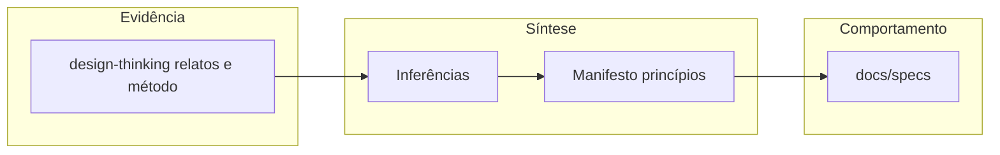

# Mapa de dores e soluções (disrupções)

Este documento liga **dores** (o que quebra convivência, confiança ou tração) às **respostas já descritas** no Muziks. A coluna **Evidência** aponta para [design-thinking-evidence-and-inferences.md](./design-thinking-evidence-and-inferences.md) sempre que o caso veio de campo ou de pesquisa qualitativa.

## Fluxo (evidência → entrega)

## Tabela principal

| Dor | Tipo | Evidência | Inferência | Solução / mitigação | Onde está |
|-----|------|-----------|------------|---------------------|-----------|
| Muitas pessoas controlam o mesmo som; fila vira “geléia”; ninguém sabe quem manda | Campo | [Padrão técnico: muitas mãos, um só som](./design-thinking-evidence-and-inferences.md#padrão-técnico-muitas-mãos-um-só-som) | Democracia sem acordo explícito gera disputa de controle e opacidade | Política explícita do dono; público só age dentro do universo permitido; regras em camadas (“firewall”) | [MANIFESTO.md](../MANIFESTO.md) (princípios 1–2); [04-rules-firewall.md](../specs/04-rules-firewall.md) |
| Bloqueios humilham ou afastam quem participa | Produto | Inferências 1–3 no design thinking | Participação precisa ser convidativa mesmo quando a escolha não cabe | Copy e estados corteses; alternativas quando fizer sentido | [MANIFESTO.md](../MANIFESTO.md) (princípio 3); [07-ux-copy-and-states.md](../specs/07-ux-copy-and-states.md) |
| Solução “aberta” permite que alguém tome a fila (ex.: outro app no mesmo som); instalação é desmontada | Campo | [Bar: solução aberta desfeita](./design-thinking-evidence-and-inferences.md#bar-solução-aberta-desfeita) | Confiança quebra rápido sem política nem canal único de influência | Universo de faixas e fluxos definidos pelo produto; anti-abuso e continuidade no backend (a fechar em implementação) | [04-rules-firewall.md](../specs/04-rules-firewall.md); [11-backend-and-integrations-open.md](../specs/11-backend-and-integrations-open.md) |
| Música vira choque de identidade / rivalidade no espaço | Campo | [Bar: música como choque de identidade](./design-thinking-evidence-and-inferences.md#bar-música-como-choque-de-identidade) | Música partilhada não é neutra; sem política, micro-escolhas viram incidente | Regras por género, artista, faixa e dia; jornadas que preveem tensão e revogação | [04-rules-firewall.md](../specs/04-rules-firewall.md); [02-personas-and-journeys.md](../specs/02-personas-and-journeys.md) |
| Pouca adesão ou expansão orgânica sem “palco” visível no espaço | Campo / produto | [Inferência 4](./design-thinking-evidence-and-inferences.md#inferências-do-campo-para-o-produto); contexto histórico em [12](../specs/12-telao-display-publico.md#origem-contexto-histórico-do-projeto) | Telão + QR + feedback social visível puxam entrada e escala quando o contexto comporta | Modo telão opcional; QR no display; opt-in para foto/identidade; perfis por tipo de espaço | [12-telao-display-publico.md](../specs/12-telao-display-publico.md); [05-discovery-and-access.md](../specs/05-discovery-and-access.md) |
| Abuso via localização, links ou enumeração; stalking ou spam remoto | Produto | Riscos listados nas specs de descoberta | Facilidade para o público e segurança para o dono evoluem juntas | Raio configurável, revogação, rate limit, degradar GPS; NFR de privacidade | [05-discovery-and-access.md](../specs/05-discovery-and-access.md); [08-nfr-privacy-accessibility.md](../specs/08-nfr-privacy-accessibility.md); [MANIFESTO.md](../MANIFESTO.md) (princípio 8) |
| Dados brutos e quantitativos da pesquisa antiga inexistentes | Conhecimento | [Método e limitações](./design-thinking-evidence-and-inferences.md#método-e-limitações) | Decisões continuam válidas como **indícios**, não como estatística reprodutível | Manter relatos e inferências explícitos; este mapa assinala lacunas; evitar afirmações numéricas inventadas | [design-thinking-evidence-and-inferences.md](./design-thinking-evidence-and-inferences.md); esta tabela |
| Detalhe de produto dilui o manifesto; leitores confundem intenção com comportamento | Docs | Ajuste feito na sessão de specs (telão só em spec) | Manifesto = essência; specs = comportamento executável | Regra de ouro: narrativa longa e requisitos em `docs/specs/`; manifesto permanece enxuto | [MANIFESTO.md](../MANIFESTO.md); [12-telao-display-publico.md](../specs/12-telao-display-publico.md) |

## Lacunas explícitas (ainda sem resposta fechada no texto)

Estes itens são **dores ou riscos reconhecidos** cuja solução depende de decisões em aberto ou de implementação futura:

- **Licenciamento de execução pública e integração com provedores** — critérios e opções em [11-backend-and-integrations-open.md](../specs/11-backend-and-integrations-open.md) e fora de escopo parcial em [01-vision-and-scope.md](../specs/01-vision-and-scope.md).
- **Valores numéricos** (raios min/max, limites de taxa) — deixados para implementação após jurídico/ops; ver [05](../specs/05-discovery-and-access.md) e [11](../specs/11-backend-and-integrations-open.md).

## Ligações rápidas

- [README desta pasta](README.md)
- [Especificações completas](../specs/README.md)
