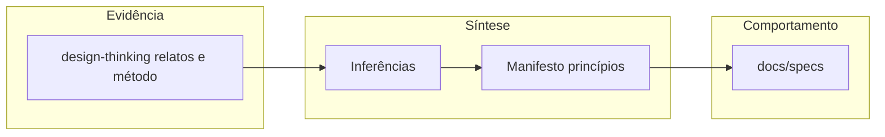

# Mapa de dores e soluções (disrupções)

Este documento liga **dores** (o que quebra convivência, confiança ou tração) às **respostas já descritas** no Muziks. A coluna **Evidência** aponta para [design-thinking-evidence-and-inferences.md](./design-thinking-evidence-and-inferences.md) quando o caso veio de campo ou de pesquisa qualitativa, ou para notas de disrupção dedicadas quando a matéria é **hipótese de produto** já estruturada fora desse ficheiro.

## Fluxo (evidência → entrega)

## Tabela principal

| Dor | Tipo | Evidência | Inferência | Solução / mitigação | Onde está |
|-----|------|-----------|------------|---------------------|-----------|
| Muitas pessoas controlam o mesmo som; fila vira “geléia”; ninguém sabe quem manda | Campo | [Padrão técnico: muitas mãos, um só som](./design-thinking-evidence-and-inferences.md#padrão-técnico-muitas-mãos-um-só-som) | Democracia sem acordo explícito gera disputa de controle e opacidade | Política explícita do dono; público só age dentro do universo permitido; regras em camadas (“firewall”) | [MANIFESTO.md](../MANIFESTO.md) (princípios 1–2); [04-rules-firewall.md](../specs/04-rules-firewall.md) |
| Bloqueios humilham ou afastam quem participa | Produto | Inferências 1–3 no design thinking | Participação precisa ser convidativa mesmo quando a escolha não cabe | Copy e estados corteses; alternativas quando fizer sentido | [MANIFESTO.md](../MANIFESTO.md) (princípio 3); [07-ux-copy-and-states.md](../specs/07-ux-copy-and-states.md) |
| Solução “aberta” permite que alguém tome a fila (ex.: outro app no mesmo som); instalação é desmontada | Campo | [Bar: solução aberta desfeita](./design-thinking-evidence-and-inferences.md#bar-solução-aberta-desfeita) | Confiança quebra rápido sem política nem canal único de influência | Universo de faixas e fluxos definidos pelo produto; anti-abuso e continuidade no backend (a fechar em implementação) | [04-rules-firewall.md](../specs/04-rules-firewall.md); [11-backend-and-integrations-open.md](../specs/11-backend-and-integrations-open.md) |
| Música vira choque de identidade / rivalidade no espaço | Campo | [Bar: música como choque de identidade](./design-thinking-evidence-and-inferences.md#bar-música-como-choque-de-identidade) | Música partilhada não é neutra; sem política, micro-escolhas viram incidente | Regras por género, artista, faixa e dia; jornadas que preveem tensão e revogação | [04-rules-firewall.md](../specs/04-rules-firewall.md); [02-personas-and-journeys.md](../specs/02-personas-and-journeys.md) |
| Pouca adesão ou expansão orgânica sem “palco” visível no espaço | Campo / produto | [Inferência 4](./design-thinking-evidence-and-inferences.md#inferências-do-campo-para-o-produto); contexto histórico em [12](../specs/12-telao-display-publico.md#origem-contexto-histórico-do-projeto) | Telão + QR + feedback social visível puxam entrada e escala quando o contexto comporta | Modo telão opcional; QR no display; opt-in para foto/identidade; perfis por tipo de espaço | [12-telao-display-publico.md](../specs/12-telao-display-publico.md); [05-discovery-and-access.md](../specs/05-discovery-and-access.md) |
| Abuso via localização, links ou enumeração; stalking ou spam remoto | Produto | Riscos listados nas specs de descoberta | Facilidade para o público e segurança para o dono evoluem juntas | Raio configurável, revogação, rate limit, degradar GPS; NFR de privacidade | [05-discovery-and-access.md](../specs/05-discovery-and-access.md); [08-nfr-privacy-accessibility.md](../specs/08-nfr-privacy-accessibility.md); [MANIFESTO.md](../MANIFESTO.md) (princípio 8) |
| Dados quantitativos da **pesquisa** antiga inexistentes; telemetria **operacional** 2016–2017 parcialmente recuperada | Conhecimento | [Método e limitações](./design-thinking-evidence-and-inferences.md#método-e-limitações); [analytics/README.md](../analytics/README.md) | Pesquisa qualitativa = indícios; exports legados = baseline histórico, não meta atual | Não inventar números; usar [analytics](../analytics/README.md) com disclaimer; qualitativo inalterado | [design-thinking-evidence-and-inferences.md](./design-thinking-evidence-and-inferences.md); [analytics](../analytics/README.md) |
| Detalhe de produto dilui o manifesto; leitores confundem intenção com comportamento | Docs | Ajuste feito na sessão de specs (telão só em spec) | Manifesto = essência; specs = comportamento executável | Regra de ouro: narrativa longa e requisitos em `docs/specs/`; manifesto permanece enxuto | [MANIFESTO.md](../MANIFESTO.md); [12-telao-display-publico.md](../specs/12-telao-display-publico.md) |
| Show ao vivo desconectado da fila digital: artista sem “temperatura” legível; janela do evento não ancora dados; pedidos opacos ou risco de partilhar o mesmo controlo do player | Produto | [Artista ao vivo: temperatura e fila](./artista-ao-vivo-temperatura-e-fila.md) | O palco precisa de sinais agregados e de um canal de pedido **sem** colapsar política nem controlo num único telefone anónimo | Modo apresentação com janela temporal; resumos de gênero/artistas; convite (link/QR) a vista só-leitura; opcional pedidos dirigidos ao artista com firewall | [artista-ao-vivo-temperatura-e-fila.md](./artista-ao-vivo-temperatura-e-fila.md); [04](../specs/04-rules-firewall.md); [05](../specs/05-discovery-and-access.md); [06](../specs/06-queue-voting-and-chips.md); [12](../specs/12-telao-display-publico.md); [02](../specs/02-personas-and-journeys.md) |
| Karaokê e participação vocal na web: sinais musicais e sensibilidades difíceis de medir sem stack pesada ou servidor; engajamento platô face a soluções nativas fechadas | Produto / Engenharia | [Karaokê na era da IA e LLMs de borda](./karaoke-era-ia-e-llms-de-borda.md) | Modelos em **borda** no browser alteram o trade-off: medição e classificação auxiliar podem ser **locais** (privacidade, latência), com custo alto de produto e engenharia | Camada **opcional** futura de IA em edge alinhada à PWA; reforça fossos de player, telão e pessoas; aumenta engajamento sem substituir política nem licenciamento | [karaoke-era-ia-e-llms-de-borda.md](./karaoke-era-ia-e-llms-de-borda.md); [10](../specs/10-pwa-strategy.md); [12](../specs/12-telao-display-publico.md); [08](../specs/08-nfr-privacy-accessibility.md); [11](../specs/11-backend-and-integrations-open.md); [14](../specs/14-fronteiras-legais-direitos-autorais.md) |
| Participação sempre grátis sem alternativa de receita B2C; ou “quem paga passa na frente” sem teto — quebra confiança na fila | Produto / Negócio | [Conexão, emoção e economia da fila](./conexao-emocao-economia-da-fila.md) | Emoção e conexão aumentam disposição a pagar por **gestos** e **peso limitado**; o ecossistema precisa ser **sustentável** sem corromper a democracia **percebida** | Assinatura/créditos **opcionais** do participante; **firewall** e caps; mensagens românticas com moderação e opt-in; invariante: não compra obra nem bypass de política | [conexao-emocao-economia-da-fila.md](./conexao-emocao-economia-da-fila.md); [03-espaco-romantico-prioridade-e-sustentabilidade.md](../business/03-espaco-romantico-prioridade-e-sustentabilidade.md); [06](../specs/06-queue-voting-and-chips.md); [04](../specs/04-rules-firewall.md); [07](../specs/07-ux-copy-and-states.md); [08](../specs/08-nfr-privacy-accessibility.md) |
| Filtros estáticos sozinhos não capturam clima da noite; pedidos “válidos” no metadado ainda quebram a essência do espaço; dono vira moderador manual | Produto | [Firewall: curador com agentes](./firewall-curador-com-agentes.md) | Democratizar sem **mediação** deixa choques na sala; IA pode **reforçar** a promessa se for **subordinada** à política dura e **explicável** | Camada dura (dia → gênero → artista → faixa) + curador opcional por *mood* da fila e briefing do dono; opt-out; copy cortês | [firewall-curador-com-agentes.md](./firewall-curador-com-agentes.md); [04](../specs/04-rules-firewall.md); [07](../specs/07-ux-copy-and-states.md); [11](../specs/11-backend-and-integrations-open.md) |

## Lacunas explícitas (ainda sem resposta fechada no texto)

Estes itens são **dores ou riscos reconhecidos** cuja solução depende de decisões em aberto ou de implementação futura:

- **Licenciamento de execução pública e integração com provedores** — critérios e opções em [11-backend-and-integrations-open.md](../specs/11-backend-and-integrations-open.md) e fora de escopo parcial em [01-vision-and-scope.md](../specs/01-vision-and-scope.md).
- **Valores numéricos** (raios min/max, limites de taxa) — deixados para implementação após jurídico/ops; ver [05](../specs/05-discovery-and-access.md) e [11](../specs/11-backend-and-integrations-open.md).
- **Modo apresentação ao vivo** (janela temporal, vista do artista, pedidos ao palco, revogação de convite) — hipótese e racional em [artista-ao-vivo-temperatura-e-fila.md](./artista-ao-vivo-temperatura-e-fila.md); requisitos normativos a consolidar numa spec em `docs/specs/`.
- **Karaokê / IA em borda** (modelos no cliente, moderação assistida, *scoring* musical, opt-in, telemetria) — hipótese e racional em [karaoke-era-ia-e-llms-de-borda.md](./karaoke-era-ia-e-llms-de-borda.md); **implementação futura**; spec dedicada quando houver decisão de investimento.
- **Economia emocional do participante** (assinatura, peso na ordem, “espaço romântico”, mensagens) — hipótese em [conexao-emocao-economia-da-fila.md](./conexao-emocao-economia-da-fila.md) e [03-espaco-romantico-prioridade-e-sustentabilidade.md](../business/03-espaco-romantico-prioridade-e-sustentabilidade.md); consolidar requisitos normativos em `docs/specs/` quando houver decisão.
- **Curador com agentes no firewall** (*mood*, essência do espaço, pedidos inusitados) — hipótese em [firewall-curador-com-agentes.md](./firewall-curador-com-agentes.md); **fora do MVP**; spec dedicada quando houver decisão de investimento.

## Ligações rápidas

- [README desta pasta](README.md)
- [Especificações completas](../specs/README.md)
