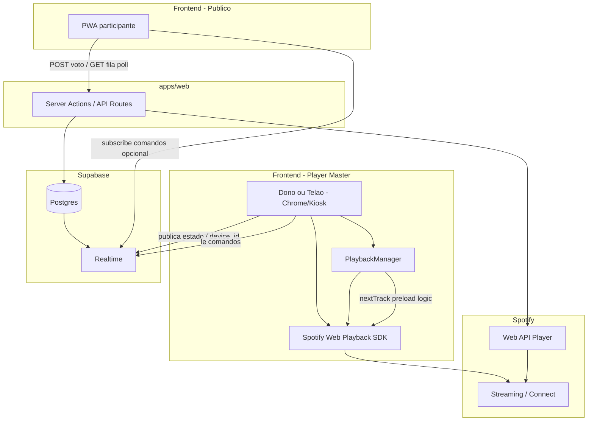
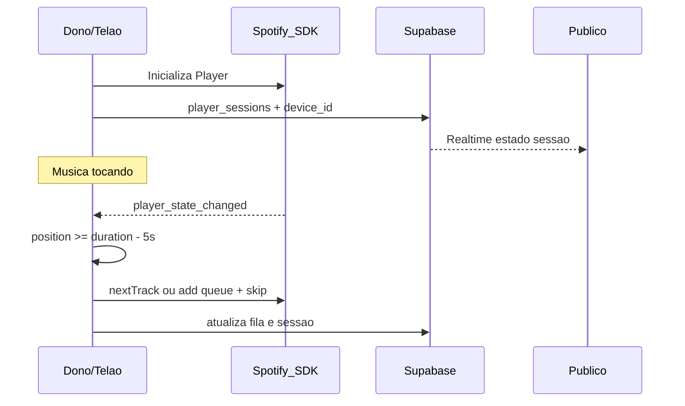
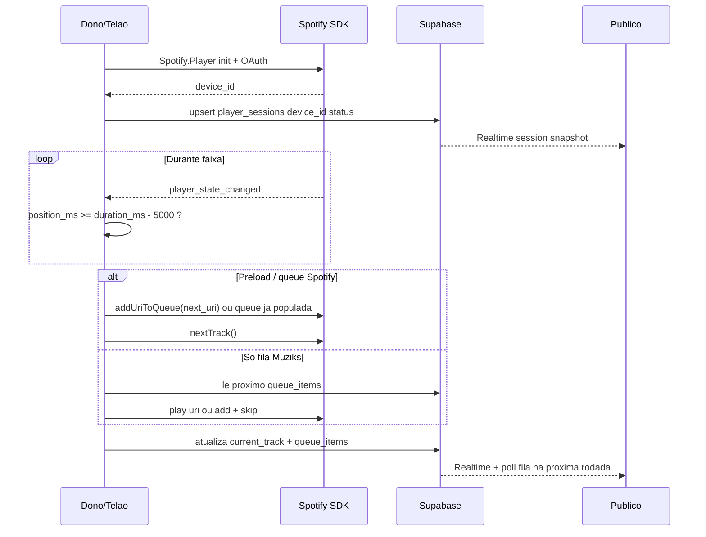

# Arquitetura de playback — decisão fechada (MVP-B)

**Propósito:** registrar a arquitetura **escolhida** para reprodução no Muziks (2026), substituindo o modelo antigo (gerenciamento manual de `<audio>`, seek, preload e sync frágil). Complementa [03-viabilidade-integracao-spotify-eda.md](03-viabilidade-integracao-spotify-eda.md) (viabilidade geral) e [congelamento-mvp-e-arquitetura.md](congelamento-mvp-e-arquitetura.md) (escopo por fase).

**Normativo:** trechos com “deve” descrevem requisitos acordados para implementação.

### Índice deste documento (entregáveis de implementação)

| # | Conteúdo | Seção |
|---|----------|--------|
| 1 | Diagrama completo da arquitetura | §5 |
| 2 | Pastas + contratos `SpotifyService`, `PlaybackManager`, `QueueService` | §9.2–9.3 |
| 3 | Fluxo “próxima música automática” | §7 |
| 4 | Checklist scopes OAuth Spotify | §10 |

---

## 0. Contexto — dor da versão antiga

Na versão anterior do produto, o maior custo técnico era **gerenciar playback manualmente**:

- seek, next, pause e volume sem SDK nativo;
- preload ~5 s antes do fim da faixa;
- transição entre músicas sem gapless confiável;
- estado sincronizado entre **telão**, **dono** e **público** (múltiplos clientes divergindo).

**Decisão MVP-B:** não reimplementar player com `<audio>` nem fila de áudio própria. O **Spotify Web Playback SDK** no **Player Master** (dono ou telão) assume áudio, preload e gapless; o Muziks concentra-se em **fila, votos, política, sessão compartilhada e comandos remotos**.

---

## 1. Posição no MVP

| Fase | Escopo | Playback |
|------|--------|----------|
| **MVP-A** | Fila, votos, política, telão (estado visual), link/QR | **Sem** reprodução orquestrada pelo app — validação da hipótese de participação |
| **MVP-B (piloto playback)** | Tudo do MVP-A + **áudio no espaço** via Spotify | **Esta spec** — implementação obrigatória no piloto que incluir som |

A dor histórica (seek, next, pause, preload ~5 s antes do fim, transição suave, sync telão/dono/público) **não** volta a ser resolvida com player de áudio próprio; o **Spotify Web Playback SDK** no dispositivo do dono/telão é o motor de áudio; o Muziks orquestra **fila, votos, regras e estado compartilhado**.

---

## 2. Abordagem híbrida (responsabilidades)

| Responsabilidade | Tecnologia | Motivo |
|------------------|------------|--------|
| **Fila + votação + regras (fonte de verdade)** | **Supabase** (Postgres + migrations em `packages/db`) | Domínio Muziks; portável para AWS |
| **Sync de estado da sessão** (faixa atual, progresso, device) | **Supabase Realtime** (canal da sessão) | Baixa cardinalidade (dono, telão, poucos controladores); não substitui polling da fila para **N** participantes no salão |
| **Leitura da fila pelo público** | HTTP + polling **3–5 s** (PoC) | Alinhado a [STACK-E-FASES-DE-MIGRACAO.md](../tech/STACK-E-FASES-DE-MIGRACAO.md) §1.1 — evita WS por celular no pico |
| **Controle de playback (áudio)** | **Spotify Web Playback SDK** + **Web API (Player)** | Gapless/preload nativos; eventos `player_state_changed` |
| **Transição automática (próxima faixa)** | **Cliente Dono/Telão** (Player Master) | Confiável: quem tem o SDK detecta fim e executa `next` |
| **Comandos remotos** (play/pause/skip do público) | Supabase (fila de comandos) → Dono executa na Web API / SDK | Público **não** precisa Premium |
| **Redis** | Fora do MVP-B | Opcional em Fase infra B+ para cache de sessão |

### 2.1 Ajuste fino vs. “Realtime em tudo”

Em rascunhos iniciais da arquitetura híbrida aparecia **Realtime também para a fila pública**. No Muziks isso foi **refinado** para não conflitar com a PoC:

| Dado | Canal | Motivo |
|------|--------|--------|
| **Fila + votos** (lista ordenada, ranking) | HTTP + polling **3–5 s** | Muitos participantes no salão; ver STACK |
| **Estado de playback** (faixa atual, progresso, `device_id`) | **Supabase Realtime** | Poucos assinantes (Master, telão display, painel dono) |
| **Comandos remotos** (play/pause/skip) | **Realtime** ou poll curto no Master | Master **consome** e executa no SDK |

Ou seja: **fila e regras** no Postgres (fonte de verdade); **Realtime** só onde a cardinalidade é baixa e a latência importa para sync telão/dono.

---

## 3. Princípios de produto (quem toca o quê)

1. **Dispositivo ativo:** o **Dono do player** ou o **navegador do telão** (Chrome / kiosk) é o **único** dispositivo Spotify Connect que **emite áudio** na sessão.
2. **Público:** vota e pode enviar comandos; **não** precisa Spotify Premium nem reproduzir áudio localmente.
3. **Premium:** obrigatório **apenas** na conta vinculada ao Player Master (dono do estabelecimento).
4. **Fila lógica:** a **fila Muziks** (Postgres) é fonte de verdade para ranking e política; o Spotify recebe **comandos derivados** (add to queue, skip, transfer playback) — ver §8 (reconciliação).

---

## 4. Integração Spotify (fechada)

### 4.1 Principal — Web Playback SDK

Roda no browser do **Player Master** (dono ou telão):

- Cria um **dispositivo Spotify Connect** dentro do navegador.
- Expõe: play, pause, seek, next, previous, volume.
- Eventos: `player_state_changed`, `playback_error`, `ready`, etc.
- **Preload e gapless:** tratados pelo SDK (não reimplementar com `<audio>`).

### 4.2 Complementar — Web API (Player endpoints)

No servidor (token do dono, refresh em cofre) e/ou no cliente Master após OAuth:

- `transfer` playback para o `device_id` do SDK.
- Adicionar à fila nativa, skip, get current playback.
- Necessário para **controle remoto** e para alinhar fila Muziks → Spotify.

### 4.3 O que não usar como núcleo

| Mecanismo | Papel no Muziks |
|-----------|-----------------|
| Embed / iframe Spotify | Apenas referência visual; **não** orquestra fila do espaço |
| Connect **sem** SDK no Master | Possível em cenário “app Spotify na caixa”; MVP-B **prioriza** SDK no browser do telão/dono |
| Player de áudio HTML5 próprio | **Proibido** para faixas Spotify (termos + complexidade) |

---

## 5. Diagrama de arquitetura



---

## 6. Camadas e modelo de dados (backend)



### 6.1 Tabelas sugeridas (domínio)

| Tabela / entidade | Campos principais | Uso |
|-------------------|-------------------|-----|
| `player_sessions` | `player_id`, `active_device_id`, `spotify_user_id`, `current_track_uri`, `progress_ms`, `status` (playing/paused/idle), `updated_at` | Estado global da sessão de playback |
| `queue_items` | Já previsto no domínio — `player_id`, `isrc`, `spotify_uri`, `votes`, `position`, `state` | Fila Muziks |
| `playback_commands` | `id`, `player_id`, `type` (play/pause/next/seek), `payload`, `status`, `created_by` | Fila de comandos; Master consome e marca `applied` |

Migrations em `packages/db/migrations` — nunca só no Dashboard.

### 6.2 Realtime (canais)

| Canal | Publicadores | Assinantes | Payload |
|-------|--------------|------------|---------|
| `player:{id}:session` | Player Master | Telão (se separado), painel dono | Estado playback + `device_id` |
| `player:{id}:commands` | Público autorizado, dono | Player Master | Comandos pendentes |

**Regra:** participantes em massa **não** assinam Realtime só para ver a fila — usam polling HTTP (STACK).

---

## 7. Fluxo — transição automática (próxima música)



### 7.1 Regras do PlaybackManager (cliente Master)

**Arquitetura detalhada (Next.js, diagramas, slices):** [PLAYBACK-NEAR-END-AND-QUEUE-MIRROR.md](../tech/PLAYBACK-NEAR-END-AND-QUEUE-MIRROR.md).

1. Inscrever `player.addListener('player_state_changed', ...)`.
2. Quando `!paused` e `position >= duration - 5000` (ms): disparar **uma vez** por faixa (debounce / flag `transitionScheduled`).
3. Resolver próxima faixa: cabeça da **fila Muziks** (após política) → URI Spotify.
4. Preferir: URI já na fila nativa Spotify → `nextTrack()`; senão `/_play` ou add + skip conforme API.
5. Atualizar `player_sessions` e consumir/remover item da fila Muziks na mesma lógica de negócio.
6. Em `playback_error`: publicar estado de erro; não travar fila sem feedback ao dono.

---

## 8. Fila dupla (Muziks × Spotify)

| Estratégia | Comportamento |
|------------|---------------|
| **Fonte de verdade** | Fila **Muziks** (votos, firewall, ISRC) |
| **Espelho no Spotify** | Player Master mantém **próximas N** faixas (ex.: 2–3) na queue nativa para gapless |
| **Reconciliação** | Se estado Spotify divergir da cabeça Muziks por >X s, emitir evento interno `PlaybackOutOfSync` e UX para dono (manual resync) |

Eventos de domínio (EDA) alinhados a [03-viabilidade-integracao-spotify-eda.md](03-viabilidade-integracao-spotify-eda.md): `QueueHeadChanged`, `SpotifyCommandRequested`, `SpotifyStateUpdated`, `PlaybackOutOfSync`.

---

## 9. Frontend — papéis e abstrações

### 9.1 Papéis

| Papel | Responsabilidades |
|-------|-------------------|
| **Player Master** (dono/telão) | Init SDK, OAuth Spotify dono, `PlaybackManager`, transição automática, executa comandos, publica `player_sessions` |
| **Público** | Vota; visualiza fila (poll); opcionalmente envia comandos → `playback_commands` |
| **Telão (somente display)** | Se **não** for o Master: só Realtime + UI; se **for** o Master: mesmo binário/rota com flag `isPlaybackMaster` |

Requisito telão: [12-telao-display-publico.md](../specs/12-telao-display-publico.md) **T2** — estado coerente com o player.

### 9.2 Estrutura de pastas (quando existir `apps/web`)

```
apps/web/src/features/playback/
  services/
    SpotifyService.ts      # init SDK, connect, getOAuthToken, device_id
    PlaybackManager.ts     # listeners, auto-next, sync Supabase
    QueueService.ts        # regras fila + votos (chama API Muziks)
  hooks/
    usePlaybackSession.ts  # subscribe Realtime session
    useSpotifyPlayer.ts    # wrapper React do SDK
  components/
    PlaybackMasterGate.tsx # só renderiza player se role=master
```

`packages/types`: tipos `PlaybackSession`, `PlaybackCommand`, `SpotifyPlayerState` normalizado.

### 9.3 Contratos das abstrações (especificação)

**SpotifyService**

- `initialize(accessToken: string): Promise<Spotify.Player>`
- `getDeviceId(): string | null`
- `connect(): Promise<void>`
- `disconnect(): void`

**PlaybackManager**

- `start(sessionId: string): void` — registra listeners
- `stop(): void`
- `applyCommand(cmd: PlaybackCommand): Promise<void>`
- `syncStateToSupabase(state: NormalizedPlayerState): void`
- privado: `scheduleNextIfNearEnd(state): void`

**QueueService**

- `getHead(playerId): Promise<QueueItem | null>`
- `popHead(playerId): Promise<void>` — após confirmação de play
- Sem lógica Spotify direta (injeção de URI via PlaybackManager)

**Nota:** `QueueService` no cliente chama **slices HTTP** do backend (votos, cabeça da fila) — não duplicar regra de ranking no front.

### 9.4 Backend — Vertical Slices (servidor)

Lógica server (Server Actions / `apps/api`) segue [VERTICAL-SLICE-ARCHITECTURE.md](../tech/VERTICAL-SLICE-ARCHITECTURE.md). O SDK Spotify e `PlaybackManager` ficam **no cliente Master**; o backend persiste domínio e expõe comandos.

| Slice (`slices/playback/`) | Responsabilidade |
|----------------------------|------------------|
| `publish-session-state/` | Upsert `player_sessions` (Master envia estado normalizado) |
| `enqueue-playback-command/` | Inserir em `playback_commands` (público/dono) |
| `consume-playback-command/` | Master marca `applied` / falha (opcional se só Realtime) |
| `get-playback-session/` | Leitura para telão display sem ser Master |

Fila e votos permanecem em `slices/queue/*` — **não** misturar com playback além de “próxima cabeça da fila”.

Adaptador HTTP Spotify (token dono, `transfer`, add queue) pode viver em `packages/spotify` como **strategy**; orquestração por caso de uso na slice.

---

## 10. OAuth — scopes necessários

Registrar no app Spotify Developer Dashboard; fluxo OAuth do **dono** (não do participante).

| Scope | Uso |
|-------|-----|
| `streaming` | **Obrigatório** — Web Playback SDK |
| `user-read-playback-state` | Ler faixa atual, progresso, dispositivo |
| `user-modify-playback-state` | Play, pause, skip, seek, volume |
| `user-read-currently-playing` | Fallback / telão |
| `user-read-email` | Opcional — identificar conta dono no painel |
| `playlist-read-private` | **Não** necessário no MVP-B |
| `user-library-read` | **Não** necessário no MVP-B |

**Catálogo / busca** (MVP-A e B): scopes adicionais de busca conforme endpoints usados (`user-read-private` não exigido para search pública com client credentials onde aplicável — separar app “catalog” vs “playback” se quotas exigirem).

Tokens: **refresh token** do dono armazenado cifrado (Supabase vault / env server); nunca expor refresh ao cliente público.

---

## 11. Vantagens e limitações

### Vantagens

- Transição suave e gapless delegados ao Spotify.
- Sem gerenciamento manual de elemento `<audio>`.
- Telão em Chrome kiosk é cenário suportado.
- Público sem Premium.

### Limitações (UX e suporte)

| Limitação | Mitigação |
|-----------|-----------|
| Dono precisa **Spotify Premium** | Copy claro no onboarding; bloquear “ativar som” sem Premium |
| SDK só em browsers suportados (Chrome, Edge; Safari com restrições) | Recomendar Chrome no telão; detectar e avisar |
| Sem webhook Spotify → servidor | Estado via SDK no Master + amostragem opcional Web API |
| Termos / uso comercial em espaço | [14-fronteiras-legais-direitos-autorais.md](../specs/14-fronteiras-legais-direitos-autorais.md) |
| Duas filas | Política de espelho §8; ferramenta “resync” no painel dono |

---

## 12. Segurança e rate limits

- Comandos remotos: validar que o autor pode atuar naquele `player_id` (sessão OAuth Muziks).
- Rate-limit em `playback_commands` (ex.: 1 skip / 10 s por participante).
- Debounce de chamadas Web API no Master (agregar `next` espúrios).
- RLS Supabase: apenas Master atualiza `player_sessions.active_device_id`; público só insere comandos permitidos.

---

## 13. Checklist de implementação (MVP-B)

- [ ] OAuth dono com scopes §10
- [ ] `SpotifyService` + `PlaybackManager` no Master
- [ ] Migrations `player_sessions`, `playback_commands`
- [ ] Realtime canais §6.2
- [ ] Fluxo auto-next §7
- [ ] Painel: indicador “dispositivo ativo” + erro Premium/browser
- [ ] Reconciliação fila §8
- [ ] Atualizar [11-backend-and-integrations-open.md](../specs/11-backend-and-integrations-open.md) §4 (reprodução fechada)

---

## 14. Documentos relacionados

| Documento | Relação |
|-----------|---------|
| [congelamento-mvp-e-arquitetura.md](congelamento-mvp-e-arquitetura.md) | Fases MVP-A / MVP-B |
| [03-viabilidade-integracao-spotify-eda.md](03-viabilidade-integracao-spotify-eda.md) | Catálogo, EDA, Caminho A vs B |
| [STACK-E-FASES-DE-MIGRACAO.md](../tech/STACK-E-FASES-DE-MIGRACAO.md) | Polling fila; Realtime exceção playback |
| [12-telao-display-publico.md](../specs/12-telao-display-publico.md) | Telão como Master opcional |
| [09-frontend-architecture.md](../specs/09-frontend-architecture.md) | `features/playback/` |
| [15-backend-architecture.md](../specs/15-backend-architecture.md) | Slices server |
| [VERTICAL-SLICE-ARCHITECTURE.md](../tech/VERTICAL-SLICE-ARCHITECTURE.md) | Organização API |
| [14-fronteiras-legais-direitos-autorais.md](../specs/14-fronteiras-legais-direitos-autorais.md) | Compliance |
