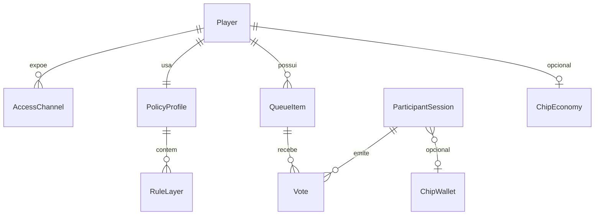

# Modelo de domínio (conceitual)

Este documento define **entidades**, **relacionamentos** e **invariantes** de negócio. Não fixa nomes de tabelas ou APIs; isso evolui com [11-backend-and-integrations-open.md](11-backend-and-integrations-open.md).

## Diagrama (conceitual)

## Entidades

### Player

Representa um **contexto de reprodução** controlado pelo dono: um bar, carro, evento, etc.

**Atributos conceituais (não exaustivo):** identidade (nome exibido, slug), timezone implícito ou explícito, estado (ativo, pausado), dono/conta responsável.

**Invariantes:**

- Toda fila e política citada pelo produto referencia **um** player por sessão de interface pública, salvo telas de descoberta que listam vários.

### AccessChannel (canal de acesso)

Forma pela qual o participante **liga-se** ao player: deep link, QR (mesmo link), slug digitável, descoberta por **GPS + raio**.

**Invariantes:**

- Canais podem ser **revogados** ou expirados independentemente do player continuar existindo.

### PolicyProfile (perfil de política)

Conjunto de regras vigentes para o player, possivelmente **variante por dia da semana** (ver [04-rules-firewall.md](04-rules-firewall.md)).

### RuleLayer (camada de regra)

Aplicação das dimensões **gênero**, **artista**, **música** como política de allow/deny. A semântica exata de composição está em [04-rules-firewall.md](04-rules-firewall.md).

### CatalogItem (item de catálogo)

Uma faixa **conhecida do sistema** com metadados mínimos para decisão de política: identificadores de gênero, artista e faixa (origem externa ou interna — aberto em [11](11-backend-and-integrations-open.md)).

**Identidade da gravação:** sempre que possível, o domínio deve ancorar a faixa num **ISRC** (*International Standard Recording Code* — código internacional único por **gravação** / fonograma). Cada provedor de streaming expõe **IDs próprios** (URI, track id, etc.); o Muziks trata o **ISRC como língua comum** entre fornecedores: mapeia `providerTrackId` → `isrc`, persiste ambos e usa o ISRC para **política**, **filas**, **votos** e **condensação de comportamento** (ex.: mesma gravação sugerida via Spotify e enfileirada depois via outro app) sem depender de título ou artista como chave frágil.

**Invariantes (desejáveis):**

- Duas entradas de catálogo com o **mesmo ISRC** referem a **mesma gravação** para efeitos de regras, estatísticas agregadas e deduplicação de fila, mesmo que os metadados exibidos (capa, duração) difiram ligeiramente entre APIs.
- Se o provedor **não** devolver ISRC, o sistema mantém **ID do provedor** como chave operacional e marca **baixa confiança** para agregação cross-provider até haver resolução manual ou base auxiliar (detalhe em [11-backend-and-integrations-open.md](11-backend-and-integrations-open.md)).

### QueueItem (item de fila)

Uma faixa **na fila** daquele player, com posição/ranking e metadados para votação. Deve carregar, quando existir, o **ISRC** herdado do `CatalogItem` (ou resolvido na proposta), para manter **endereçamento estável** entre sessões e integrações.

**Invariantes:**

- **Voto** só incide sobre itens que estejam **elegíveis para votação** (estado explícito ou implícito “na fila / elegível”).
- Itens **reprovados pela política** não entram na fila pública; o participante recebe feedback amigável antes disso.

### Vote (voto)

Registro de intenção de **priorizar** um `QueueItem` dentro das regras do player.

**Invariantes:**

- Voto não **licencia** música nem representa compra de obra.
- Se **ChipEconomy** ativo, voto pode exigir **saldo** consumível ([06-queue-voting-and-chips.md](06-queue-voting-and-chips.md)).

### ChipEconomy / ChipWallet (opcional)

- **ChipEconomy:** configuração do player (fichas exigidas? quantas por voto? limites?).
- **ChipWallet:** saldo do participante **no contexto daquele player** ou do estabelecimento (modelo exato aberto em [11](11-backend-and-integrations-open.md)).

### ParticipantSession

Sessão anônima ou autenticada do participante, usada para **rate limiting**, anti-fraude básico e consistência de votos.

---

## Eventos (linguagem ubíqua)

- `PlayerPublished`, `PolicyUpdated`, `TrackProposed`, `TrackRejected`, `TrackEnqueued`, `VoteCast`, `VoteRejected`, `ChipsConsumed`, `AccessRevoked`.

Eventos ajudam a alinhar **UI**, **API** e **analytics** sem amarrar a um framework.

## Deliberações abertas (domínio)

- Fila com **estados** explícitos “proposta / aceita / tocando / tocada” vs fila linear simples — ver notas em [06-queue-voting-and-chips.md](06-queue-voting-and-chips.md).
- Unicidade de participante (anonimato vs login social) — [11-backend-and-integrations-open.md](11-backend-and-integrations-open.md).
