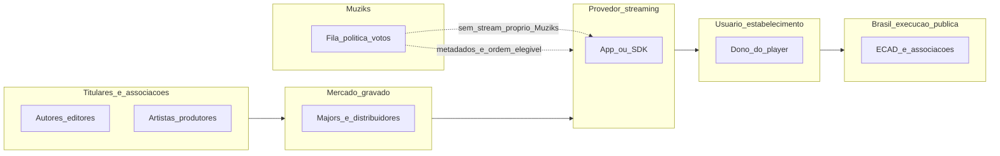

# Fronteiras legais, direitos autorais e papel do Muziks

## Propósito e limites deste documento

Este texto é a **fonte de verdade de produto** sobre **o que o Muziks não faz**, **o que faz** e **onde ficam obrigações de terceiros** (titulares, provedores de streaming, exploradores de espaço, entidades de arrecadação), para alinhar especificações, integrações e futura redação de **Termos de Uso**, **Política de Privacidade** e comunicações ao usuário.

**Não constitui consultoria jurídica.** Decisões contratuais, interpretação de lei e defesa em litígio exigem **advogado habilitado** na jurisdição aplicável (no Brasil, e em outros países se o produto operar fora do território brasileiro).

## O que o Muziks não é (fronteiras explícitas)

- O Muziks **não vende** obras musicais, fonogramas nem **licenças de reprodução** em nome de titulares de direito autoral.
- O Muziks **não substitui** contratos ou licenças entre o usuário e **gravadoras, editoras, distribuidoras, artistas** ou **sociedades de gestão coletiva**.
- O Muziks **não assume**, por si só, o papel de **licenciar execução pública** no estabelecimento ou evento: isso permanece **fora do escopo de produto** como “resolver licenciamento” ([01-vision-and-scope.md](01-vision-and-scope.md)) e é responsabilidade de quem **explora o ambiente** e de **entidades e leis aplicáveis** (ver secção sobre ECAD no Brasil).

## O que o Muziks é (tese operacional para termos legais)

- O Muziks **orquestra fila e política**: curadoria em tempo real, regras do dono do player, votação e ordenação do que é **elegível** a entrar na fila, com base em **identificadores de faixa e metadados** compatíveis com a arquitetura acordada nas specs de domínio e integrações.
- A **reprodução sonora** (fluxo de áudio ouvido no espaço) é **autorizada e executada** pelo **usuário no seu contexto** — em geral o **dono do player / estabelecimento** — através do **aplicativo, integração ou SDK do provedor de streaming** que ele utilizar. O Muziks **não se posiciona como provedor de catálogo nem como fonte proprietária do stream de áudio**; atua como **camada de participação e de regras** sobre o que se pretende enfileirar, alinhado ao [Manifesto](../MANIFESTO.md) (princípio 7: fichas pagam **mecanismo de participação**, não a obra).

### Participação pública vs execução musical

A proposta de valor deve ser descrita como **participação controlada**: sugerir, votar, priorizar ou influenciar faixas dentro da política definida pelo dono do player. Isso é diferente de vender acesso à obra, licenciar execução pública, prometer catálogo próprio ou transferir ao participante o controle irrestrito do som.

Esta distinção é parte da confiança do produto:

- Para o **participante**, a ação é uma influência na fila, não compra da música nem direito garantido de reprodução.
- Para o **dono do player / estabelecimento**, o Muziks organiza regras e UX, mas não elimina a obrigação de manter contas, contratos, licenças e obrigações de conformidade aplicáveis ao uso real do ambiente.
- Para a **copy e os termos**, evitar linguagem que diga ou sugira “toque qualquer música legalmente pelo Muziks”; preferir “participe da fila”, “vote dentro das regras do lugar” e “o áudio toca pelo provedor/conta do dono”.

### Provedores de streaming (lista exemplificativa)

Exemplos de serviços onde o usuário pode reproduzir música mediante **conta e termos próprios** (a lista **não é exaustiva** nem implica parceria com o Muziks):

- Spotify  
- Apple Music  
- YouTube Music  
- Deezer  
- Amazon Music  
- Tidal  

**Marcas, planos e condições mudam.** Qualquer integração técnica deve respeitar os **Termos de Uso** e as **APIs** de cada provedor.

### ISRC: mesma língua para metadados (produto, não licença)

O **ISRC** (*International Standard Recording Code*) identifica **uma gravação** de forma **internacional e estável**. Usá-lo como **chave canónica** no domínio Muziks faz com que gênero, artista, título e regras de *firewall* se apliquem à **mesma obra gravada** quer o dado venha de um ou outro fornecedor — **interfaces e estratégias de endereçamento** podem ser globais na camada do produto, com ganho de **precisão em curadoria** e em **agregar comportamento** (votos, pedidos, analytics) sem confundir remixes, *covers* ou reedições que compartilham título.

Isso **não** concede direito de reprodução nem substitui contrato com titulares ou com o ECAD; apenas alinha **identificação técnica** entre catálogos. Detalhes de modelo e integração: [03-domain-model.md](03-domain-model.md), [11-backend-and-integrations-open.md](11-backend-and-integrations-open.md). Esquema e registro: [IFPI — ISRC](https://isrc.ifpi.org/).

## Acesso ao catálogo e planos (responsabilidade do usuário)

- O usuário (em especial o **dono do player** em contexto comercial) deve manter **conta, plano e tipo de uso** compatíveis com o **contexto real de uso** — por exemplo, distinção entre **consumo pessoal** e **sonorização comercial / ambiente público**, quando o provedor assim exigir nos seus contratos.
- Por isso, a documentação e os termos legais do Muziks devem falar em **uso licenciado conforme o contrato do provedor de streaming** (incluindo eventual **oferta comercial** ou restrição a **uso pessoal**), em vez de afirmar apenas “player pago” de forma absoluta: existem **tiers gratuitos** limitados a **contextos** que o próprio provedor define; em **uso profissional em espaço aberto ao público**, em geral **exige-se conformidade adicional** (plano comercial, outro produto do provedor ou instrumento legal paralelo), sempre conforme **cada provedor**.

## Cadeia de titularidade e mercado gravado (contexto educativo)

Obras musicais gravadas envolvem **titulares** (compositores, editores, artistas intérpretes, **produtores fonográficos**, entre outros, conforme o caso e a lei aplicável). O mercado gravado global concentra grande parte da receita nas **três “majors”**:

- **Universal Music Group (UMG)**  
- **Sony Music Entertainment**  
- **Warner Music Group (WMG)**  

Além delas, há **selos independentes** e **distribuidores** que levam catálogo ao público (exemplos de **canais de mercado**, sem vínculo contratual com o Muziks: **The Orchard** (ecossistema Sony), **ADA** (Warner), **Virgin Music Group** (Universal)).  

**Não** se deve inferir que “todas as músicas” pertencem a um subconjunto fixo de empresas: o catálogo é **misto**; a spec apenas **educa** sobre onde costumam residir negociações de **gravação e distribuição**.

## Execução pública no Brasil e ECAD

No Brasil, a **Lei de Direitos Autorais** ([Lei nº 9.610, de 19 de fevereiro de 1998](http://www.planalto.gov.br/ccivil_03/leis/l9610.htm)) disciplina, entre outros temas, direitos de **execução pública** de obras.

O **ECAD** (Escritório Central de Arrecadação e Distribuição) é a entidade que **centraliza a arrecadação** e a **distribuição** de valores devidos a titulares e às **associações** que representam autores, compositores, editores, artistas intérpretes e executantes, no âmbito do modelo brasileiro de gestão coletiva — conforme a **própria instituição** e a literatura oficial descrevem o papel de intermediação entre **usuários de obras** (ex.: estabelecimentos que **sonorizam** ambientes) e **titulares**.

**Leitura recomendada (oficial / institucional):**

- [ECAD — site institucional](https://www4.ecad.org.br/) (inclui materiais como “Caminho do Direito Autoral” e orientações ao público que **utiliza música**).  
- [Ministério da Cultura — Perguntas frequentes sobre direitos autorais](https://www.gov.br/cultura/pt-br/assuntos/direitos-autorais/perguntas-frequentes/perguntas-frequentes).

Em cenários típicos (**bar, loja, academia, hotel, evento com sonorização**), a **obrigação de licenciar e remunerar a execução pública** (e de **cumprir as normas** da cadeia de gestão coletiva aplicável) recai sobre quem **explora o estabelecimento** ou **organiza o uso público da obra** — não sobre o Muziks **como substituto** desse dever. O Muziks fornece **ferramentas de política e UX**; o **dono do player** permanece o **âncora operacional e de compliance** do ambiente, como em [01-vision-and-scope.md](01-vision-and-scope.md) (premissas).

### Outras jurisdições

Fora do Brasil, podem existir **entidades equivalentes** ou **modelos de licenciamento** distintos. Este documento **não** afirma equivalência legal entre países; apenas recomenda que produto e termos **reconheçam** a necessidade de **conformidade local**.

## Princípios para redação de termos legais e copy de produto

- **Não prometer** “música incluída”, “licença de obra Muziks” ou “isento de ECAD” (ou entidade equivalente).  
- **Não confundir** pagamento de **fichas** (participação na fila) com **pagamento de direitos autorais** ou de **execução pública** ([Manifesto](../MANIFESTO.md), princípio 7).  
- **Deixar explícito** que o **fluxo de áudio** provém do **provedor escolhido pelo usuário**, sob os **termos desse provedor**.  
- **Encaminhar** dúvidas sobre licenciamento a **profissional habilitado** e às **entidades competentes** (ex.: canais oficiais do ECAD no Brasil para **uso de obras em público**).  
- Manter **coerência** com decisões técnicas abertas em [11-backend-and-integrations-open.md](11-backend-and-integrations-open.md) até que “catálogo” e “onde o áudio toca” estejam fechados: esta spec define **guardrails** de narrativa e responsabilidade, não a stack.

## Diagrama: papéis (não é fluxo técnico de dados)

A aresta tracejada indica **coordenação de produto** (política, fila, votos), não **substituição** do contrato do provedor nem **pagamento** de execução pública pelo Muziks.

## Manutenção

- Alterações de posicionamento legal de produto: revisar **este arquivo** e, em seguida, **Termos de Uso** / políticas públicas, com **assessoria jurídica**.  
- Conflito entre este documento e o [Manifesto](../MANIFESTO.md): prevalece o manifesto; esta spec deve ser **corrigida** ([README das specs](README.md), convenções).
