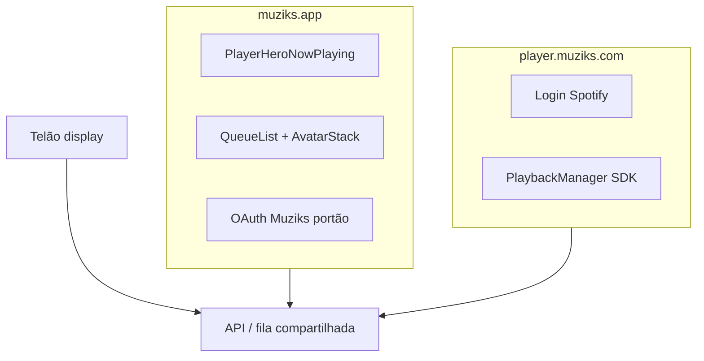
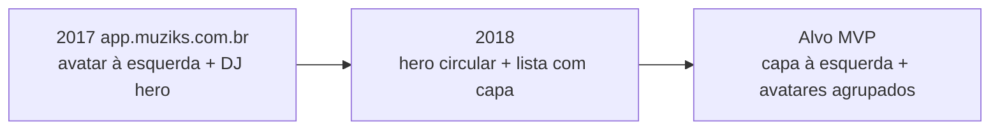
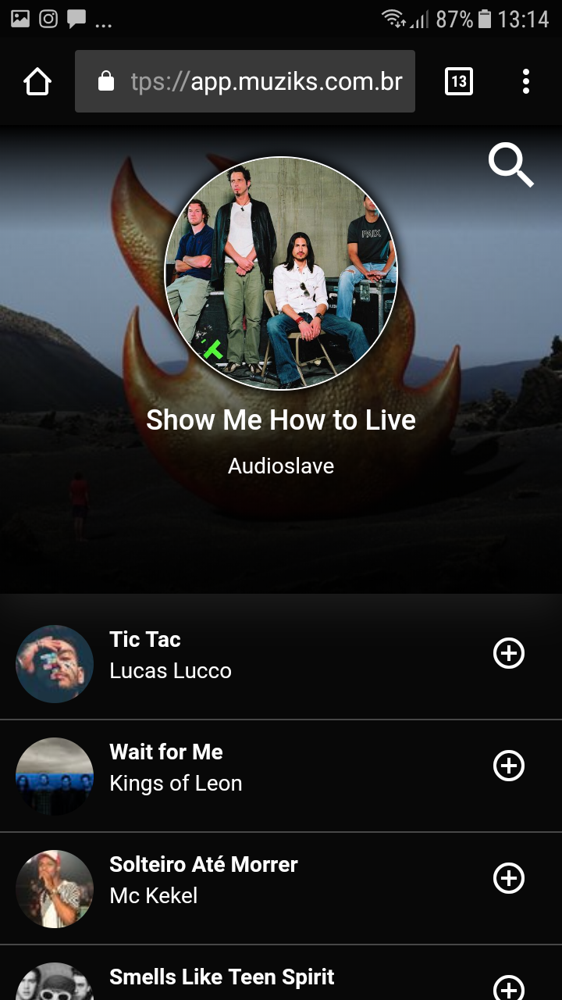

# UI do player e fila (participante)

**Propósito:** especificar o **layout e a interação** da tela mobile do participante (fila, hero, avatares de quem selecionou), a **linha do tempo** desde o produto legado até o alvo do MVP, e o **split de hosts** entre visualização pública e player master (Spotify).

**Normativo:** trechos com “deve” descrevem requisitos de produto/UI acordados nesta pasta.

**Leitura obrigatória:** [06-queue-voting-and-chips.md](06-queue-voting-and-chips.md), [07-ux-copy-and-states.md](07-ux-copy-and-states.md), [05-discovery-and-access.md](05-discovery-and-access.md), [mvp/05-identidade-fosso-participante-voto.md](../mvp/05-identidade-fosso-participante-voto.md), [12-telao-display-publico.md](12-telao-display-publico.md), [09-frontend-architecture.md](09-frontend-architecture.md), [tech/ATOMIC-DESIGN.md](../tech/ATOMIC-DESIGN.md).

**Catálogo visual:** [../images/screens/README.md](../images/screens/README.md).

---

## 1. Escopo

| Superfície | Host | Público | O que esta spec cobre |
|------------|------|---------|------------------------|
| **Visualização / participante** | `muziks.app/{slug-player}` | Espectador e participante | Hero, fila, busca, pilha de avatares, tela expandida de selecionadores |
| **Player master** | `player.muziks.com/{slug-player}` | Dono / operador do espaço | Apenas **referência** de host; layout e fluxo de login Spotify em [06-arquitetura-playback-spotify.md](../mvp/06-arquitetura-playback-spotify.md) |
| **Telão** | Rota ou flag de display (ver spec 12) | Sala / evento | Fora do escopo de layout mobile aqui; mesma fonte de dados de “quem escolheu” |

**Legado de deploy:** documentos anteriores citavam `player.muziks.app/{slug}` como host único. O modelo vigente **separa** apresentação (`muziks.app`) de operação com Spotify (`player.muziks.com`).

**Implementação (quando houver código):** o monorepo pode usar `apps/web` (participante) + `apps/player` (master) ou multi-host no mesmo app — a spec fixa **hosts e responsabilidades**, não a árvore de pastas.

---

## 2. Split de superfícies

| Host | Deve conter | Não deve conter |
|------|-------------|-----------------|
| `muziks.app/{slug}` | Fila pública, hero now-playing, votos/propostas (após portão OAuth Muziks), busca, pilha de avatares | Login Spotify do estabelecimento; SDK de playback no navegador do participante |
| `player.muziks.com/{slug}` | Autenticação Spotify do dono, controles de sessão, orquestração de playback (MVP-B) | Fluxo massivo de espectadores anônimos (redirecionar para `muziks.app`) |

O **QR e deep links** de descoberta ([05-discovery-and-access.md](05-discovery-and-access.md)) **devem** apontar para `muziks.app/{slug}`, não para o host master.

---

## 3. Anatomia da tela participante (`muziks.app/{slug}`)

Regiões verticais (mobile, portrait):

1. **Hero / now-playing** — faixa em destaque, identidade da **música** (não do participante), fundo com efeito parallax (§7).
2. **Lista da fila** — scroll vertical; cada linha conforme §5.
3. **Busca** (quando visível) — campo “o que quer ouvir?” ou ícone que abre busca; alinhado a [07-ux-copy-and-states.md](07-ux-copy-and-states.md) e portão de identidade em [mvp/05-identidade-fosso-participante-voto.md](../mvp/05-identidade-fosso-participante-voto.md).

**Tema:** dark-first, coerente com identidade histórica do produto e PWA em [tech/ESPECIFICACAO-FRONTEND.md](../tech/ESPECIFICACAO-FRONTEND.md). Materiais de vidro: [DESIGN.md](../DESIGN.md) §3 (Glassmorphism na fila/sheets; Liquid Glass no hero).

---

## 4. Linha do tempo: legado → alvo

| Fase | Referência | Layout resumido |
|------|------------|-----------------|
| **Legado ~2017** | [Screenshot_20170715-194626.png](../images/screens/Screenshot_20170715-194626.png) | Barra de busca; **hero DJ** (foto de fundo, nome do DJ, faixa tocando, barra de progresso); fila com **avatar do participante à esquerda** (badge numérico), título/artista, **+** / **−**. Host: `app.muziks.com.br`. |
| **Legado ~2018** | [Screenshot_20180321-131450.png](../images/screens/Screenshot_20180321-131450.png) | **Hero** com imagem de fundo e círculo central grande (artista/faixa), título e artista; lista com miniatura circular e **+** à direita. Parallax já pretendido no hero. |
| **Alvo MVP** | Esta spec §5–§6 | Capa da **música** à esquerda da linha; **quem selecionou** em pilha entre texto e **+**; hero com artwork da faixa (não avatar de usuário). |

### 4.1 Legado 2017

### 4.2 Legado 2018

**Lição de produto:** misturar **identidade do participante** (avatar à esquerda) com **identidade da faixa** gerava ambiguidade. O alvo **separa** música (capa) de pessoas (pilha de avatares).

---

## 5. Fila — linha da música

Ordem horizontal **obrigatória** em cada item da fila:

`[capa da faixa]` · `[título / artista]` · `[pilha de avatares]` · `[botão + ou −]`

| Elemento | Requisito |
|--------|-----------|
| **Capa** | Imagem circular ou arredondada da faixa/álbum; fallback neutro se metadado ausente ([03-domain-model.md](03-domain-model.md)). |
| **Texto** | Título em destaque; artista em peso menor ou cor secundária. |
| **Pilha de avatares** | Ver §6; pode estar vazia se ninguém selecionou ainda. |
| **Ação** | **+** para adicionar voto/seleção (conforme regras em spec 06); **−** quando o usuário já participou daquela faixa e a regra permite remover. |

**Separadores:** linha sutil entre itens (equivalente a `Separator` shadcn).

**Atualização:** polling 3–5 s ([09-frontend-architecture.md](09-frontend-architecture.md)); evitar flicker agressivo ([07-ux-copy-and-states.md](07-ux-copy-and-states.md)).

---

## 6. Pilha de avatares (quem selecionou)

### 6.1 Regras de exibição

- **Deve** mostrar até **4** avatares circulares sobrepostos (estilo “stack”), da esquerda para a direita ou com offset negativo horizontal.
- Se houver **mais de 4** participantes distintos naquela faixa, o quinto slot **deve** ser um indicador **`+N`** (N = total − 4), não um quinto rosto parcial.
- A pilha **deve** ficar **entre** o bloco título/artista e o botão **+** / **−** — não à esquerda da capa (contraste com legado 2017).

### 6.2 Interação

- Toque na pilha (incluindo `+N`) **deve** abrir a **tela expandida de selecionadores** (§6.3).
- Área de toque mínima compatível com alvo tátil (~44×44 px efetivos no conjunto).

### 6.3 Tela expandida de selecionadores

- **Deve** usar overlay mobile de altura adequada (`Sheet` shadcn, full-height ou quase).
- Lista scrollável: avatar + nome de exibição (ou pseudônimo permitido pela política) por participante.
- **Deve** haver controle claro de voltar (gesto ou botão).
- Estado vazio: se a pilha for tocada sem dados (erro de rede), mensagem honesta + retry ([07-ux-copy-and-states.md](07-ux-copy-and-states.md)).

### 6.4 Privacidade e consentimento

- Exibir foto de perfil **somente** quando o participante tiver consentido e a política do player permitir — alinhado a [08-nfr-privacy-accessibility.md](08-nfr-privacy-accessibility.md) e [12-telao-display-publico.md](12-telao-display-publico.md).
- Modo degradado: iniciais ou avatar genérico sem foto.
- O telão pode mostrar rostos em escala maior; o mobile usa a **mesma fonte de verdade** de “quem escolheu”, com regras de opt-in compartilhadas.

### 6.5 Acessibilidade

- `aria-label` descritivo na pilha (ex.: “5 pessoas escolheram esta música; toque para ver lista”).
- Lista expandida: itens focáveis; ordem de tab lógica.

---

## 7. Hero / now-playing e parallax

### 7.1 Conteúdo

O hero **deve** comunicar **o que está tocando ou em destaque**, não quem é o DJ/usuário como elemento principal:

- Artwork da faixa (círculo grande ou card central).
- Título e artista da faixa em destaque.
- Opcional no MVP-B: barra de progresso e tempos (como no legado 2017), sincronizados com sessão de playback quando disponível.

### 7.2 Parallax e material

- **Comportamento desejado:** ao rolar a lista da fila, o fundo do hero (imagem atmosférica ou blur do artwork) **deve** deslocar-se mais devagar que o conteúdo, reforçando profundidade.
- O **card** now-playing no hero **deve** usar **Liquid Glass** ([DESIGN.md](../DESIGN.md) §3.2); busca, sheet de selecionadores e chrome da fila usam **Glassmorphism** (§3.1).
- **MVP:** parallax é **recomendado**; pode ser adiado se o custo de performance em PWA for alto, mantendo hero estático com overlay escuro e vidro estático.
- **Não** depender de parallax para informação crítica (título da faixa permanece legível sem o efeito).

---

## 8. Estados de interface

Estados completos e copy em [07-ux-copy-and-states.md](07-ux-copy-and-states.md). Resumo aplicado a esta tela:

| Estado | Efeito na UI |
|--------|----------------|
| Espectador | Vê hero + fila; **+** e busca acessíveis até o portão OAuth |
| Portão de identidade | Interrompe antes do provedor; explica “por quê” |
| Fila vazia | Hero pode mostrar placeholder; lista com convite à primeira proposta |
| Carregando | Skeleton no hero e nas linhas da fila |
| Erro de rede | Banner ou inline com retry; preservar scroll position quando possível |

---

## 9. Stack UI: shadcn + Material Design 3

| Camada | Escolha |
|--------|---------|
| Primitivos | **shadcn/ui** (Radix) em `components/ui` / `packages/ui` |
| Estilo | **Tailwind CSS** + tokens que espelham papéis MD3 (`surface`, `on-surface`, `primary`) |
| Referência visual | **Material Design 3** para motion, elevação, densidade tátil e hierarquia tipográfica — **sem** adotar MUI como biblioteca de componentes |

### 9.1 Componentes shadcn sugeridos

| Peça da UI | Componente / molécula |
|------------|----------------------|
| Avatares | `Avatar` |
| Pilha | Molécula `ParticipantAvatarStack` (composição de `Avatar` + overflow `+N`) |
| Ação na fila | `Button` variant icon, circular |
| Lista expandida | `Sheet` + `ScrollArea` |
| Separadores | `Separator` |
| Carregamento | `Skeleton` |
| Busca | `Input` + ícone |

Detalhe de pastas Atomic: [tech/ATOMIC-DESIGN.md](../tech/ATOMIC-DESIGN.md).

### 9.2 Mapa Atomic Design (esta tela)

| Nível | Exemplos |
|-------|----------|
| Molécula | `QueueTrackRowMeta`, `ParticipantAvatarStack`, `AddToQueueButton` |
| Organismo | `PlayerHeroNowPlaying`, `QueueList` |
| Página | `ParticipantPlayerPage` → rota `muziks.app/[slug]` |
| Overlay | `SelectorsSheet` (rota secundária ou estado de UI) |

---

## 10. Fora de escopo desta spec

- Layout detalhado do **telão** ([12-telao-display-publico.md](12-telao-display-publico.md)).
- Painel **admin** / configuração de política (rotas `(owner)`).
- Tokens de design completos — ver [DESIGN.md](../DESIGN.md) (identidade e paleta); JSON machine-readable fica para quando existir `apps/web`.
- Implementação do SDK Spotify (ver [mvp/06-arquitetura-playback-spotify.md](../mvp/06-arquitetura-playback-spotify.md)).

---

## 11. Documentação relacionada

| Documento | Uso |
|-----------|-----|
| [09-frontend-architecture.md](09-frontend-architecture.md) | Rotas, monorepo, polling |
| [tech/PROCESSO-DESENVOLVIMENTO.md](../tech/PROCESSO-DESENVOLVIMENTO.md) | Ambientes e deploy por host |
| [tech/MONOREPO-TURBOREPO.md](../tech/MONOREPO-TURBOREPO.md) | `apps/web` vs `apps/player` |
| [ARQUITETURA.md](../ARQUITETURA.md) | Visão consolidada |
