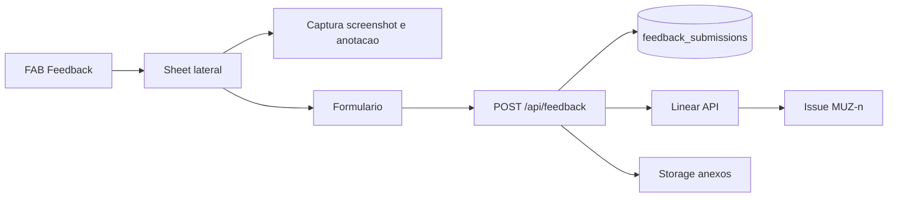
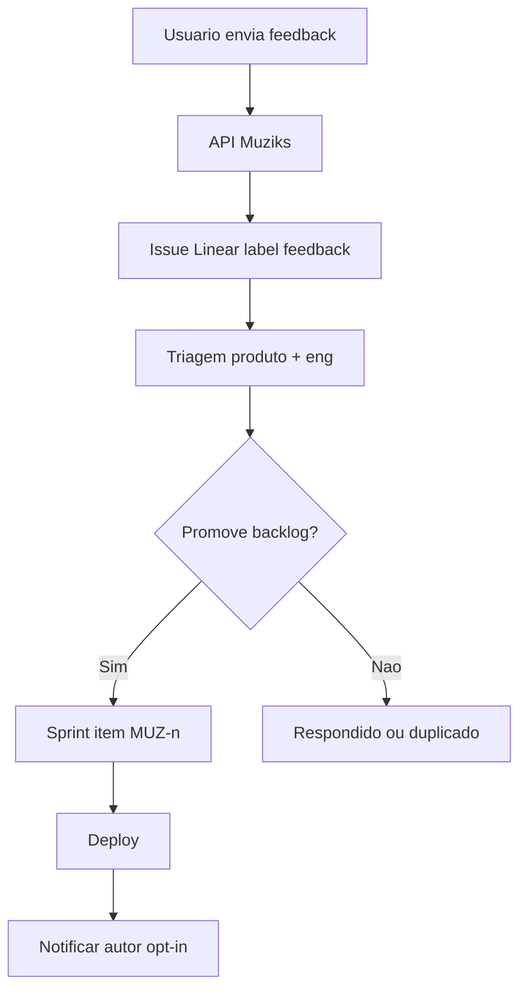

# Feedback in-app, contexto rico e integração Linear

**Status:** normativo (MVP+ / fase pós-PoC estável)  
**Data:** 2026-05-19

**Propósito:** reduzir o **abismo** entre quem usa o Muziks (dono, participante, piloto) e o **issue** que o time abre no Linear — capturando contexto técnico e de produto **no momento** do relato. O feedback é **moat** de produto: o cliente participa das decisões **junto** com engenharia, não só via Discord ou email solto.

Documentos irmãos: [07-ux-copy-and-states.md](07-ux-copy-and-states.md) · [08-nfr-privacy-accessibility.md](08-nfr-privacy-accessibility.md) · [PROCESSO-DESENVOLVIMENTO.md](../tech/PROCESSO-DESENVOLVIMENTO.md) §1 · [MEIOS-DE-COMUNICACAO-E-OPERACAO.md](../tech/MEIOS-DE-COMUNICACAO-E-OPERACAO.md)

---

## 1. Princípio: cliente na frente do backlog

| Regra | Descrição |
|-------|-----------|
| **Elegibilidade de task** | Nova issue de **produto/bug** no backlog **deve** ser rastreável a: (a) feedback in-app, (b) issue Linear de piloto/comunidade, ou (c) spec/decisão explícita no git. Exceção: `debt` / `infra` internos documentados. |
| **Fonte citada** | Toda issue criada via widget **carrega** link ou ID do registro de feedback (`feedback_id`) no corpo ou campo customizado Linear. |
| **Triagem conjunta** | Semanal (ou no ciclo Linear): produto + engenharia revisam fila `label:feedback` antes de promover a sprint — não “telefone sem fio” do relato original. |
| **Fechar o loop** | Quando issue `MUZ-n` for resolvida, notificar opt-in do autor (email ou in-app) com link para release/nota — fase 2. |

O Linear permanece **fonte de execução**; o git (`docs/specs/`) permanece **fonte de comportamento normativo**. Feedback **alimenta** issues; não substitui specs.

---

## 2. Experiência do usuário (UX)

### 2.1 Superfície

| Elemento | Comportamento |
|----------|----------------|
| **Botão flutuante (FAB)** | Ícone discreto (ex.: canto inferior direito); visível em `apps/web` e `apps/player` para usuários autenticados ou em modo piloto (configurável por env). |
| **Painel lateral** | Ao clicar: **drawer/sheet** (shadcn `Sheet`) pela direita; não bloquear a fila inteira em mobile — largura ~360–420px desktop, full-height mobile. |
| **Fechar** | Esc, overlay, botão X; rascunho local opcional (sessionStorage) até envio. |

### 2.2 Conteúdo do formulário

| Campo | Obrigatório | Notas |
|-------|-------------|-------|
| **Tipo** | Sim | `bug` · `ideia` · `confusao` · `outro` |
| **Descrição** | Sim | Texto livre; placeholder humano ([07-ux-copy-and-states.md](07-ux-copy-and-states.md)) |
| **Screenshot** | Não | Captura da viewport ou área selecionada |
| **Anotação** | Não | Desenho/marcação sobre screenshot (setas, caixas, texto curto) |
| **Incluir contexto técnico** | Default on | Checkbox explicado em linguagem simples: “ajuda o time a reproduzir” |
| **Contato** | Não | Email só se usuário quiser resposta; não exigir para enviar |

### 2.3 Estados de UI

| Estado | Copy orientativa |
|--------|------------------|
| Enviando | “Enviando seu relato…” |
| Sucesso | “Obrigado — recebemos. Nossa equipe usa isso para priorizar melhorias.” + ID curto (`FB-xxx`) |
| Erro | “Não conseguimos enviar agora. Tente de novo ou use o link de suporte.” + retry |
| Offline | Guardar rascunho; enviar quando rede voltar (opcional fase 2) |

### 2.4 Acessibilidade

- FAB com `aria-label` (“Enviar feedback”).
- Foco preso no sheet enquanto aberto; retorno de foco ao FAB ao fechar.
- Anotação em canvas com contraste mínimo WCAG para traços padrão.

---

## 3. Contexto capturado (pacote automático)

O sistema **deve** anexar um JSON estruturado (e resumo legível no corpo da issue Linear), sem dados desnecessários ([08-nfr-privacy-accessibility.md](08-nfr-privacy-accessibility.md)).

### 3.1 Pacote mínimo (v1)

| Campo | Exemplo / origem |
|-------|------------------|
| `feedback_id` | UUID gerado no servidor |
| `created_at` | ISO-8601 |
| `app` | `web` \| `player` |
| `app_version` | build / commit curto / `NEXT_PUBLIC_APP_VERSION` |
| `url` | path + query (sem tokens em query) |
| `player_slug` | se na rota `/{slug}` |
| `player_id` | se sessão Muziks resolver |
| `user_role` | `owner` \| `participant` \| `anonymous` |
| `muziks_session_id` | cookie/sessão opaca (não JWT cru) |
| `viewport` | largura × altura, `devicePixelRatio` |
| `user_agent` | string completa (servidor pode truncar) |
| `locale` | `pt-BR` |
| `sync_mode` | se Master: `hybrid` \| `api_device` \| `sdk` |
| `playback_summary` | faixa atual (nome truncado), paused, **sem** token Spotify |
| `queue_snapshot_hash` | hash ou versão da fila — não dump completo de votos |
| `tier` | `free` \| `paid` (para priorização business) |
| `recent_client_errors` | últimos N erros JS capturados (mensagem + stack truncado) |

### 3.2 O que não capturar

- Refresh token Spotify, cookies de auth completos, senhas, dados de cartão.
- Conteúdo de campos de formulário além do que o usuário colou no feedback.
- Localização GPS bruta salva sem consentimento explícito no relato.

### 3.3 Screenshot e anotação

- Formato: PNG WebP; tamanho máximo (ex.: 2 MB) com compressão client-side.
- Upload via API Muziks → storage temporário (Supabase Storage ou anexo Linear) com TTL.
- Anotação: camada vetorial exportada junto (JSON) + imagem composta para humanos.

---

## 4. Arquitetura técnica (Next.js)

### 4.1 Frontend

| Peça | Onde |
|------|------|
| `FeedbackFab` + `FeedbackSheet` | `packages/ui` ou `apps/*/src/components/organisms/` |
| Provider de erros client | `window.onerror` / React error boundary → buffer circular |
| Captura de tela | Biblioteca (ver §5) ou `html2canvas` + canvas overlay |
| Hook `useFeedbackContext()` | Monta pacote §3.1 a partir de stores/session |

**Apps:** `apps/web` (participante + telão leitura) e `apps/player` (Master); **não** obrigatório em `apps/blog` na v1.

### 4.2 Backend (Vertical Slice)

| Slice | Rota sugerida |
|-------|----------------|
| `submit-feedback` | `POST /api/feedback` (ou `/api/players/{slug}/feedback` se escopo por espaço) |

**Passos do handler:**

1. Validar rate-limit (IP + user id).
2. Validar payload (Zod em `@muziks/types`).
3. Persistir linha em `feedback_submissions` (Postgres).
4. Criar issue no **Linear** via API (server-only `LINEAR_API_KEY`).
5. Anexar screenshot(s) — Linear attachment API ou link assinado no corpo.
6. Retornar `{ feedbackId, linearIssueId, linearIssueUrl }`.

Secrets: `LINEAR_API_KEY`, `LINEAR_TEAM_ID`, template de issue — **nunca** no cliente.

### 4.3 Integração Linear

Usar [Linear API](https://developers.linear.app/docs/graphql/working-with-the-graphql-api) (GraphQL) ou SDK oficial.

| Campo Linear | Valor |
|--------------|-------|
| **Team** | Muziks |
| **Title** | `[Feedback] {tipo} — {slug ou app} — {primeiros 60 chars}` |
| **Description** | Descrição do usuário + bloco colapsável “Contexto automático” (markdown) |
| **Labels** | `feedback`, `from-in-app`, tipo (`bug` / `idea`) |
| **Priority** | Inferida na triagem; automático só para `bug` + erro client recente |
| **Links** | URL da página, `feedback_id` interno |

**Reduzir abismo:** corpo da issue **já** contém passos para reproduzir (URL, papel, playback, versão) — engenheiro não precisa pedir “qual bar?” no Discord.

Opcional: campo customizado Linear `Feedback ID` para busca reversa.

---

## 5. Build vs buy (biblioteca)

| Opção | Prós | Contras |
|-------|------|---------|
| **Biblioteca SaaS** (Marker.io, Userback, etc.) | Rápido, anotação madura | Custo, dados fora, LGPD, menos controle do pacote §3.1 |
| **Open source** (html2canvas, fabric.js, konva) | Controle, self-host | Manutenção UX de anotação |
| **Híbrido** | Widget OSS + envio só para API Muziks | Integração custom |

**Decisão v1 (recomendada):** desenvolver **componente próprio** fino (FAB + Sheet + captura + POST interno) usando primitivos **shadcn** e uma lib de screenshot/anotação avaliada em spike (`MUZ-*`). Critério de aceite do spike: anotação usável em mobile + anexo no Linear em menos de 30 segundos.

Se spike falhar prazo: SaaS temporário **somente em pilotos** com DPA e export para Linear manual — não norma de produção.

---

## 6. Persistência local (opcional v1, recomendado v1.1)

Tabela `feedback_submissions`:

| Coluna | Tipo |
|--------|------|
| `id` | uuid PK |
| `created_at` | timestamptz |
| `linear_issue_id` | text nullable |
| `app`, `player_id`, `user_id` | text/uuid |
| `type`, `description` | text |
| `context_json` | jsonb |
| `attachment_urls` | text[] |

Permite métricas: feedback/semana, tempo até issue, taxa de conversão em `done`.

---

## 7. Processo e Linear (workflow)

| Etapa | Dono |
|-------|------|
| Auto-criação issue | Sistema (API) |
| Triagem `label:feedback` | Produto + tech lead |
| Priorização sprint | Alinhado [ROADMAP.md](../ROADMAP.md) |
| Spec derivada | Se mudança normativa → PR em `docs/specs/` **antes** ou **com** merge do código |

Ver [PROCESSO-DESENVOLVIMENTO.md](../tech/PROCESSO-DESENVOLVIMENTO.md) §1.5 (feedback → backlog).

---

## 8. Moat e produto

- **Velocidade de melhoria:** quem opera bar vê que “reportou na sexta, melhorou na terça”.
- **Dados de dor reais:** cluster de `confusao` na fila vs `bug` no Master guia UX e specs.
- **Confiança B2B:** dono pagante sente co-propriedade do roadmap (alinhado a [04-playback-bridge-e-tiering.md](../business/04-playback-bridge-e-tiering.md) — feedback não substitui tier, mas prioriza quem gera receita).
- **Discord/comunidade** complementa, não substitui — template `#feedback-beta` aponta para widget quando app estiver aberto.

---

## 9. NFR e legal

- Consentimento: copy curto no rodapé do sheet — “envio inclui página e dados técnicos listados”.
- Retenção: anexos 90 dias default; issue Linear segue política do time.
- Direito de exclusão: apagar `feedback_submissions` por `user_id` sob pedido LGPD.
- Screenshots podem conter **rostos ou telas de terceiros** — aviso “evite dados sensíveis na captura”.

---

## 10. Critérios de aceite (v1)

- [ ] FAB visível em `web` e `player` (flag env).
- [ ] Sheet com tipo + descrição + screenshot opcional + anotação básica.
- [ ] `POST` cria registro DB + issue Linear com labels `feedback` e contexto §3.1.
- [ ] Nenhum secret no bundle client.
- [ ] Rate-limit impede spam (ex.: 5 envios / hora / IP).
- [ ] Processo documentado: triagem semanal de issues `feedback`.

---

## 11. Fora de escopo (v1)

- Votação pública de features (Canny-style).
- Chat ao vivo com suporte.
- Feedback por WhatsApp (pode linkar no corpo da issue manualmente).
- Tradução automática do relato.

---

## Referências

- [Linear — API](https://developers.linear.app/)
- [PROCESSO-DESENVOLVIMENTO.md](../tech/PROCESSO-DESENVOLVIMENTO.md)
- [MEIOS-DE-COMUNICACAO-E-OPERACAO.md](../tech/MEIOS-DE-COMUNICACAO-E-OPERACAO.md) — `#feedback-beta`
- [13-kpis-fases-e-loops.md](13-kpis-fases-e-loops.md) — instrumentar taxa feedback → done
