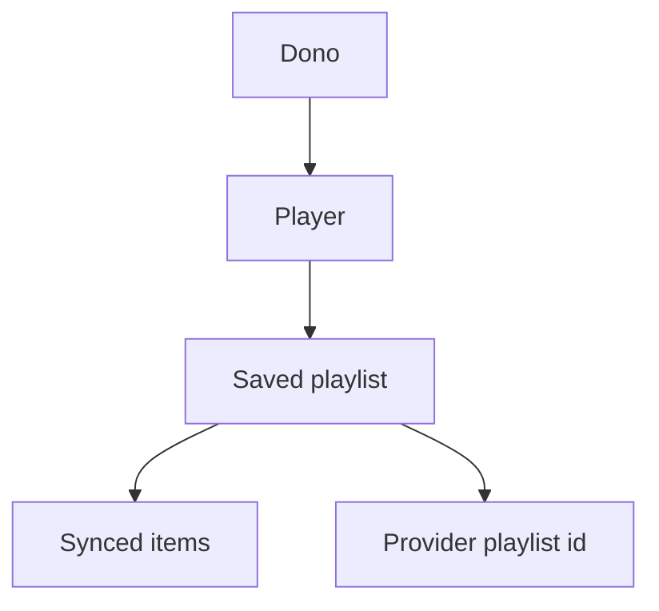

# Playlists de provider e playlist inicial

**Status:** aprovado para implementação inicial  
**Data:** 2026-05-25

**Propósito:** especificar como o Muziks lista playlists do provider, salva snapshots locais, sincroniza uma ou várias playlists e define uma playlist padrão para iniciar o Player Master quando não houver nada tocando.

Documentos relacionados:

- [03-domain-model.md](03-domain-model.md) — fonte de verdade Muziks e ISRC como chave comum
- [11-backend-and-integrations-open.md](11-backend-and-integrations-open.md) — integrações e Spotify como adapter de playback
- [15-backend-architecture.md](15-backend-architecture.md) — Vertical Slice Architecture
- [PLAYBACK-MASTER-CLIENT-SYNC.md](../tech/PLAYBACK-MASTER-CLIENT-SYNC.md) — sync vivo do Player Master
- [14-fronteiras-legais-direitos-autorais.md](14-fronteiras-legais-direitos-autorais.md) — guardrails de provider e execução pública

---

## 1. Escopo

Nesta entrega, o Muziks deve implementar o fluxo **provider -> Muziks** com Spotify como primeiro provider.

| Recurso | Entra agora | Observação |
| ------- | ----------- | ---------- |
| Listar playlists do dono no Spotify | Sim | Via token do dono, server-side. |
| Salvar playlist no Muziks | Sim | Salva snapshot local por `playerId`. |
| Atualizar playlist salva | Sim | Re-sincroniza dados do provider. |
| Sincronizar várias playlists | Sim | Operação em lote, com resultado por playlist. |
| Definir playlist padrão | Sim | Uma default por player. |
| Iniciar player pela playlist padrão | Sim | `PUT /me/player/play` com `context_uri`. |
| Criar playlist nova no Spotify | Não | Fase futura `Muziks -> provider`. |
| Escrever/remover/reordenar itens no provider | Não | Fase futura e dependente de novos escopos. |

---

## 2. Glossário

| Termo | Definição |
| ----- | --------- |
| **Provider playlist** | Playlist que existe no provider externo, como Spotify ou Deezer. |
| **Saved playlist** | Registro local do Muziks que aponta para uma provider playlist. |
| **Synced snapshot** | Cópia local dos metadados e itens da playlist no momento do sync. |
| **Default playlist** | Saved playlist marcada como inicial para um player. |
| **Provider snapshot id** | Versão informada pelo provider. No Spotify, `snapshot_id`. |

O Muziks deve tratar o provider como adapter. A execução no Spotify usa IDs/URIs do Spotify; regras futuras de catálogo devem preferir ISRC quando disponível.

---

## 3. Modelo de domínio

Uma playlist salva pertence a um `player`, não ao usuário globalmente. Isso permite que o mesmo dono opere espaços com defaults diferentes no futuro.



Requisitos:

- Deve existir no máximo uma playlist default por player.
- Playlists e itens salvos são owner-only no banco.
- A fila viva continua em `queue_items`; playlist salva não deve ser misturada automaticamente com a fila.
- Imagens de playlist/faixa vindas do Spotify podem expirar e devem ser tratadas como cache visual, não como storage permanente.
- Itens indisponíveis, locais, episódios ou sem objeto de track válido devem ser ignorados no snapshot inicial.

---

## 4. Fluxo Spotify

### 4.1 Escopos

O Player Master passa a precisar destes escopos além dos escopos de playback já existentes:

- `playlist-read-private`
- `playlist-read-collaborative`

Usuários com token emitido antes desta mudança devem reconectar o Spotify se o provider responder `403` por escopo ausente.

### 4.2 Listagem

O Muziks deve chamar:

```text
GET /me/playlists?limit=50&offset={offset}
```

O resultado deve ser normalizado para a UI com:

- `provider = "spotify"`
- `providerPlaylistId`
- `providerUri`
- `name`
- `description`
- `imageUrl`
- `ownerName`
- `tracksTotal`
- `providerSnapshotId`
- `public`
- `collaborative`

### 4.3 Sync de itens

O Muziks deve chamar:

```text
GET /playlists/{playlist_id}/tracks?limit=50&offset={offset}
```

Para cada track válida, salvar:

- `providerTrackId`
- `providerTrackUri`
- `isrc`
- `title`
- `artist`
- `albumImageUrl`
- `durationMs`
- `position`

O sync deve paginar até consumir todos os itens. O Spotify limita a página a 50 itens.

### 4.4 Playback inicial

Quando uma default existir e o player estiver sem faixa atual, o Player Master deve chamar:

```text
PUT /me/player/play
{
  "context_uri": "spotify:playlist:{playlist_id}",
  "position_ms": 0
}
```

O device alvo deve ser resolvido pelo mesmo caminho dos comandos de playback existentes: device preferido em modo `api_device`, device ativo informado pela sincronização, ou device do estado atual.

---

## 5. Comportamento de produto

### 5.1 Tela Playlists

A tela de playlists do Player Master deve permitir:

- ver playlists vindas do provider;
- ver se a playlist já foi salva no Muziks;
- salvar uma playlist;
- atualizar uma playlist salva;
- selecionar uma ou várias playlists para sync;
- definir uma playlist salva como padrão.

Estados esperados:

| Estado | Comportamento |
| ------ | ------------- |
| Spotify desconectado | Mostrar CTA para conectar Spotify. |
| Escopo ausente | Mostrar copy de reconectar Spotify. |
| Carregando | Mostrar feedback inline sem travar navegação. |
| Erro do provider | Mostrar erro curto e permitir tentar novamente. |
| Playlist vazia | Permitir salvar snapshot vazio, mas sinalizar `0 faixas`. |

### 5.2 Configurações

A tela de configurações deve mostrar a playlist default atual na seção de Player. Se não houver default, deve mostrar um estado vazio com link para a tela Playlists.

### 5.3 Auto-start

O auto-start da default deve acontecer somente quando todas as condições forem verdadeiras:

- Spotify conectado;
- device de playback pronto ou selecionado;
- existe playlist default com `providerUri`;
- estado atual é `idle` ou não há `trackUri`;
- a tentativa ainda não foi feita nesta montagem da tela.

O auto-start não deve acontecer quando:

- já existe uma faixa atual;
- o player está pausado com faixa carregada;
- o dono acabou de executar um comando manual;
- não há device resolvido.

---

## 6. APIs internas

Rotas do `apps/player` devem ser finas e delegar para slices:

| Rota | Método | Uso |
| ---- | ------ | --- |
| `/api/players/{slug}/playlists` | `GET` | Lista saved playlists do Muziks. |
| `/api/players/{slug}/playlists/provider` | `GET` | Lista playlists do provider atual. |
| `/api/players/{slug}/playlists/sync` | `POST` | Sincroniza uma ou várias provider playlists. |
| `/api/players/{slug}/playlists/default` | `GET` | Lê a playlist default. |
| `/api/players/{slug}/playlists/default` | `PUT` | Define a playlist default. |

Todas as rotas devem:

- validar posse do `slug`;
- resolver `playerId` server-side;
- usar token do dono via vault/cookie server-side;
- nunca enviar refresh token ao cliente.

---

## 7. Fora de escopo

- Criar playlist no Spotify/Deezer.
- Atualizar provider a partir da fila Muziks.
- Limpar ou reordenar fila nativa Spotify.
- Transformar playlist salva em fila Muziks automaticamente.
- Abrir leitura pública das playlists salvas para participantes.

---

## 8. Critérios de aceite

- [ ] Spec existe antes do código funcional.
- [ ] Spotify lista playlists com escopos novos.
- [ ] É possível salvar/atualizar uma ou várias playlists.
- [ ] Snapshot local persiste metadados e itens normalizados.
- [ ] Só há uma default por player.
- [ ] Configurações exibem a default atual.
- [ ] Player Master inicia a default por `context_uri` apenas no estado inicial/idle.
- [ ] Lint/typecheck passa nos pacotes alterados.
