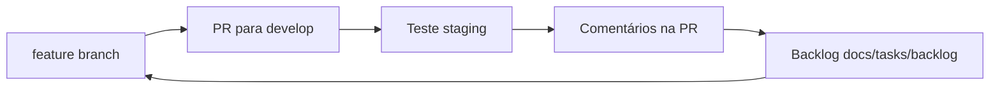

# Ciclo de entrega, backlog e foco (fase atual)

**Status:** vigente até a **versão estável para piloto** (meta: **sábado 30/05/2026**) e enquanto o time for essencialmente **uma pessoa** sem usuários externos em produção.

**Normativo de longo prazo:** [PROCESSO-DESENVOLVIMENTO.md](../tech/PROCESSO-DESENVOLVIMENTO.md) (Linear obrigatório, `MUZ-n` em PRs, branch `staging` quando aplicável). Este documento descreve a **exceção operacional temporária** para ganhar velocidade de descoberta sem jogar fora as regras futuras.

---

## 1. Por que este doc existe

- As **specs** e o processo assumem **Linear** + ritos de time; hoje há **um contribuidor**, produto **sem uso real** ainda, mas já existem **dev (local)**, **staging** e **prod**.
- O ciclo que está funcionando: **feature → PR para `develop` → testar em staging → comentários na PR → extrair feedback para `docs/tasks/backlog/` → repetir**.
- Objetivo imediato: **MVP-B estável** — playback + fila + participante alinhados ao [congelamento MVP](../mvp/congelamento-mvp-e-arquitetura.md), não “fechar o backlog inteiro”.

---

## 2. Ambientes

| Ambiente | Onde | Uso nesta fase |
|----------|------|----------------|
| **dev** | máquina local (`pnpm dev:*`) | implementação, debug rápido, ingest de logs locais |
| **staging** | previews Vercel / deploy de integração (`develop`) | teste realista (Spotify, fila, player + web) |
| **prod** | `muziks.app`, `player.muziks.app` (quando promovido) | só quando o incremento em staging estiver aceitável; piloto em 1–2 lugares reais vem **depois** desta versão “final” interna |

**Regra prática:** feedback de QA e percepções vêm de **staging** (comentários de PR, screenshots, backlog). Promoção para **prod** é consciente, não a cada merge.

---

## 3. Ciclo de desenvolvimento (agora)

| Passo | Ação |
|-------|------|
| 1 | Branch `feature/<slug-curto>` a partir de **`develop`** (bootstrap atual; quando existir branch long-lived `staging` para web/player, seguir [PROCESSO §0.2](../tech/PROCESSO-DESENVOLVIMENTO.md)). |
| 2 | Implementar; `pnpm lint` no escopo alterado. |
| 3 | Abrir **PR → `develop`**. Corpo: o que mudou + como testar em staging. |
| 4 | Testar no ambiente de staging; registrar percepções **na PR** (texto + screenshot). |
| 5 | Consolidar itens acionáveis em **`docs/tasks/backlog/`** (ex.: `YYYY-MM-tema.md`, IDs `P25-xx`). |
| 6 | Priorizar **core** (§5); nova feature ou fix na mesma branch ou nova `feature/*`. |
| 7 | Quando estável o suficiente para “versão final” interna: PR **`develop` → `main`** / deploy prod conforme processo. |

### O que está **relaxado** nesta fase

| Regra normativa (futuro) | Agora |
|--------------------------|--------|
| Todo PR com issue **Linear** `MUZ-n` | **Opcional** — usar IDs do backlog (`P25-01`) ou título da PR; abrir Linear quando for multi-pessoa ou piloto externo |
| Triagem semanal Linear | **Backlog em git** + comentários de PR |
| Branch `feature/MUZ-<n>-slug` | `feature/<slug>` aceitável |
| Feedback in-app → Linear | Widget/spec [17](../specs/17-feedback-in-app-e-linear.md) permanece direção; não bloqueia entrega solo |

### O que **não** relaxamos

- Sem commit direto em **`main`**.
- Specs normativas em `docs/specs/` — mudança de comportamento exige atualizar spec ou PR que documenta exceção temporária.
- Segredos fora do git (`.env`, tokens).

---

## 4. Onde vive cada tipo de informação

| Pasta / artefato | Conteúdo |
|------------------|----------|
| [`docs/tasks/backlog/`](backlog/) | Percepções, bugs de staging, dúvidas de arquitetura, ideias pós-MVP — **fonte de verdade do trabalho pendente** nesta fase |
| [`docs/tasks/todo/`](todo/) | Notas técnicas maiores (ex.: idempotência de estado) ainda não viradas feature |
| [`docs/tasks/tasks/`](tasks/) | *(reservado)* itens **em execução** ativa (opcional; pode ser um `.md` por sprint curto) |
| **PR no GitHub** | Evidência, screenshots, discussão do incremento |
| **Linear** | Retomar quando houver **2+ contribuidores** ou **piloto com dono de espaço** usando prod |

### Legenda de tipos no backlog

| Tipo | Significado | Exemplo |
|------|-------------|---------|
| **bug** | Comportamento errado ou inconsistente | seek dessincronizado |
| **ux** | Fluxo confuso ou pedido repetido | web pedindo dispositivo Spotify |
| **produto** | Escopo novo ou storyboard | subtela de artista |
| **arquitetura** | Desenho, precedência, escala | orchestrator vs votos vs Spotify |
| **ops/humano** | Config fora do código | redirect URL no Spotify Dashboard |
| **polish** | Acabamento visual ou de detalhe — não quebra função, mas melhora percepção de qualidade | favicon em tema claro |
| **ops** | Logs, observabilidade | ingest 1 h de logs staging |

---

## 5. Foco até 30/05/2026 — funcionalidade core

Meta: **uma versão estável** que permita, num cenário controlado (staging → depois 1–2 lugares reais):

1. Dono abre **player**, autentica **Spotify**, escolhe **dispositivo** (só no player).
2. **Play/pause** e troca de faixa refletem **estado coerente** (UI ↔ Spotify ↔ Postgres/realtime).
3. Participante em **web** vê **fila** e **now-playing** atualizados; **vota** sem fluxo de device Spotify.
4. **Fila Muziks** e política básica funcionam com latência aceitável no salão.
5. Sem regressões graves: OAuth em loop, timer parado, fila Spotify divergente após skip.

### Prioridade a partir do [backlog PR #25](backlog/2026-05-staging-pr25-perceptions.md)

| Prioridade | IDs | Motivo |
|------------|-----|--------|
| **P0 — bloqueia core** | P25-02, P25-03, P25-04, P25-05, P25-06, P25-07, P25-09 | playback, sync, separação web/player |
| **P1 — estabilidade** | P25-01, P25-14, P25-10 | permissões, re-render, redirect Spotify |
| **P2 — depois do core** | P25-08, P25-11, P25-12, P25-13 | arquitetura documentada / escala 50+ |
| **P3 — pós-30/05** | P25-15, P25-16, P25-17 | polish, busca rica, artista |

Referência de escopo de produto: [congelamento-mvp-e-arquitetura.md](../mvp/congelamento-mvp-e-arquitetura.md) (**MVP-B** com som).

### Fora do foco até passar o marco

- Subtelas de artista, **polish** extensivo, performance 50+ sem piloto.
- Feedback in-app → Linear automatizado (spec 17) como gate de PR.

---

## 6. Quando voltar ao processo “cheio”

| Gatilho | Ação |
|---------|------|
| **2+ pessoas** commitando no repo | PRs com `MUZ-n`; triagem Linear semanal |
| **Piloto** em 1–2 espaços em **prod** | Issues Linear por bug de campo; labels `feedback` quando widget existir |
| **Branch `staging` long-lived** ativa para web/player | Features partem de `staging`; PR feature → staging ([PROCESSO §0.2](../tech/PROCESSO-DESENVOLVIMENTO.md)) |

Até lá, este arquivo e os backlogs em `docs/tasks/backlog/` são a **fonte operacional**; Linear permanece alinhado às specs, não bloqueia o dia a dia solo.

---

## 7. Referências

- [PROCESSO-DESENVOLVIMENTO.md](../tech/PROCESSO-DESENVOLVIMENTO.md) — norma de longo prazo
- [AGENTS.md](AGENTS.md) — papéis das pastas `backlog` / `todo` / `tasks`
- [2026-05-staging-pr25-perceptions.md](backlog/2026-05-staging-pr25-perceptions.md) — backlog derivado do PR #25
- [ROADMAP.md](../ROADMAP.md) — fases macro do produto
