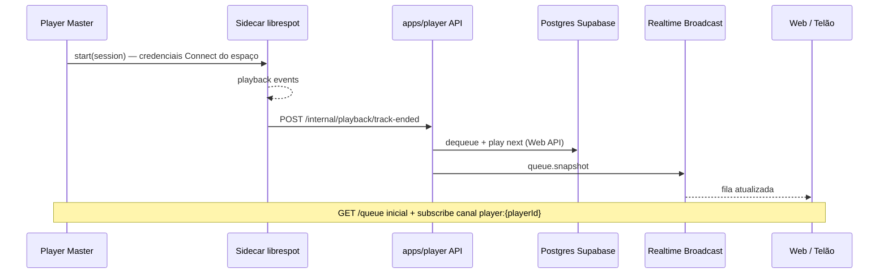

# ADR: Sidecar librespot para fim de faixa e orquestração da fila

**Status:** proposto (não implementado)  
**Data:** 2026-05-18

## Contexto

O Muziks precisa detectar com precisão quando uma faixa **termina** (ou está a poucos segundos do fim) para:

1. **Dequeue** do item atual na fila Muziks (`queue_items`, votos).
2. Opcionalmente **comandar** a próxima faixa no Spotify (Web API oficial ou dispositivo Connect).
3. **Notificar** clientes (Master, telão, participantes) via Realtime.

Hoje:

- O **Web Playback SDK** no Master emite `player_state_changed`, mas **não** dispara dequeue nem `startPlayback` automático.
- O **orchestrator** server (`POST /api/internal/playback-tick`) usa `GET /me/player` e pode emitir `track_ended` no lifecycle — com latência de poll e sem ligar à fila.
- A fila usa **Postgres** como fonte de verdade e **Broadcast** `queue.snapshot` após dequeue (ainda incompleto em votos/enqueue).

A [librespot](https://github.com/librespot-org/librespot) implementa o protocolo **Spotify Connect** e expõe eventos de playback com granularidade útil para timing. Partes do ecossistema dependem de engenharia reversa do web player (tokens TOTP, secrets voláteis) — ver [Reverse engineering · librespot Wiki](https://github.com/librespot-org/librespot/wiki/Reverse-engineering). Isso é **frágil** e **não** deve ser o único caminho de produção; o sidecar é um **sensor** opcional, não substituto da Web API oficial para controle de fila em produto licenciado.

## Decisão

### 1. Serviço sidecar (processo separado)

Rodar um **sidecar** (binário librespot ou wrapper) **fora** do Next.js (`apps/player`), acionado quando o dono inicia playback no Master:

| Responsabilidade | Sidecar | API Muziks (`apps/player`) |
|------------------|---------|----------------------------|
| Observar fim / troca de faixa com precisão | Sim | Não (só consome eventos) |
| Dequeue, votos, ledger, idempotência | Não | Sim |
| `startPlayback` / `addToQueue` (Web API) | Não* | Sim |
| Broadcast `queue.snapshot` | Não | Sim |
| Persistir lifecycle (`track_ended`) | Não | Sim (opcional, duplicar com tick) |

\*O sidecar **pode** tocar áudio via Connect se o produto optar por “Muziks como dispositivo”; o MVP-B prevê Web Playback SDK + Web API no Master — manter controle de “próxima da fila Muziks” na **API** com token OAuth do dono.

### 2. Autenticação: não reutilizar o OAuth do browser

O token OAuth obtido no login Spotify do Player (**Web API** + Web Playback SDK) **não** é o mesmo fluxo que o librespot usa (Connect / credenciais de dispositivo).

- **Não** planejar “passar o mesmo Bearer” do browser para o sidecar.
- O sidecar autentica-se no Connect com credenciais/config **do espaço** (conta Premium do dono), gerenciadas no servidor.
- Comunicação sidecar → Muziks: `POST` interno com **`PLAYBACK_WORKER_SECRET`** (mesmo padrão de `playback-tick`), mais `playerId` e `idempotencyKey` por transição de faixa.

### 3. Contrato HTTP proposto (interno)

```
POST /api/internal/playback/track-ended
Authorization: Bearer <PLAYBACK_WORKER_SECRET>
Content-Type: application/json

{
  "playerId": "uuid",
  "spotifyTrackId": "string",
  "trackUri": "spotify:track:…",
  "endedAt": "ISO-8601",
  "idempotencyKey": "string (min 8)",
  "reason": "track_ended | near_end | track_advanced"
}
```

Handler (server, autoridade):

1. Validar secret + idempotência (reutilizar padrão de `queue_dequeue_ledger` / lifecycle).
2. `dequeueNextQueueItemHandler` com `reason` adequado.
3. Se houver `head` na fila: `startPlayback` via `@muziks/spotify` (token do dono no vault).
4. `broadcastQueueSnapshotFromServer` com `source: "playback"` (estender `queueSnapshotSources` em `@muziks/types`).
5. Opcional: `applyLifecycleFromSample` / evento `track_ended` para histórico e telão.

**Near-end:** o sidecar pode avisar ~5 s antes (`reason: "near_end"`) para preload na fila nativa Spotify; o dequeue definitivo só em `track_ended` ou confirmação de troca de `spotifyTrackId`.

### 4. Fluxo end-to-end



### 5. Fila e Realtime (complemento ao ADR playback)

- **Fonte de verdade:** tabelas `queue_items` / votos no Postgres.
- **Leitura no front:** `GET /api/players/{slug}/queue` → snapshot; updates via **Broadcast** `queue.snapshot` no canal `player:{playerId}` — ver [ADR-playback-hybrid-realtime.md](./ADR-playback-hybrid-realtime.md).
- **Não** expor mutação de fila direto do browser ao Postgres; sidecar também **não** escreve no DB — só chama API interna.
- Após **vote**, **enqueue**, **dequeue** e **track-ended**, a API deve sempre emitir `queue.snapshot`.

Cliente Supabase no front: `@supabase/supabase-js` + `@supabase/ssr` (`createBrowserClient`) — subscribe em `channel('player:{id}').on('broadcast', …)`; não é obrigatório usar `postgres_changes` na fila.

### 6. Fallback e coexistência

| Cenário | Comportamento |
|---------|----------------|
| Sidecar ativo | Fim de faixa preciso → API → dequeue + play |
| Sidecar offline | `playback-tick` (Edge Function → `POST /internal/playback-tick`) continua como backup |
| Master só SDK | UI em tempo real; orquestração de fila **não** no cliente (evitar duplo dequeue) |

Idempotência em dequeue + `idempotencyKey` no track-ended evita avanço duplo se sidecar e tick dispararem juntos.

## Consequências

- Novo deployável (Docker/systemd) além de `apps/player`; documentar em [DOCKER-REGISTRY-E-RELEASES.md](./DOCKER-REGISTRY-E-RELEASES.md) quando existir imagem.
- Operação: secrets Connect do dono, rotação, Premium obrigatório no dispositivo observado.
- Risco legal/ToS: librespot é reverse engineering; uso recomendado como **sensor interno** com playback de produção via APIs oficiais onde possível.
- Manutenção: mudanças no web player Spotify podem exigir atualização do librespot (wiki Reverse engineering).

## Fora de escopo (esta ADR)

- Implementação do binário sidecar e Helm/Dockerfile.
- Substituir Web Playback SDK por librespot como único motor de áudio no browser.
- Tokens web player TOTP do wiki librespot em produção.

## Referências

- [ADR-spotify-state-sync.md](./ADR-spotify-state-sync.md) — visão em duas camadas, diagramas de deploy e coexistência com o Master
- [librespot](https://github.com/librespot-org/librespot) · [Reverse engineering (wiki)](https://github.com/librespot-org/librespot/wiki/Reverse-engineering)
- [ADR-playback-hybrid-realtime.md](./ADR-playback-hybrid-realtime.md)
- [06-arquitetura-playback-spotify.md](../mvp/06-arquitetura-playback-spotify.md) §7.1 (transição ~5 s antes do fim)
- Código: `apps/player/src/lib/realtime/muziks-queue-channel.ts`, `playback-orchestrator-runner.ts`, `packages/queue`
