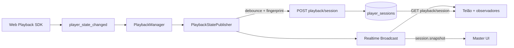
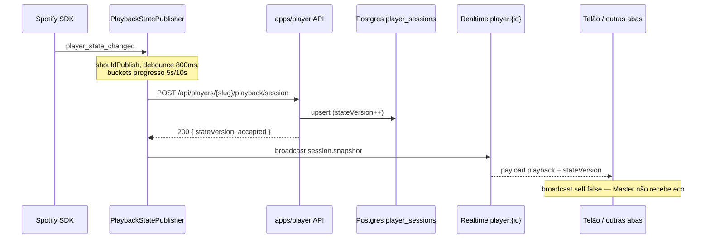
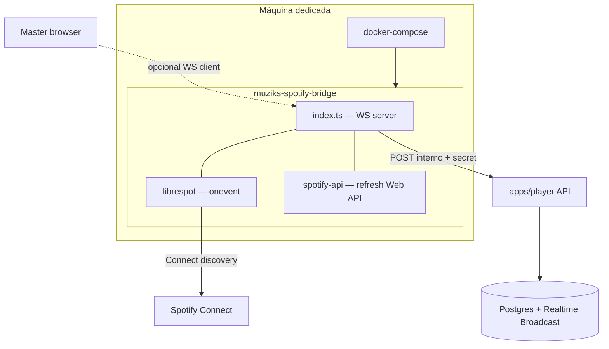
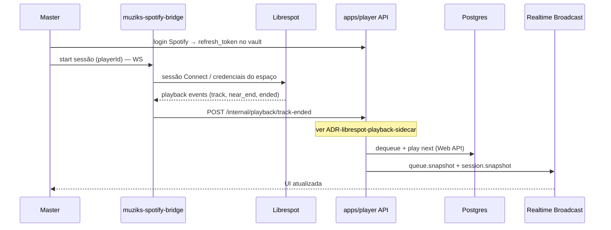
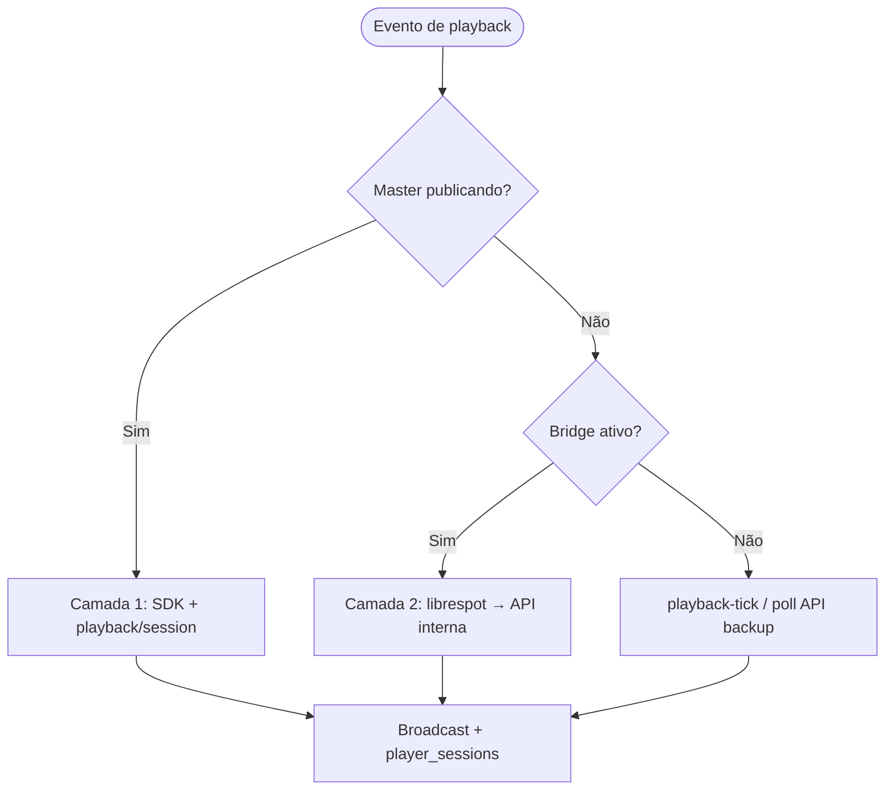

# ADR: Sincronização de estado Spotify (Master, Realtime e bridge)

**Status:** aceito (camada Master) · proposto (camada bridge)  
**Data:** 2026-05-19

## Contexto

O Muziks precisa que **todos os clientes React** (Master, telão, observadores) vejam o mesmo **now playing** (faixa, progresso, pausa, device) com latência baixa, sem depender de poll HTTP pesado na Vercel.

Não existe **webhook oficial** do Spotify para o servidor reagir a cada mudança de playback. As opções viáveis são:

| Caminho | Quando funciona | Limite |
|---------|-----------------|--------|
| **Web Playback SDK** no Master | Master aberto, áudio via browser/kiosk | Aba em background, fechada ou throttled pelo OS → eventos param |
| **Web API** (`GET /me/player`) | Qualquer device Connect ativo | Poll com rate limit; latência |
| **Bridge librespot** (container dedicado) | Espaço com bridge ativo | Operação extra; reverse engineering (sensor) |

Este ADR consolida **dois níveis** de solução que se complementam. Detalhes de fila e dequeue continuam em [ADR-librespot-playback-sidecar.md](./ADR-librespot-playback-sidecar.md); modo híbrido SDK+API em [ADR-playback-hybrid-realtime.md](./ADR-playback-hybrid-realtime.md). **Fluxo cliente Master (diagramas + arquivos):** [PLAYBACK-MASTER-CLIENT-SYNC.md](./PLAYBACK-MASTER-CLIENT-SYNC.md). **Preload near-end e espelho da fila Spotify (Next.js):** [PLAYBACK-NEAR-END-AND-QUEUE-MIRROR.md](./PLAYBACK-NEAR-END-AND-QUEUE-MIRROR.md).

---

## Visão geral (duas camadas)

```mermaid
flowchart TB
  subgraph L1["Camada 1 — Master (implementado)"]
    SDK[Spotify Web Playback SDK]
    PUB[PlaybackStatePublisher]
    API1[POST /api/players/{slug}/playback/session]
    DB[(player_sessions)]
    BC1[Broadcast session.snapshot]
    SDK -->|player_state_changed| PUB
    PUB --> API1
    API1 --> DB
    PUB --> BC1
  end

  subgraph L2["Camada 2 — Bridge (proposto)"]
  BR[muziks-spotify-bridge]
  LS[Librespot]
  WS[WebSocket :8765]
  API2[API interna Muziks]
  BR --> LS
  BR --> WS
  LS -->|onevent / Connect| API2
  API2 --> DB
  API2 --> BC2[Broadcast session.snapshot / queue.snapshot]
  end

  subgraph UI["Clientes React"]
    M[Master]
    T[Telão / participantes]
  end

  BC1 --> UI
  BC2 --> UI
  DB -.->|GET fallback| UI

  L1 -.->|complementa quando Master offline| L2
```

---

## Camada 1 — Master → API → Postgres → Broadcast

**Status:** implementado em `apps/player` (Fase 1–2), com reconciliação Web API no browser e hooks de bridge no publisher.

| Peça | Status |
|------|--------|
| `SdkPlaybackSource` + taxonomia `SdkPlaybackEvent` | Implementado — lifecycle, playback, errors; hidratação via `getCurrentState()` no `ready` |
| `SpotifyApiPlaybackPoller` (`GET /api/spotify/playback/state`) | Implementado — perfil `hybrid` ~3,5 s; perfil `default` ~18 s / 35 s — ver [PLAYBACK-MASTER-CLIENT-SYNC.md](./PLAYBACK-MASTER-CLIENT-SYNC.md) |
| `PlaybackSyncCoordinator` | Implementado — `hybrid` = SDK + API poll; `api_device` = API poll (não eco Postgres) |
| `SessionPlaybackPoller` no Master | **Não usado** para now playing ao vivo — mantido no repo para outros consumidores |
| Fonte `bridge` no `PlaybackStatePublisher` | Hook (`applyBridgeState`, `setBridgeActive`) — librespot/WS em PR futuro |

### Diagrama de fluxo (principal)



### Diagrama de sequência



### Responsabilidades

| Peça | Papel |
|------|--------|
| `PlaybackSyncCoordinator` | SDK + poll Web API; modos `hybrid` / `api_device` / `sdk` |
| `SdkPlaybackSource` | Listeners Web Playback SDK; eventos tipados |
| `SpotifyApiPlaybackPoller` | Poll `GET /api/spotify/playback/state` no browser |
| `PlaybackStatePublisher` | Normaliza estado, evita spam, chama API e Broadcast |
| `publishSessionStateHandler` | Auth do dono (`assertPlayerSlugAccess`), upsert autoritativo |
| `player_sessions` | Fonte de verdade persistida (não criar `player_now_playing`) |
| `player-session-channel` | `session.snapshot` no canal `player:{playerId}` |

### Contrato HTTP (já existente)

```
POST /api/players/{slug}/playback/session
Authorization: sessão Muziks do dono

Corpo (resumo): trackUri, trackName, artistName, albumImageUrl,
positionMs, durationMs, paused, deviceId, status, syncMode,
preferredDeviceId, activeDeviceName, stateVersion
```

Leitura inicial / fallback: `GET /api/players/{slug}/playback/session`.

### Regras de publicação (anti-spam)

Implementadas em `PlaybackStatePublisher`:

- **Debounce:** 800 ms para mudanças que não são troca de faixa.
- **Troca de faixa:** flush imediato.
- **Fingerprint:** track + paused + status + device + bucket de `positionMs` (5 s tocando, 10 s pausado).
- **Modo hybrid:** poll Web API lento no browser; em divergência SDK vs API, **API vence** para reconciliação.

### O que não fazer

| Anti-padrão | Motivo |
|-------------|--------|
| Tabela `player_now_playing` separada | Duplica `player_sessions`; schema já definido em Drizzle |
| `postgres_changes` em cada tick de progresso | Custo e ruído; ADR híbrido exige **Broadcast** |
| Rota genérica `/api/player/now-playing` | Usar slug + slice `publish-session-state` |
| Dequeue / `startPlayback` no listener do SDK | Orquestração de fila só na **API** (idempotência) |
| Assumir que upsert “notifica sozinho” | Fan-out é **Broadcast explícito** após persistência aceita |

### Limitações (por que existe a camada 2)

Com **somente** a camada 1:

- Sem Master ativo, ninguém publica `session.snapshot`.
- Fim de faixa + avanço da fila Muziks não é confiável só com `player_state_changed`.
- Connect em device externo depende de poll Web API no browser.

---

## Camada 2 — Spotify State Service (`muziks-spotify-bridge`)

**Status:** proposto (não implementado). Evolução operacional do sidecar descrito em [ADR-librespot-playback-sidecar.md](./ADR-librespot-playback-sidecar.md).

### Objetivo

Container em **máquina dedicada** (Docker) que:

1. Roda **Librespot** (listener Connect / eventos de playback).
2. Expõe **WebSocket** (porta sugerida `8765`) para múltiplos players/sessões.
3. **Centraliza** observação de estado (`now_playing`, progresso, troca de faixa).
4. Chama a **API Muziks** (webhook interno) para persistir em Supabase e disparar Broadcast — **mesmo contrato mental** da camada 1, sem o browser como único publicador.

### Diagrama de deploy



### docker-compose (referência)

```yaml
# Estrutura alvo — implementação futura em repositório/imagem própria
services:
  spotify-bridge:
    build: .
    container_name: muziks-spotify-bridge
    restart: unless-stopped
    network_mode: host   # discovery Spotify Connect
    environment:
      PLAYER_NAME: Muziks Master
      SPOTIFY_CLIENT_ID: ${SPOTIFY_CLIENT_ID}
      MUZIKS_API_URL: https://player.muziks.app/api/internal/...
      WS_PORT: "8765"
      PLAYBACK_WORKER_SECRET: ${PLAYBACK_WORKER_SECRET}
    volumes:
      - ./cache:/app/cache
      - ./logs:/app/logs
    ports:
      - "8765:8765"
```

`network_mode: host` é recomendado para discovery Connect; em cloud, avaliar alternativas (multicast limitado).

### Diagrama de sequência (bridge + fila)



### Estrutura de projeto (alvo)

```
muziks-spotify-bridge/
├── Dockerfile
├── docker-compose.yml
├── src/
│   ├── index.ts          # WebSocket server
│   ├── librespot.ts      # processo + --onevent
│   └── spotify-api.ts    # Web API (refresh do vault)
├── package.json
└── tsconfig.json
```

### Autenticação e tokens

| Tópico | Decisão |
|--------|---------|
| Web API (dequeue, `startPlayback`) | `refresh_token` do dono no **vault** Supabase; API `apps/player` é autoridade |
| Librespot (Connect) | Credenciais/config **do espaço** no bridge — ver [ADR-librespot-playback-sidecar.md](./ADR-librespot-playback-sidecar.md) §2 |
| Bridge → API | `PLAYBACK_WORKER_SECRET` + `playerId` + `idempotencyKey` |
| Browser → bridge | Não passar Bearer cru; sessão WS autenticada por player/secret de curta duração |

Bridge e sidecar **não escrevem** direto no Postgres; só chamam rotas internas. Regras de fila permanecem em `@muziks/queue` e handlers server.

### Política de produto e tiering (aceito)

O **bridge/sidecar** (`apps/spotify-bridge`) é **somente para espaços pagantes** — quem contribui com receita proporcional ao custo de infra persistente (VM/container, worker, librespot). **Freemium** usa **apenas a camada 1** (SDK + Web API no Master + Postgres + Realtime).

| Tier | Camada 1 (Master / SDK) | Camada 2 (bridge + librespot) |
|------|-------------------------|-------------------------------|
| Freemium / trial | Sim — experiência completa de fila e playback com Master ativo | **Não** — sem provisionamento de bridge |
| Pagante / Pro | Sim | Sim — observação contínua, `track_ended` preciso, menor dependência do browser |

**Racional:** limitação física de abstração de custo — sustentável, seguro (menos workers expostos em massa), idempotência na API Muziks, demanda alinhada à classe de negócio. Detalhe comercial: [04-playback-bridge-e-tiering.md](../business/04-playback-bridge-e-tiering.md).

**Enforcement (alvo):** feature flag por espaço (`playback_bridge_enabled` ou equivalente); rotas internas e provisionamento Docker recusam tier free; allowlist manual até billing automatizado.

---

## Coexistência e fallback



| Cenário | Comportamento |
|---------|----------------|
| Master aberto, hybrid | Camada 1; UI em tempo real no Master |
| Master fechado, bridge ativo | Camada 2 persiste sessão + track-ended |
| Bridge offline | `POST /api/internal/playback-tick` (backup) |
| Sidecar + tick simultâneos | `idempotencyKey` no dequeue evita avanço duplo |

---

## Realtime — canal único por player

Todos os eventos de baixa cardinalidade compartilham o canal Supabase:

| Evento | Payload | Quem publica |
|--------|---------|--------------|
| `session.snapshot` | `playback` + `stateVersion` | Master (`PlaybackStatePublisher`) ou API após bridge |
| `queue.snapshot` | `MuziksQueueSnapshot` | API após vote/dequeue/track-ended |

Canal: `player:{playerId}` · `broadcast.self: false` no Master.

Participantes e telão: `GET` inicial + `subscribeSessionSnapshots` / `subscribeQueueSnapshots` — **não** poll Vercel por progresso.

---

## Mapa de código

### `apps/player` (camada 1)

| Arquivo | Função |
|---------|--------|
| `src/features/playback/services/playback-sync-coordinator.ts` | SDK + API poll + bridge hooks |
| `src/features/playback/services/sdk-playback-source.ts` | Eventos Web Playback SDK |
| `src/features/playback/services/spotify-api-playback-poller.ts` | Poll Web API no Master |
| `src/features/playback/lib/sdk-events.ts` | Taxonomia `SdkPlaybackEvent` |
| `src/features/playback/services/playback-state-publisher.ts` | Debounce, POST, Broadcast |
| `app/api/players/[slug]/playback/session/route.ts` | Rota HTTP |
| `src/slices/playback/publish-session-state/handler.ts` | Upsert autoritativo |
| `src/lib/realtime/player-session-channel.ts` | Subscribe / broadcast cliente |
| `src/lib/realtime/player-session-broadcast-server.ts` | Broadcast server-side (orchestrator) |
| `packages/db/src/schema/player-sessions.ts` | Schema Drizzle |

### `apps/spotify-bridge` (camada 2 — base)

| Arquivo | Função |
|---------|--------|
| `src/index.ts` | Bootstrap HTTP + WS |
| `src/ws/server.ts` | WebSocket, `/health` |
| `src/librespot.ts` | Processo `librespot --onevent` |
| `src/muziks-api-client.ts` | `POST` rotas internas do player |
| `src/spotify-api.ts` | Web API (placeholder) |
| `Dockerfile` / `docker-compose.yml` | Deploy VM |

---

## Consequências

- **Documentação única** para onboarding: este ADR + ADRs especializados (híbrido, sidecar).
- Camada 1 reduz invocações serverless; camada 2 adiciona custo de ops (VM + Docker).
- Imagem `muziks-spotify-bridge` futura: registrar em [DOCKER-REGISTRY-E-RELEASES.md](./DOCKER-REGISTRY-E-RELEASES.md).

## Referências

- [04-playback-bridge-e-tiering.md](../business/04-playback-bridge-e-tiering.md) — bridge só pagantes; freemium = SDK
- [PLAYBACK-NEAR-END-AND-QUEUE-MIRROR.md](./PLAYBACK-NEAR-END-AND-QUEUE-MIRROR.md) — preload, fila dupla, slices `mirror-next`
- [ADR-playback-hybrid-realtime.md](./ADR-playback-hybrid-realtime.md) — decisão Broadcast vs `postgres_changes`
- [ADR-librespot-playback-sidecar.md](./ADR-librespot-playback-sidecar.md) — `track-ended`, dequeue, contrato interno
- [ADR-spotify-web-api-sdk.md](./ADR-spotify-web-api-sdk.md)
- [06-arquitetura-playback-spotify.md](../mvp/06-arquitetura-playback-spotify.md)
- [notes/repos.md](../notes/repos.md) — link librespot-org
- [librespot](https://github.com/librespot-org/librespot) · [Reverse engineering (wiki)](https://github.com/librespot-org/librespot/wiki/Reverse-engineering)
