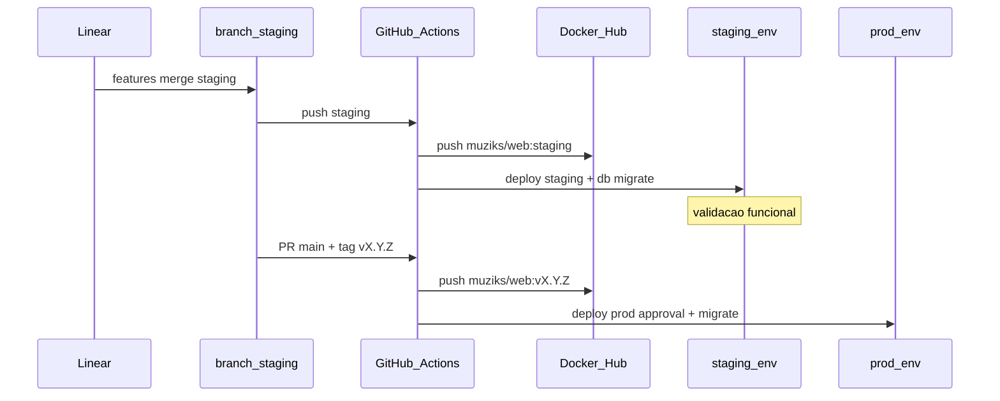
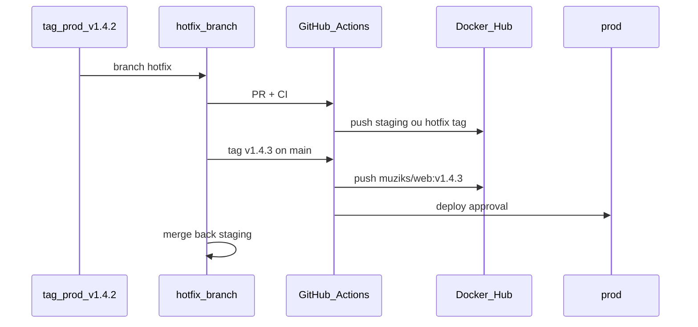

# Registry Docker e releases versionadas

**Propósito:** definir o **hub de imagens Docker** como artefato imutável de **releases funcionais** dos apps (`apps/web`, futuro `apps/api`, opcional `apps/blog`), alinhado a [PROCESSO-DESENVOLVIMENTO.md](PROCESSO-DESENVOLVIMENTO.md) (branches, tags semver, hotfix) e [STACK-E-FASES-DE-MIGRACAO.md](STACK-E-FASES-DE-MIGRACAO.md) (migrations por ambiente).

**Normativo:** convenções com “deve” aplicam-se quando houver releases com imagem Docker; dependem de **GitHub Actions** (§5 de [PROCESSO-DESENVOLVIMENTO.md](PROCESSO-DESENVOLVIMENTO.md)), não do git workflow de branches.

---

## 1. Papel do registry na stack

| Camada | PoC / validação rápida | Release funcional (produção séria) |
|--------|-------------------------|-------------------------------------|
| **Build** | Vercel (integração Next.js) | **Imagem Docker** versionada no registry |
| **Artefato promovível** | Deploy Vercel por commit | **Tag de imagem** = mesma versão do Git (`vX.Y.Z`) |
| **Rollback** | Redeploy commit anterior na Vercel | **Repull** da imagem `vX.Y.(Z-1)` já publicada |
| **Destino do run** | Vercel serverless | ECS/Fargate, Fly.io, Railway, VM, k8s — escolha por fase infra |

O registry **não substitui** o Git como fonte de verdade do código; **complementa** com binário/container **reproduzível** para ambientes que exigem controle operacional (piloto comercial, AWS Fase C, auditoria de “o que está no ar”).

**Regra:** toda promoção a **produção** que use Docker **deve** referenciar uma imagem já validada em **staging** com o **mesmo digest** (ou tag `staging` promovida a `vX.Y.Z` no mesmo pipeline).

---

## 2. Registry escolhido

| Opção | Namespace sugerido | Quando usar |
|-------|-------------------|-------------|
| **Docker Hub** (primário documentado) | `muziks/web`, `muziks/api`, `muziks/blog` | Conta/org **muziks** no Docker Hub; visibilidade pública ou private conforme plano |
| **GitHub Container Registry** (alternativa) | `ghcr.io/<org>/muziks-web` | Mesmo fluxo CI; preferível se tudo ficar no GitHub e sem conta Docker Hub paga |

**Decisão:** usar **um** registry por ambiente de organização; não publicar a mesma release em dois hubs sem necessidade.

### 2.1 Convenção de nomes de imagem

```
<registry>/<namespace>/<app>:<tag>
```

Exemplos (Docker Hub):

| App | Imagem | Tags típicas |
|-----|--------|----------------|
| Player | `muziks/web` | `v1.4.2`, `1.4.2`, `sha-abc1234`, `staging` |
| Spotify bridge | `muziks/spotify-bridge` | idem (`apps/spotify-bridge`) |
| API (futuro) | `muziks/api` | idem |
| Blog (opcional) | `muziks/blog` | idem |

- **Sem** tag `latest` em produção automatizada — operação **deve** pinar `vX.Y.Z` explícito.
- Tag `staging` — último build da branch `staging` (sobrescreveível).
- Tag `sha-<curto>` — rastreio ao commit; imutável.

---

## 3. O que é uma “release funcional inteira”

Uma release **funcional** é um conjunto **fechado** e testado:

| Componente | Incluído na release |
|------------|---------------------|
| **Git** | Tag anotada `vMAJOR.MINOR.PATCH` em `main` |
| **Imagem** | Build multi-stage do app (`apps/web`, etc.) no CI |
| **Schema DB** | Migrations em `packages/db` aplicadas em **staging** antes da tag |
| **Config** | Variáveis por GitHub Environment (`staging` / `production`) — não baked secrets na imagem |
| **Notas** | GitHub Release com changelog + issue Linear fechadas |
| **Smoke** | Checklist mínimo pós-deploy (health, login dono, fila, playback se MVP-B) |

**Não** é release funcional: imagem só com `main` sem passar por `staging`, sem tag semver, ou hotfix sem merge de volta.

---

## 4. Tipos de release e versionamento (SemVer)

Alinhado a [PROCESSO-DESENVOLVIMENTO.md](PROCESSO-DESENVOLVIMENTO.md) §3.1.

| Tipo | Branch / gatilho | Versão | Imagem |
|------|------------------|--------|--------|
| **Release planejado** | Merge `staging` → `main` + tag `vX.Y.Z` | MINOR ou MAJOR conforme contrato | `muziks/web:vX.Y.Z` |
| **Patch programado** | Idem, só correções acumuladas em staging | PATCH | `vX.Y.(Z+1)` |
| **Hotfix não programado** | `hotfix/*` a partir da tag em produção | **Somente PATCH** `vX.Y.(Z+1)` | Mesma convenção; pipeline **fast-track** |
| **Staging contínuo** | Push em `staging` | Sem tag Git obrigatória | `muziks/web:staging` + `sha-*` |

### 4.1 Regras de hotfix

1. Criar `hotfix/MUZ-NNN-descricao` a partir da **tag** em produção (`git checkout v1.4.2 -b hotfix/...`).
2. Correção **mínima**; sem feature nova.
3. CI: lint + build imagem + deploy **staging** (ou ambiente hotfix dedicado) → validação humana.
4. Tag `v1.4.3` em `main`; push imagem `muziks/web:v1.4.3`.
5. **Obrigatório:** merge (ou cherry-pick) em `staging` e `main` para não divergir.
6. Se houver migration: migration **forward-only** e pequena; rollback de app = imagem anterior + runbook DB (STACK §4).

Hotfix **não** deve pular migrate em staging quando a mudança tocar schema.

---

## 5. Fluxos (diagramas)

### 5.1 Release planejado



### 5.2 Hotfix



---

## 6. CI/CD — workflows

Complementa [PROCESSO-DESENVOLVIMENTO.md](PROCESSO-DESENVOLVIMENTO.md) §5.

### 6.0 `apps/spotify-bridge` (implementado)

| Workflow | Gatilho | Tags publicadas |
|----------|---------|-----------------|
| [`docker-spotify-bridge-staging.yml`](../../.github/workflows/docker-spotify-bridge-staging.yml) | Push `staging` + path filters abaixo; ou `workflow_dispatch` | `muziks/spotify-bridge:staging`, `:sha-<7>` |
| [`docker-spotify-bridge-release.yml`](../../.github/workflows/docker-spotify-bridge-release.yml) | Push tag Git `v*.*.*` | `muziks/spotify-bridge:vX.Y.Z`, `:X.Y.Z` |

**Path filters** (staging — não rebuildar quando só `docs/` mudar):

- `apps/spotify-bridge/**`
- `packages/types/**`
- `packages/config/**`
- `pnpm-lock.yaml`, `package.json`, `pnpm-workspace.yaml`

**Build:** contexto na raiz do monorepo; `docker build -f apps/spotify-bridge/Dockerfile .`

### 6.0.1 Setup Docker Hub (privado)

1. Criar repositório **`muziks/spotify-bridge`** no Docker Hub com visibilidade **private**.
2. Gerar **Access Token** (read/write) na conta ou org **muziks**.
3. No GitHub (`lucasargate/muziks` ou org): **Settings → Secrets and variables → Actions**:
   - `DOCKERHUB_USERNAME` — usuário ou org do Hub
   - `DOCKERHUB_TOKEN` — token do passo 2
4. Validar: **Actions → Docker — spotify-bridge (staging) → Run workflow** (`workflow_dispatch`) antes da branch `staging` existir.
5. Rotina manual pós-push: [docs/tests/spotify-bridge/INICIO-RAPIDO.md](../tests/spotify-bridge/INICIO-RAPIDO.md) (guia curto) · [docker-e2e.md](../tests/spotify-bridge/docker-e2e.md) (referência).
6. (Futuro) Environment `production` com **approval** — quando houver job de deploy na VM.

### 6.1 Outros apps (planejado)

| Workflow | Gatilho | Ações |
|----------|---------|--------|
| `docker-build-staging.yml` | Push `staging` + paths `apps/web`, `packages/**` | `docker build` → push `muziks/web:staging` e `:sha-*` |
| `release-docker-prod.yml` | Tag `v*.*.*` | Build → push `:vX.Y.Z` → deploy prod (approval) → `db:migrate` prod |
| `hotfix-docker-prod.yml` | Tag `v*.*.*` em branch `hotfix/*` ou após merge hotfix | Igual release; approval obrigatório |
| `ci.yml` | PR | Lint (sem push de imagem de prod) |

**Path filters:** Turborepo / paths — não rebuildar `web` quando só `docs/` mudar.

### 6.2 Secrets (GitHub Environments)

| Secret | Uso |
|--------|-----|
| `DOCKERHUB_USERNAME` / `DOCKERHUB_TOKEN` | Push para Docker Hub |
| Ou `GITHUB_TOKEN` com `packages: write` | Push para GHCR |
| `DATABASE_URL` por environment | Migrate pós-build, antes ou depois do deploy conforme runbook |
| Credenciais do **runtime** (ECS, Fly, etc.) | Deploy do serviço que **puxa** a imagem |

Produção: **approval gate** no environment `production` (já previsto no processo).

### 6.3 Promoção imagem → ambiente

| Ambiente | Tag consumida | Quem atualiza |
|----------|---------------|---------------|
| **staging** | `staging` ou `sha-*` do último merge | Pipeline automático |
| **production** | **`vX.Y.Z` fixo** | Pipeline na tag; operador não edita tag à mão no cluster |

Inventário de “o que está em prod” = tag Git + digest da imagem no GitHub Release.

---

## 7. Estrutura no monorepo (quando existir código)

```
muziks/
├── apps/web/
│   └── Dockerfile          # ou docker/web/Dockerfile com context na raiz
├── apps/api/               # futuro
│   └── Dockerfile
├── docker/
│   ├── web.Dockerfile        # opcional: Dockerfiles centralizados
│   └── README.md             # build local: pnpm + turbo
├── .github/workflows/
│   ├── docker-spotify-bridge-staging.yml
│   ├── docker-spotify-bridge-release.yml
│   ├── docker-build-staging.yml          # futuro: apps/web
│   └── release-docker-prod.yml           # futuro: apps/web
```

**Build:** contexto na **raiz** do monorepo (`docker build -f docker/web.Dockerfile .`) para `pnpm` + Turborepo resolver `packages/*`.

**Imagem:** Node LTS Alpine ou distroless; estágio `runner` só com output `standalone` do Next.js quando aplicável.

---

## 8. Coexistência com Vercel (fases)

| Fase | Deploy player |
|------|----------------|
| **A — PoC** | Vercel Hobby/Pro; imagens Docker **opcionais** (CI já publica para testar pipeline) |
| **B — Piloto comercial** | Staging Vercel **ou** container; **produção** pode exigir imagem pinada (SLA, rollback) |
| **C — AWS / próprio** | Produção **deve** consumir registry; Vercel deixa de ser origin de prod |

Registrar no Linear issue `infra` ao cruzar cada gatilho.

---

## 9. Checklist — release funcional (antes da tag)

- [ ] Issues Linear da release fechadas ou movidas
- [ ] `staging` verde (lint, build, migrate)
- [ ] Smoke em `staging-player.muziks.app` documentado
- [ ] Changelog / Release notes redigidos
- [ ] Sem secrets no Dockerfile nem na imagem
- [ ] Migrations idempotentes e testadas
- [ ] Tag `vX.Y.Z` e imagem com **mesmo** número de versão
- [ ] Plano de rollback: tag e imagem `vX.Y.(Z-1)` anotados na Release

---

## 10. Checklist — hotfix emergencial

- [ ] Branch `hotfix/*` a partir da tag em produção
- [ ] Escopo mínimo; revisão em &lt; 24 h quando possível
- [ ] Validado em staging (ou ambiente hotfix)
- [ ] PATCH semver + imagem nova
- [ ] Merge de volta em `staging` e `main`
- [ ] Post-mortem leve em Linear se incidente de produção

---

## 11. Documentos relacionados

| Documento | Conteúdo |
|-----------|----------|
| [PROCESSO-DESENVOLVIMENTO.md](PROCESSO-DESENVOLVIMENTO.md) | Branches, tags, ambientes, approval |
| [STACK-E-FASES-DE-MIGRACAO.md](STACK-E-FASES-DE-MIGRACAO.md) | Migrations CI/CD, fases infra |
| [MONOREPO-TURBOREPO.md](MONOREPO-TURBOREPO.md) | Apps e packages no build |
| [congelamento-mvp-e-arquitetura.md](../mvp/congelamento-mvp-e-arquitetura.md) | Escopo por fase |

---

## Manutenção

Mudança de registry (Docker Hub ↔ GHCR), política de tag ou critério de “release funcional” **deve** atualizar este arquivo e a §5–6 de [PROCESSO-DESENVOLVIMENTO.md](PROCESSO-DESENVOLVIMENTO.md).
