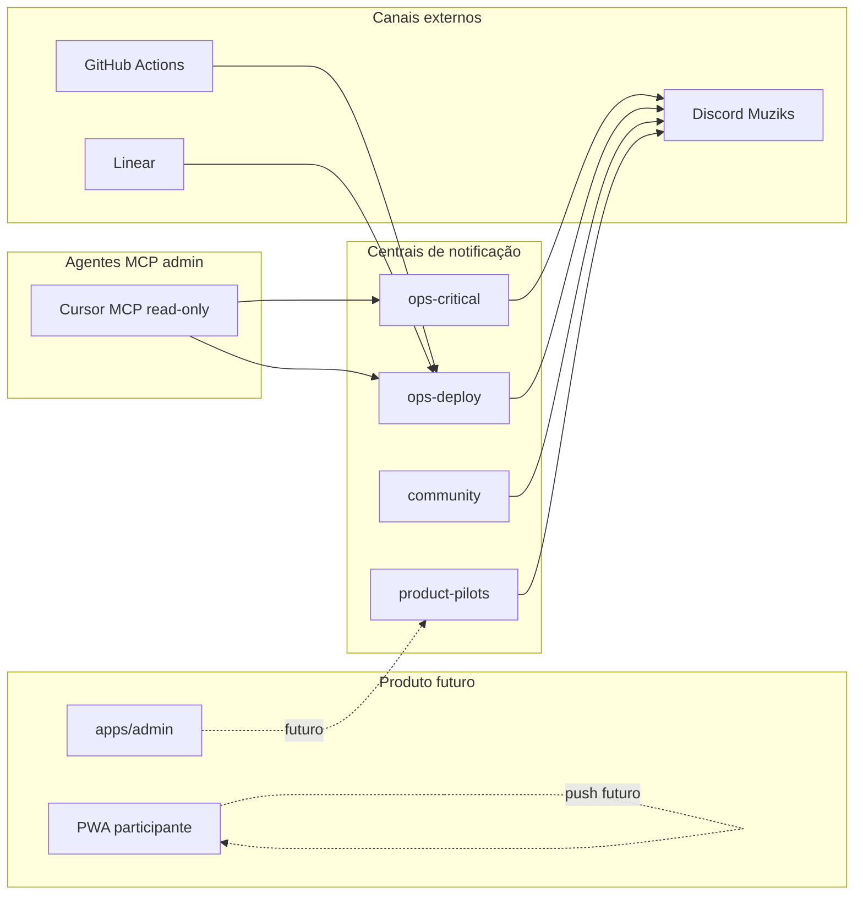
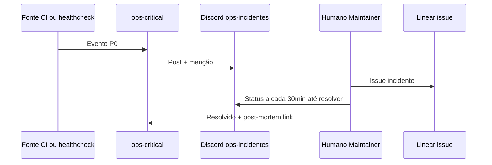

# Meios de comunicação e operação (Muziks)

**Propósito:** definir como o time, a comunidade e os **agentes (MCP)** se comunicam fora do produto — servidor Discord, **centrais de notificação** e **controles administrativos** assistidos por IA — sem misturar isso com notificações **in-app** do participante (futuro).

**Estado:** normativo para **operação e comunidade**; implementação de bots, webhooks e servidores MCP é **incremental** (Fase 0–2 do [ROADMAP](../ROADMAP.md)).

Documentos irmãos: [PROCESSO-DESENVOLVIMENTO.md](PROCESSO-DESENVOLVIMENTO.md), [STACK-E-FASES-DE-MIGRACAO.md](STACK-E-FASES-DE-MIGRACAO.md), [11-backend-and-integrations-open.md](../specs/11-backend-and-integrations-open.md) §8 (push no PWA).

---

## 1. Visão geral

| Canal | Público | Uso principal |
|-------|---------|----------------|
| **Discord (servidor Muziks)** | Comunidade dev, pilotos, time núcleo | Suporte leve, anúncios, incidentes internos, extração rápida de contexto |
| **Linear** | Time de execução | Issues, priorização, vínculo PR — [PROCESSO-DESENVOLVIMENTO.md](PROCESSO-DESENVOLVIMENTO.md) §1 |
| **GitHub** | Código, specs, CI | PR, Actions, Discussions (complementar ao Discord) |
| **Centrais de notificação** | Ops + donos (futuro) | Um lugar por **severidade** e **audiência**; evita ruído no chat |
| **MCP (admin)** | Mantenedores com Cursor | Consultas read-only, relatórios, ações **explícitas** e auditáveis |

**Separação importante**

- **Push no PWA** (“sua faixa subiu”) — produto, participante, [11-backend](../specs/11-backend-and-integrations-open.md) §8; **fora** deste doc.
- **Discord + centrais + MCP** — operação, comunidade OSS e time; **não** substituem suporte pago com SLA ([business/01](../business/01-receita-rentabilidade-e-go-to-market.md) §6).

---

## 2. Servidor Discord Muziks

### 2.1 Objetivos

1. **Comunidade dev/entusiasta:** self-host, dúvidas, showcase de instalações — alinhado ao *go-to-market* OSS em [01-receita](../business/01-receita-rentabilidade-e-go-to-market.md).
2. **Coordenação interna:** deploys, incidentes, decisões rápidas entre mantenedores.
3. **Ponte com pilotos (beta):** canal dedicado quando existir Fase 3 do roadmap — sem misturar com `#geral`.

### 2.2 Estrutura sugerida (categorias e canais)

| Categoria | Canal | Quem lê | Notas |
|-----------|-------|---------|--------|
| **Comece aqui** | `#regras` `#apresentacoes` | Todos | Link para manifesto, código de conduta, sem PII de terceiros |
| **Comunidade** | `#geral` `#ajuda-self-host` `#showcase` | Público | *Best effort*; não é canal de incidente de produção |
| **Produto** | `#anuncios` `#feedback-beta` | Comunidade + pilotos | Somente leitura em anúncios; feedback estruturado (template fixado) |
| **Desenvolvimento** | `#dev` `#specs` `#integracoes` | Contribuidores | Encaminhar decisões normativas para **PR no git**, não só chat |
| **Operação** | `#ops-deploys` `#ops-alertas` `#ops-incidentes` | Time + bots | Alimentados pelas **centrais** (§3); `#ops-incidentes` só mantenedores |
| **Off-topic** | `#lounge` | Opcional | Moderado |

### 2.3 Papéis (roles)

| Role | Permissão típica | Atribuição |
|------|------------------|------------|
| `@everyone` | Ler comunidade; escrever em ajuda/geral | Automático |
| `Piloto` | `#feedback-beta` + thread privada de piloto | Convite manual |
| `Contribuidor` | `#dev`, `#specs` | Após primeiro PR mergeado (critério a publicar em `#regras`) |
| `Maintainer` | Todos os canais ops | Time núcleo |
| `Bot` | Postar em `#ops-*`; sem admin global | Webhooks / bot oficial |

**Regra:** papéis de **moderação** (kick/ban) ficam só com `Maintainer`; bots **não** recebem permissão de administrador no servidor.

### 2.4 Fases de adoção

| Fase roadmap | Discord |
|--------------|---------|
| **0 — Fundação** | Criar servidor, `#regras`, `#geral`, `#dev`, `#ops-alertas` (manual ou webhook GitHub) |
| **1 — Stack** | `#ops-deploys` ligado a Actions; integração Linear → notificação (opcional) |
| **2 — MVP interno** | `#feedback-beta` fechado; template de bug report |
| **3+ — Beta / lançamento** | `Piloto`, moderação documentada; link no README do app |

### 2.5 O que **não** vai para o Discord

- Dados pessoais de participantes de bares (LGPD).
- `service_role` Supabase, tokens Spotify, secrets de produção.
- Decisões **normativas** só no chat — devem virar commit em `docs/specs/` ou `docs/tech/`.

---

## 3. Centrais de notificação

“Central” aqui é um **destino lógico** (canal Discord, webhook, email ops, dashboard futuro) com contrato claro de **o que entra** e **quem é mencionado**.

### 3.1 Catálogo de centrais (MVP operacional)

| ID central | Severidade | Audiência | Exemplos de evento | Destino inicial |
|------------|------------|-----------|-------------------|-----------------|
| `ops-critical` | P0 | Maintainer on-call | API down, erro de migrate prod, vazamento suspeito | `#ops-incidentes` + menção role |
| `ops-deploy` | P2 | Time técnico | Deploy staging/prod, tag `v*`, falha CI em `main`/`staging` | `#ops-deploys` |
| `ops-data` | P3 | Quem pediu relatório | Export analytics concluído, job agendado falhou | Thread ou `#ops-alertas` |
| `community` | info | Comunidade | Release notes, post de blog, changelog | `#anuncios` |
| `product-pilots` | info | Pilotos | Janela de manutenção, nova build beta | `#feedback-beta` (pin) |

### 3.2 Contrato mínimo de mensagem

Toda notificação automática **deve** incluir:

1. **Título** curto (`[deploy][staging] web @ sha-abc123`).
2. **Ambiente** (`dev` | `staging` | `prod`).
3. **Link** (PR, workflow run, issue Linear, dashboard).
4. **Timestamp** UTC.
5. **Sem** corpo de log completo — link para artefato (GitHub Actions, Sentry futuro).

### 3.3 Fontes (roteamento)

| Fonte | → Central | Quando configurar |
|-------|-----------|-------------------|
| GitHub Actions | `ops-deploy`, `ops-critical` (falha) | Com monorepo — [PROCESSO-DESENVOLVIMENTO.md](PROCESSO-DESENVOLVIMENTO.md) §5 |
| Linear (automação) | `ops-deploy` (issue `infra` fechada) | Projeto Muziks criado |
| MCP admin (consulta) | `ops-data` (resposta sob demanda) | Fase 0 — manual no Cursor |
| App / API (futuro) | `product-pilots` | Beta fechado |

### 3.4 Escalonamento (incidentes)

**Pós-incidente:** nota de uma página no git (`docs/analytics/` ou issue Linear `infra`); mudança normativa em spec se aplicável.

---

## 4. Agentes MCP para controles de admin *(por hora)*

**Escopo atual (“por hora”):** facilitar **operações** e **extração de dados** para mantenedores no **Cursor**, sem expor superfície MCP ao participante nem ao dono do bar no MVP.

Isso é distinto de:

- **Agentes curador** no produto ([firewall-curador-com-agentes.md](../disruption/firewall-curador-com-agentes.md)).
- **IA-first** no repositório ([ROADMAP](../ROADMAP.md) — redação de specs).

### 4.1 Princípios

| Princípio | Regra |
|-----------|--------|
| **Read-first** | Ferramentas padrão são **somente leitura** (métricas, filas de issue, schema, relatórios analytics). |
| **Ação explícita** | Escrita (migrate, toggle feature, ban user) exige ferramenta separada, confirmação humana e log. |
| **Sem secrets no chat** | MCP usa env local / vault; nunca retorna `service_role` ou tokens OAuth. |
| **Auditoria** | Toda ação de escrita registra **quem** (conta GitHub/Linear), **o quê** e **issue** vinculada. |
| **Ambiente** | Default `dev` ou `staging`; `prod` só com perfil MCP `admin-prod` e checklist. |

### 4.2 Catálogo de servidores MCP (alvo)

| Servidor MCP | Ferramentas (exemplos) | Fase |
|--------------|------------------------|------|
| **linear** | Buscar issue, criar comentário, listar ciclo | Já utilizável no Cursor |
| **github** | PR, checks, workflow runs | Com monorepo |
| **muziks-supabase-read** | `query_readonly`, `count_players`, `health` | Após projeto Supabase dev |
| **muziks-analytics** | Ler agregados em `docs/analytics/data/` | Fase 0 (arquivos locais) |
| **discord-ops** *(opcional)* | Postar em central `ops-data` com template | Quando bot existir |

Servidores **custom** `muziks-*` vivem fora deste repo (repositório `muziks-mcp` ou pasta `tools/mcp/` no monorepo quando houver código) — este documento define **contrato**, não implementação.

### 4.3 Perfis de uso no Cursor

| Perfil | MCP habilitado | Uso típico |
|--------|----------------|------------|
| `contributor-docs` | github (read), linear (read) | Specs, PR de docs |
| `maintainer-ops` | + supabase-read, analytics | Investigar piloto, custos, fila |
| `maintainer-prod` | + ações limitadas (futuro) | Incidente; exige segundo humano em P0 |

Arquivo de exemplo (local, **não** commitar secrets): `.cursor/mcp.json` na máquina do mantenedor; template versionado em `docs/tech/mcp.template.json` quando o monorepo existir.

### 4.4 Fluxos assistidos (exemplos)

**Extração de dados**

1. Maintainer pergunta no Cursor: “quantos players ativos em staging na última semana?”.
2. Agente chama `muziks-supabase-read` com SQL parametrizado aprovado.
3. Resposta em markdown; se útil para stakeholders, export para `docs/analytics/reports/` via PR.

**Operação**

1. Falha de deploy em `#ops-deploys`.
2. Agente lê workflow via MCP GitHub, resume causa, sugere issue Linear `infra`.
3. Humano aplica correção; merge; notificação resolve thread.

**O que o agente MCP não faz**

- Alterar política de firewall de um player em produção sem issue e revisão.
- Responder participante de bar em nome do Muziks (suporte comercial é outro canal).

### 4.5 Roadmap MCP admin

| Marco | Entrega |
|-------|---------|
| **Agora** | Linear + docs locais; Discord manual |
| **Monorepo** | Template MCP + GitHub read |
| **Supabase dev** | `muziks-supabase-read` com views read-only |
| **Beta** | Bot Discord + central `product-pilots` |
| **Pós-lançamento** | Dashboard ops único (opcional); MCP continua para deep-dive |

---

## 5. Integração com processo existente

| Atividade | Onde registrar | Notificação |
|-----------|----------------|-------------|
| Issue de execução | Linear | Opcional → `ops-deploy` ao fechar `infra` |
| Spec normativa | PR → `main` | Não automático; anúncio manual em `#anuncios` se relevante |
| Release `v*` | Tag GitHub | `ops-deploy` + `#anuncios` (changelog) |
| Incidente P0 | Linear + `#ops-incidentes` | `ops-critical` |
| Relatório analytics | `docs/analytics/reports/` | `ops-data` ou PR apenas |

Cadência do [ROADMAP](../ROADMAP.md): review **quinzenal de agentes** inclui revisão deste doc e dos prompts MCP (§4.3).

---

## 6. Segurança e privacidade

- Webhooks Discord: URL em GitHub **Secrets** por ambiente; rotacionar se vazar.
- Canais `#ops-*`: visibilidade restrita a `Maintainer` + bots.
- Dados de pilotos: pseudônimos nos threads; IDs internos só em ferramentas com auth.
- Alinhar [08-nfr-privacy-accessibility.md](../specs/08-nfr-privacy-accessibility.md) quando notificações tocarem donos de espaço.

---

## 7. Checklist de bootstrap (Fase 0)

- [ ] Criar servidor Discord **Muziks** (nome + ícone alinhados à [marca](../legal/marca-e-uso-do-nome.md)).
- [ ] Publicar `#regras` (link manifesto, AGENTS.md, sem secrets).
- [ ] Criar centrais `ops-alertas`, `ops-deploys`, `ops-incidentes` com permissões.
- [ ] Configurar webhook GitHub → `#ops-deploys` (repositório `muziks`).
- [ ] Projeto Linear **Muziks** + label `infra` para incidentes.
- [ ] Documentar no README do repo o **invite** da comunidade (link estável).
- [ ] Template local MCP: Linear + leitura do repositório; planejar `muziks-supabase-read`.

---

## Manutenção

Mudanças em canais, centrais, perfis MCP ou política de incidentes **devem** atualizar este arquivo e, se afetarem CI ou ambientes, [PROCESSO-DESENVOLVIMENTO.md](PROCESSO-DESENVOLVIMENTO.md).

*Última intenção: um mapa único para “como o time fala, alerta e investiga” sem acoplar isso ao PWA do participante.*
