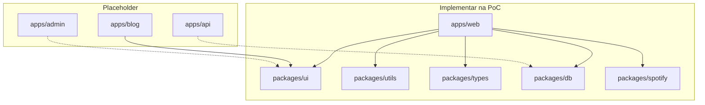

# Monorepo Turborepo

**Propósito:** definir a estrutura de pastas, domínios, grafo de dependências e o que implementar na PoC vs placeholders futuros.

**Normativo** para quando o código existir. O repositório **hoje** contém apenas `docs/` — este documento descreve o layout ao iniciar implementação ([AGENTS.md](../../AGENTS.md)).

Documentos irmãos: [STACK-E-FASES-DE-MIGRACAO.md](STACK-E-FASES-DE-MIGRACAO.md), [PROCESSO-DESENVOLVIMENTO.md](PROCESSO-DESENVOLVIMENTO.md), [DOCKER-REGISTRY-E-RELEASES.md](DOCKER-REGISTRY-E-RELEASES.md), [ESPECIFICACAO-FRONTEND.md](ESPECIFICACAO-FRONTEND.md), [ATOMIC-DESIGN.md](ATOMIC-DESIGN.md).

---

## 1. Estrutura de pastas

```
muziks/                          ← raiz do monorepo
├── apps/
│   ├── web/                     ← player.muziks.app/{slug} — PWA, fila, participante, telão
│   ├── blog/                    ← blog.muziks.com.br
│   ├── admin/                   ← futuro painel admin (placeholder)
│   └── api/                     ← futuro backend dedicado (placeholder)
├── packages/
│   ├── ui/                      ← shadcn + tokens (Atomic Design)
│   ├── utils/                   ← helpers puros (cn, formatadores)
│   ├── types/                   ← tipos de domínio compartilhados
│   ├── spotify/                 ← abstrações Spotify (Deezer futuro: pkg ou subpasta)
│   └── db/                      ← schema Drizzle, migrations, client Postgres
├── docker/                      ← Dockerfiles (contexto raiz; ver DOCKER-REGISTRY-E-RELEASES.md)
├── docs/                        ← especificações (permanecem na raiz)
├── turbo.json
├── pnpm-workspace.yaml
└── package.json
```

Opcional na Fase A: `packages/config` (`eslint-config`, `tsconfig` base) quando `admin`/`api` existirem.

---

## 2. Domínios e deploy

| Domínio | App | Host / path | Ambientes | Projeto Vercel |
|---------|-----|-------------|-----------|----------------|
| **muziks.com.br** | `apps/blog` | **blog.muziks.com.br** | dev + prod | Separado |
| **muziks.app** | `apps/web` | **player.muziks.app/{universal-slug-player-name}** | dev + staging + prod | Separado |

- O **slug universal** do player identifica o contexto na URL pública — alinhar a [05-discovery-and-access.md](../specs/05-discovery-and-access.md).
- Apex `muziks.com.br` pode redirecionar para o blog (registros na **Cloudflare** → origin Vercel).
- **Dois projetos Vercel** — políticas de branch e CI distintas ([PROCESSO-DESENVOLVIMENTO.md](PROCESSO-DESENVOLVIMENTO.md)).
- **DNS** já na Cloudflare; proxy laranja na frente da Vercel. Recursos CF adicionais (R2, Pages, Workers): [STACK-E-FASES-DE-MIGRACAO.md](STACK-E-FASES-DE-MIGRACAO.md) §1.4.

---

## 3. Responsabilidade por app

### 3.1 `apps/web` (PoC — implementar)

- Next.js App Router, PWA, participante, fila, telão, painel do dono (pode viver em `app/(owner)/` na PoC).
- API Routes / Server Actions; Supabase como BaaS.
- Roteamento: `player.muziks.app/[slug]/...`

### 3.2 `apps/blog` (PoC ou logo após `web`)

- Conteúdo institucional, SEO, posts.
- GitFlow simples; sem staging.
- Pode compartilhar `packages/ui` com tokens alinhados à marca.

### 3.3 `apps/admin` (placeholder)

- Criar app separado só quando bundle, equipe ou subdomínio justificar.
- Até lá: rotas de dono dentro de `apps/web` ou middleware por host.

### 3.4 `apps/api` (placeholder)

- **Não** criar na PoC.
- Extrair quando: gatilho de **5 players constantes** + prep Fase infra B, necessidade de workers/WS dedicados, ou migração AWS.
- Mesmo `packages/db` e contratos HTTP estáveis desde `web`.

---

## 4. Packages

| Package | Conteúdo | Consumidores |
|---------|----------|--------------|
| **`ui`** | shadcn, design tokens, primitivos | `web`, `blog`, futuro `admin` |
| **`utils`** | Funções puras, `cn`, formatadores | Todos os apps |
| **`types`** | Tipos de domínio (Player, Queue, Vote, …) | `web`, `api`, `db` |
| **`spotify`** | Cliente tipado, rate-limit, mapeamento ISRC; **sem secrets** | `web`, futuro `api` |
| **`db`** | **Drizzle** schema, migrations (`drizzle-kit`), seed scripts, client | `web`, futuro `api` |

Secrets (`SUPABASE_SERVICE_ROLE`, keys Spotify) ficam apenas nos **apps**, nunca em packages publicáveis.

---

## 5. Grafo Turborepo (PoC)



---

## 6. Workspace e scripts

**`pnpm-workspace.yaml`:**

```yaml
packages:
  - "apps/*"
  - "packages/*"
```

**Scripts raiz (sugeridos):**

| Script | Comando |
|--------|---------|
| `dev` | `turbo run dev` |
| `dev:web` | `turbo run dev --filter=@muziks/web` |
| `build` | `turbo run build` |
| `lint` | `turbo run lint` |
| `db:migrate` | via `packages/db` |

Cache remoto Turborepo (Vercel) — habilitar quando houver conta de time.

---

## 7. Convenções de código

- **Pacotes:** `pnpm` exclusivamente ([AGENTS.md](../../AGENTS.md)).
- **UI:** Atomic Design em `packages/ui` + composição em `apps/web` — [ATOMIC-DESIGN.md](ATOMIC-DESIGN.md).
- **Lint:** `pnpm lint` no escopo alterado (CI com path filters).
- **Testes automatizados:** não criar neste repositório salvo pedido explícito.

---

## 8. O que não fazer na PoC

- Scaffold de `apps/api` ou `apps/admin` com código vazio sem necessidade.
- Unificar blog e player num único deploy Vercel (domínios e políticas de ambiente divergem).
- Colocar migrations apenas no Dashboard Supabase sem arquivo em `packages/db`.

---

## Manutenção

Nova app ou package **deve** atualizar este documento, `turbo.json` e [PROCESSO-DESENVOLVIMENTO.md](PROCESSO-DESENVOLVIMENTO.md) (filtros CI).
