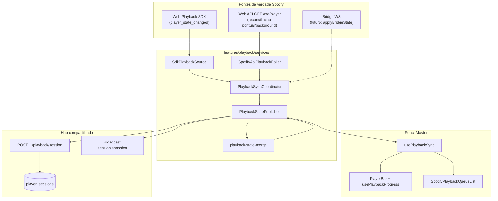
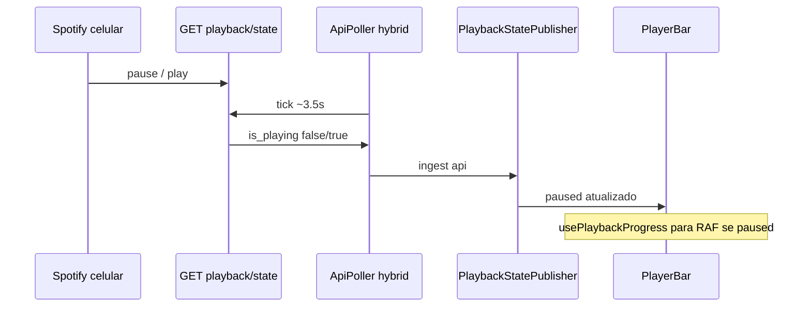
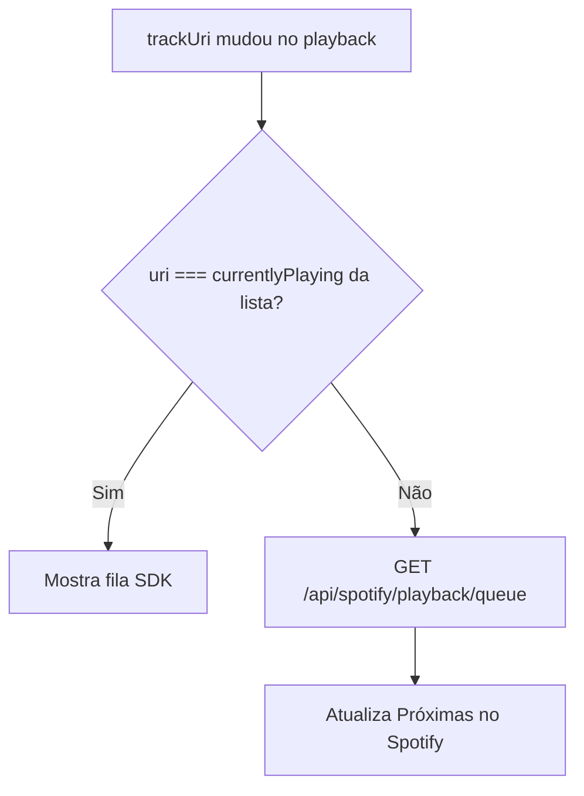

# Playback Master — sincronização no cliente (`apps/player`)

**Status:** implementado (MVP-B)
**Data:** 2026-05-20

**Propósito:** descrever o fluxo **no browser do Player Master** entre Web Playback SDK, reconciliação pontual da Web API, merge de estado, barra de progresso, lista **Próximas no Spotify** e publicação remota (Postgres + Realtime). Complementa os ADRs de decisão e o espelho near-end.

Documentos irmãos:

- [ADR-playback-hybrid-realtime.md](./ADR-playback-hybrid-realtime.md) — decisão híbrido + Broadcast
- [ADR-spotify-state-sync.md](./ADR-spotify-state-sync.md) — duas camadas (Master + bridge)
- [PLAYBACK-NEAR-END-AND-QUEUE-MIRROR.md](./PLAYBACK-NEAR-END-AND-QUEUE-MIRROR.md) — preload / mirror na fila nativa
- [TRIGGER-DEV-PLAYBACK-ORCHESTRATION.md](./TRIGGER-DEV-PLAYBACK-ORCHESTRATION.md) — PoC de worker/reconciliação e backoff Spotify
- [06-arquitetura-playback-spotify.md](../mvp/06-arquitetura-playback-spotify.md) — produto e responsabilidades

---

## 1. Visão geral



| Peça | Arquivo | Papel |
|------|---------|--------|
| Orquestração | `playback-sync-coordinator.ts` | Liga SDK, poll API e publisher conforme `syncMode` |
| Eventos SDK | `sdk-playback-source.ts` | Listeners Spotify → estado normalizado + fila `track_window` |
| Poll API | `spotify-api-playback-poller.ts` | `GET /api/spotify/playback/state` pontual ou em `api_device` |
| Merge / publish | `playback-state-publisher.ts` | Debounce, fingerprint, POST sessão, Broadcast |
| Regras híbrido | `playback-state-merge.ts` | Quem vence em divergência (API vs SDK) |
| Hook UI | `usePlaybackSync.ts` | Estado React, connect/hybrid, controles |
| Progresso | `usePlaybackProgress.ts` | Timer RAF só quando `paused === false` |
| Fila Spotify UI | `spotify-playback-queue-list.tsx` | SDK alinhado ou espelho API |
| Debug | `config/debug.ts` + `playback-debug.ts` | `PLAYBACK_DEBUG` e logs `[muziks:playback]` |

---

## 2. Modos de sync (`PlaybackSyncMode`)

| Modo | SDK | Poll API | Uso |
|------|-----|----------|-----|
| **`hybrid`** (compat) | Sim | Pontual | Browser SDK como autoridade, com reconciliação em eventos |
| **`sdk`** (default ativo) | Sim | Não contínuo | Áudio no navegador Master |
| **`api_device`** | Não | Pontual no browser; contínuo no worker | Device Connect escolhido (`DeviceSelector`) |

Em `api_device` com `authority = worker` e snapshot fresco, o Master **não** inicia `PlaybackStatePoller` contínuo; consome `session.snapshot` + `spotify.queue.snapshot` e reconcilia com `refreshApiOnce` (visibilidade, transfer, control).

O coordinator expõe `startHybrid`, `startSdk`, `setPreferredDevice` + `api_device`. Quando o usuário ativa o player neste navegador, o Master transfere o playback para o device do SDK e passa a publicar `stateSource = sdk_browser`.

---

## 3. Reconciliacao fora do SDK

O SDK **não** recebe `player_state_changed` do app Spotify no telefone. Se o áudio sai do browser, a sessão deve ser marcada como background/API e o estado entra pela **Web API** (`GET /me/player`) com orçamento.

### 3.1 Perfis de poll (`SpotifyApiPlaybackPoller`)

| Perfil | Cache | Playing | Paused | Idle |
|--------|-------|---------|--------|------|
| `default` | 3,5 s | 18 s | 35 s | 35 s |
| **`hybrid`** | 1,2 s | **3,5 s** | **3,5 s** | 12 s |

Usos pontuais no browser:

- `refreshOnce()` ao iniciar hybrid e quando a aba volta a `visible`
- SDK `not_ready` → `refreshApiOnce()` (troca de device)
- quando o usuário escolhe dispositivo externo (`api_device`)
- quando o worker detecta outro device ativo e publica `worker_api`

### 3.2 Merge quando API e SDK divergem

`statesDiverge` compara `trackUri`, `deviceId`, `paused`, `status`.

| Situação | Regra |
|----------|--------|
| API ≠ SDK (ex.: playback saiu do browser) | Sessão vira background/API; API vence em `trackUri`, `deviceId`, `paused`, `status` |
| SDK com device/faixa vazia e API com playback | `shouldSdkSuppressLocalDisplay` — não sobrescrever UI |
| Mesmo device, só progresso | `preferSdkProgressInHybrid` copia **só** `positionMs` do SDK (nunca `paused` se divergiu) |



### 3.3 Barra de progresso (timer)

`usePlaybackProgress(playback)`:

- Ao mudar `playback` (incl. `paused`), reinicia `liveNow`
- **`requestAnimationFrame`** só roda se `paused === false` e há `durationMs`
- Pause no celular → poll atualiza `playback.paused` → efeito limpa RAF → barra congela

Não depende de Zustand: `usePlaybackSync` → `setPlayback` → props.

---

## 4. Lista **Próximas no Spotify**

Componente: `SpotifyPlaybackQueueList` + `useSpotifyPlaybackQueueRealtime`.

### 4.1 Duas fontes de fila

| Fonte | Origem | Quando usar |
|-------|--------|-------------|
| **SDK** | `track_window` → `SpotifyQueuePublisher` → `spotify.queue.snapshot` | Browser é o device ativo e alinhado |
| **API / worker** | Worker ou reconciliação pontual no Master → broadcast | Connect externo; participantes (`apps/web`) via Realtime |
| **Fallback HTTP** | `GET /api/spotify/playback/queue` (master) ou `GET .../playback/spotify-queue` (web) | Realtime indisponível ou snapshot stale (~45s) |

### 4.2 Alinhamento (`sdkQueueAligned`)

```text
sdkQueueAligned =
  (syncMode sdk ou hybrid com fila SDK)
  E trackUri do playback === sdkQueue.currentlyPlaying.uri
```

| `sdkQueueAligned` | Lista exibida | Poll HTTP |
|-------------------|---------------|-----------|
| `true` | Fila do SDK | Desligado |
| `false` | Fila da API | Ligado (ou refresh pontual) |

### 4.3 Troca de faixa

Quando o **playback** muda (`trackUri`) e a faixa ▶ da lista **não** coincide:

1. `useEffect` chama `refresh()` na API de queue
2. UI passa a mostrar `polledQueue` até realinhar



Isso cobre skip no celular, next no Connect e troca no SDK com `track_window` atrasado.

---

## 5. Publicação remota (web / telão / outras abas)

Após mudança semântica relevante, `PlaybackStatePublisher`:

1. `POST /api/players/{slug}/playback/session` → `player_sessions`
2. `broadcastSessionSnapshot` → canal `player:{playerId}`, evento `session.snapshot`
3. `broadcast.self: false` — Master não escuta o próprio envio

Consumidores públicos fazem `GET` inicial e assinam `session.snapshot`. Poll HTTP fica apenas como fallback/degradação. O Master usa `subscribeRealtime: false` quando é a fonte SDK local.

Ver [ADR-playback-hybrid-realtime.md](./ADR-playback-hybrid-realtime.md).

### 5.1 Worker/reconciliação (PoC Trigger.dev)

Trigger.dev pode agendar `playback-tick` server-side para reconciliar estado, respeitar backoff Spotify e publicar snapshots quando o browser não estiver tocando. Esse worker **não** substitui o SDK quando o Master está ativo; ele assume apenas `api_device`, background, SDK stale/offline ou device externo.

Regras resumidas:

- worker usa token do dono via vault + refresh server-side, não cookie do browser;
- catálogo pode usar Client Credentials, mas playback/queue não;
- near-end prepara a fila Spotify; dequeue só após transição confirmada;
- Broadcast continua explícito após persistência aceita.

---

## 6. Debug local

| Constante | Arquivo | Valor atual |
|-----------|---------|-------------|
| `PLAYBACK_DEBUG` | `apps/player/src/config/debug.ts` | `true` (desligar antes de release) |

Logs no console com prefixo `[muziks:playback]`:

- `sdk raw:*` — eventos brutos do Web Playback SDK
- `sdk event:*` — taxonomia `SdkPlaybackEvent`
- `sdk normalized_state` — estado após normalização

---

## 7. Fila Muziks (contraste)

| Dado | Transporte no player |
|------|----------------------|
| Fila votada Muziks | **Realtime** `queue.snapshot` (`useMuziksCustomerQueue` `transport: "realtime"`) |
| Fila nativa Spotify | SDK + API conforme §4 (sem Realtime) |

Público em `apps/web` usa o mesmo contrato da fila votada: `GET` inicial + `queue.snapshot`; polling HTTP fica apenas como fallback operacional — ver [ADR-playback-hybrid-realtime.md](./ADR-playback-hybrid-realtime.md).

---

## 8. Bridge (futuro)

`PlaybackSyncCoordinator.applyBridgeState` + `setBridgeActive(true)` fazem o publisher priorizar snapshots do `apps/spotify-bridge` sobre SDK/API. Mesmo contrato de POST + Broadcast. Ver [ADR-spotify-state-sync.md](./ADR-spotify-state-sync.md) camada 2.

---

## 9. Checklist para agentes

- [ ] Novo comportamento de sync → atualizar este doc + ADR se mudar decisão
- [ ] Não usar `SessionPlaybackPoller` no Master para now playing ao vivo (Postgres é fallback / outros consumidores)
- [ ] Pause/play remoto → API poll hybrid, não esperar só SDK
- [ ] Troca de `trackUri` → verificar §4 (fila Spotify)
- [ ] `PLAYBACK_DEBUG = false` antes de merge em produção se logs forem barulhentos
