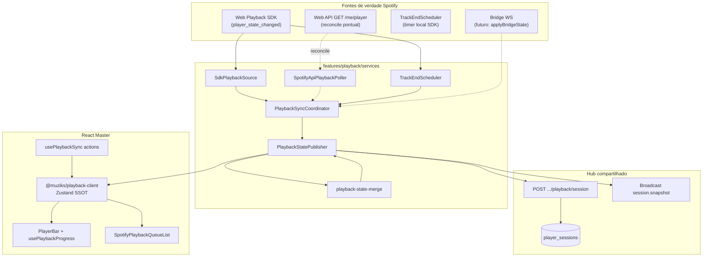
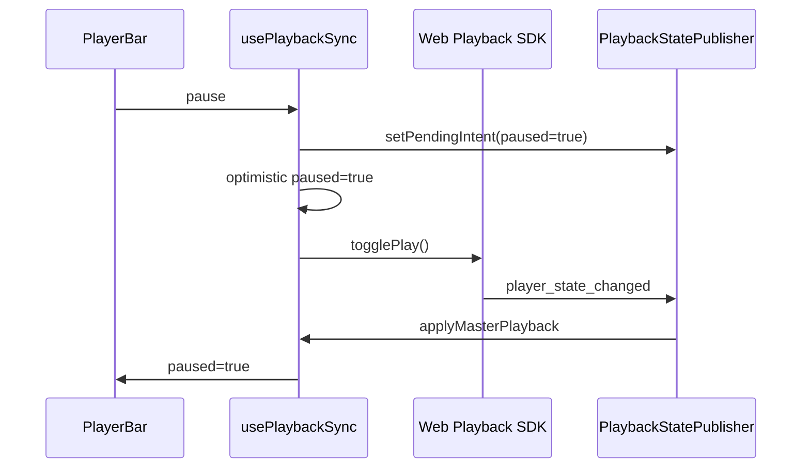
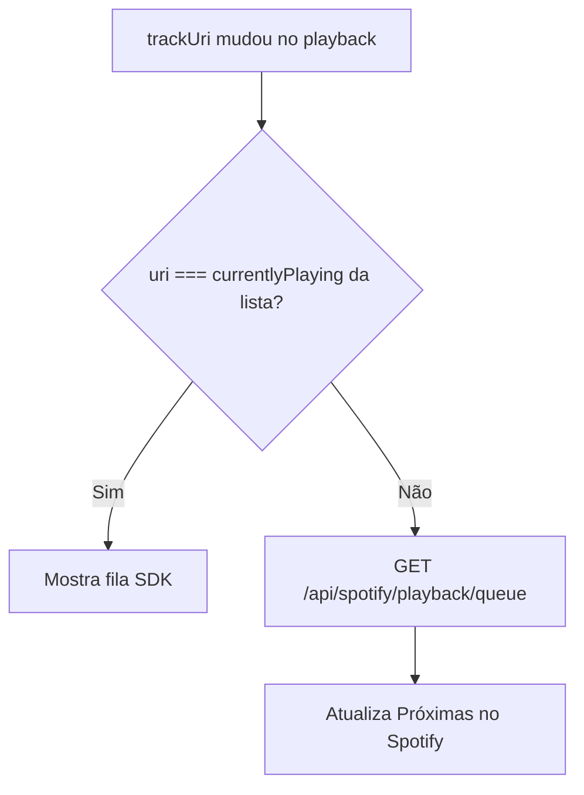

# Playback Master — sincronização no cliente (`apps/player`)

**Status:** implementado (MVP-B)  
**Data:** 2026-05-20

**Propósito:** descrever o fluxo **no browser do Player Master** entre Web Playback SDK, poll da Web API, merge de estado, barra de progresso, lista **Próximas no Spotify** e publicação remota (Postgres + Realtime). Complementa os ADRs de decisão e o espelho near-end.

Documentos irmãos:

- [ADR-playback-hybrid-realtime.md](./ADR-playback-hybrid-realtime.md) — decisão híbrido + Broadcast
- [ADR-spotify-state-sync.md](./ADR-spotify-state-sync.md) — duas camadas (Master + bridge)
- [PLAYBACK-NEAR-END-AND-QUEUE-MIRROR.md](./PLAYBACK-NEAR-END-AND-QUEUE-MIRROR.md) — preload / mirror na fila nativa
- [06-arquitetura-playback-spotify.md](../mvp/06-arquitetura-playback-spotify.md) — produto e responsabilidades

---

## 1. Visão geral



| Peça | Arquivo | Papel |
|------|---------|--------|
| Orquestração | `playback-sync-coordinator.ts` | Liga SDK, poll API e publisher conforme `syncMode` |
| Eventos SDK | `sdk-playback-source.ts` | Listeners Spotify → estado normalizado + fila `track_window` |
| Poll API | `spotify-api-playback-poller.ts` | Reconcile pontual / `api_device` (perfil `reconcile` ~45 s só com device externo) |
| Near-end | `track-end-scheduler.ts` | Timer local a partir do SDK (`positionMs` + `durationMs`) |
| Merge / publish | `playback-state-publisher.ts` | Debounce, fingerprint, POST sessão, Broadcast |
| Regras híbrido | `playback-state-merge.ts` | Quem vence em divergência (API vs SDK) |
| Store UI | `@muziks/playback-client` | Zustand SSOT: playback, loading, filas |
| Hook UI | `usePlaybackSync.ts` | Ações SDK/API, connect/hybrid (lê/escreve store) |
| Progresso | `usePlaybackProgress.ts` | Timer RAF só quando `paused === false` |
| Fila Spotify UI | `spotify-playback-queue-list.tsx` | SDK alinhado ou espelho API |
| Debug | `config/debug.ts` + `playback-debug.ts` | `PLAYBACK_DEBUG` e logs `[muziks:playback]` |

---

## 2. Modos de sync (`PlaybackSyncMode`)

| Modo | SDK | Poll API | Uso |
|------|-----|----------|-----|
| **`hybrid`** (default Master) | Sim — **fonte da UI** no browser | Reconcile **pontual** (não hot path) | Browser Master + celular / Connect |
| **`sdk`** | Sim | Não | Áudio só no navegador Master |
| **`api_device`** | Não | Sim (perfil `default`) | Device Connect escolhido (`DeviceSelector`) |

O coordinator expõe `startHybrid`, `startSdk`, `setPreferredDevice` + `api_device`.

---

## 3. Modo `hybrid` — UI no SDK, reconcile pontual

Com o browser como device ativo (`sdkAuthoritativeForUi`):

- **UI** (ícone play/pause, faixa, progresso): `player_state_changed` → `PlaybackStatePublisher.ingestSdk`
- **Controles locais**: `sdkPlayer.togglePlay()` / `nextTrack()` quando `shouldControlViaSdk` (device alinhado)
- **Intent lock** (~3 s): ingest API que contradiz play/pause do usuário é ignorado
- **POST remoto** (`publishRemote: minimal`): só mudança semântica a partir do SDK

O SDK **não** recebe eventos do app Spotify no telefone. Pause/play no celular usa **reconcile pontual** da Web API (não loop de 3,5 s).

### 3.1 Poll da API (`SpotifyApiPlaybackPoller`)

| Perfil | Uso |
|--------|-----|
| `default` | `api_device` — now playing via API |
| `reconcile` | Device externo ou gatilhos pontuais (~45 s) |
| `hybrid` | **Legado** — não usado no hot path da UI |

Gatilhos de `refreshApiOnce()` (um GET, sem tick contínuo no browser Master):

- Hidratação ao `ready` do SDK
- Aba `visibilitychange` → visible
- SDK `not_ready`
- `statesDiverge` entre último SDK e API (device/faixa)
- Poll contínuo **só** enquanto `api.deviceId !== sdk.deviceId` (perfil `reconcile`)

### 3.2 Merge e autoridade da UI

| Situação | Regra |
|----------|--------|
| Browser = device ativo (`sdkAuthoritativeForUi`) | API **não** atualiza UI para `paused`/`trackUri` iguais ao SDK |
| Pause no celular / outro Connect | `shouldApiUpdateUi` + API vence |
| Intent lock após clique local | API stale ignorada por ~3 s |
| Mesmo device, só progresso | `preferSdkProgressInHybrid` — só `positionMs` do SDK |

### 3.3 Controles locais (pause imediato)



`POST /api/spotify/playback/control` no fallback API retorna `{ ok: true }` **sem** re-fetch de estado (evita `is_playing` stale).

### 3.4 Near-end (`TrackEndScheduler`)

Timer local a partir de `positionMs`, `durationMs` e `positionUpdatedAt` do SDK (~10 s antes do fim). Dispara callback `onNearEnd` (espelho `mirror-next` em PR futuro). **Não** depende de poll de `GET /me/player` para a barra ou ícone.

### 3.5 Barra de progresso (timer)

`usePlaybackProgress(playback)`:

- Ao mudar `playback` (incl. `paused`), reinicia `liveNow`
- **`requestAnimationFrame`** só roda se `paused === false` e há `durationMs`
- Pause no celular → poll atualiza `playback.paused` → efeito limpa RAF → barra congela

`usePlaybackProgress` lê `playback` da store (via props derivadas de `useMasterPlaybackStore`).

### 3.6 Estado global (Zustand) — cinco regras

Pacote: [`packages/playback-client`](../../packages/playback-client/).

| # | Regra | Implementação |
|---|--------|----------------|
| 1 | UI só reflete a store | `PlayerBar`, `PlayerMasterLayout` → selectors `useMasterPlaybackStore` |
| 2 | Clique → SDK/API → store → UI | `togglePlay` / `skipToNext` → optimistic `applyMasterPlayback` → SDK ou `POST .../control` |
| 3 | Evento SDK/API → publisher → store | `PlaybackStatePublisher.onLocalState` → `applyMasterPlayback` |
| 4 | Mudança semântica → Postgres + Broadcast | `PlaybackStatePublisher` (inalterado) |
| 5 | Observadores (web, telão) | `usePublicPlaybackStore` + `subscribeSessionSnapshots`; master mantém `subscribeRealtime: false` |

Stores: `useMasterPlaybackStore`, `useSpotifyQueueStore`, `useMuziksQueueStore` (master); `usePublicPlaybackStore` (web participante).

---

## 4. Lista **Próximas no Spotify**

Componente: `SpotifyPlaybackQueueList` + `useSpotifyPlaybackQueue`.

### 4.1 Duas fontes de fila

| Fonte | Origem | Quando usar |
|-------|--------|-------------|
| **SDK** | `track_window` em `player_state_changed` → `sync.spotifyQueue` | Browser é o device ativo e alinhado |
| **API** | `GET /api/spotify/playback/queue` | Connect externo ou fila SDK defasada |

### 4.2 Alinhamento (`sdkQueueAligned`)

```text
sdkQueueAligned =
  (syncMode sdk ou hybrid com fila SDK)
  E trackUri do playback === sdkQueue.currentlyPlaying.uri
```

| `sdkQueueAligned` | Lista exibida | Poll HTTP |
|-------------------|---------------|-----------|
| `true` | Fila do SDK | Desligado |
| `false` | Fila da API | Ligado (ou refresh pontual) |

### 4.3 Troca de faixa

Quando o **playback** muda (`trackUri`) e a faixa ▶ da lista **não** coincide:

1. `useEffect` chama `refresh()` na API de queue
2. UI passa a mostrar `polledQueue` até realinhar



Isso cobre skip no celular, next no Connect e troca no SDK com `track_window` atrasado.

---

## 5. Publicação remota (telão / outras abas)

Após mudança semântica relevante, `PlaybackStatePublisher`:

1. `POST /api/players/{slug}/playback/session` → `player_sessions`
2. `broadcastSessionSnapshot` → canal `player:{playerId}`, evento `session.snapshot`
3. `broadcast.self: false` — Master não escuta o próprio envio

Consumidores:

- **Master:** `subscribeRealtime: false` — UI pelo SDK/API local → `useMasterPlaybackStore`.
- **Telão / 2ª aba (player):** `usePlaybackSession({ subscribeRealtime: true })` → `applyMasterPlayback`.
- **`apps/web`:** `usePublicPlaybackSession` — hydrate HTTP + `session.snapshot` → `usePublicPlaybackStore`; poll 30 s fallback.

Ver [ADR-playback-hybrid-realtime.md](./ADR-playback-hybrid-realtime.md).

---

## 6. Debug local

| Constante | Arquivo | Valor atual |
|-----------|---------|-------------|
| `PLAYBACK_DEBUG` | `apps/player/src/config/debug.ts` | `true` (desligar antes de release) |

Logs no console com prefixo `[muziks:playback]`:

- `sdk raw:*` — eventos brutos do Web Playback SDK
- `sdk event:*` — taxonomia `SdkPlaybackEvent`
- `sdk normalized_state` — estado após normalização

---

## 7. Fila Muziks (contraste)

| Dado | Transporte no player |
|------|----------------------|
| Fila votada Muziks | **Realtime** `queue.snapshot` (`useMuziksCustomerQueue` `transport: "realtime"`) |
| Fila nativa Spotify | SDK + API conforme §4 (sem Realtime) |

Público em `apps/web`: fila Muziks via `queue.snapshot` (Realtime) + poll 30 s fallback; playback via §5 acima — ver [06-arquitetura-playback-spotify.md](../mvp/06-arquitetura-playback-spotify.md) §2.1.

---

## 8. Bridge (futuro)

`PlaybackSyncCoordinator.applyBridgeState` + `setBridgeActive(true)` fazem o publisher priorizar snapshots do `apps/spotify-bridge` sobre SDK/API. Mesmo contrato de POST + Broadcast. Ver [ADR-spotify-state-sync.md](./ADR-spotify-state-sync.md) camada 2.

---

## 9. Checklist para agentes

- [ ] Novo comportamento de sync → atualizar este doc + ADR se mudar decisão
- [ ] Não usar `SessionPlaybackPoller` no Master para now playing ao vivo (Postgres é fallback / outros consumidores)
- [ ] Pause/play no browser → SDK + intent lock; remoto (celular) → reconcile pontual
- [ ] Troca de `trackUri` → verificar §4 (fila Spotify)
- [ ] `PLAYBACK_DEBUG = false` antes de merge em produção se logs forem barulhentos
