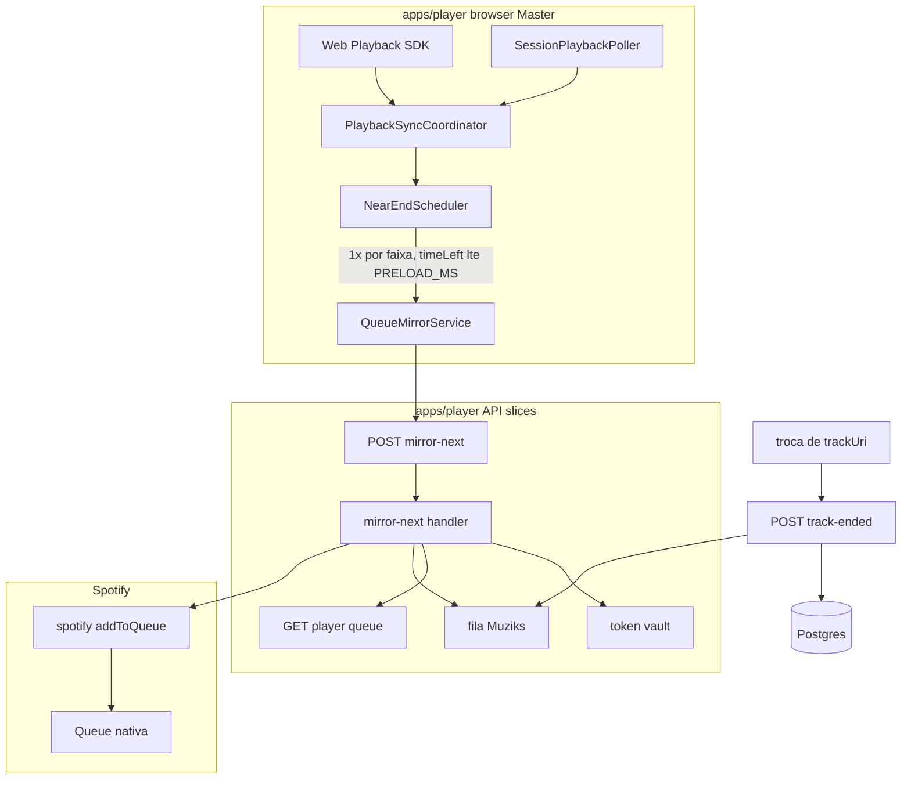
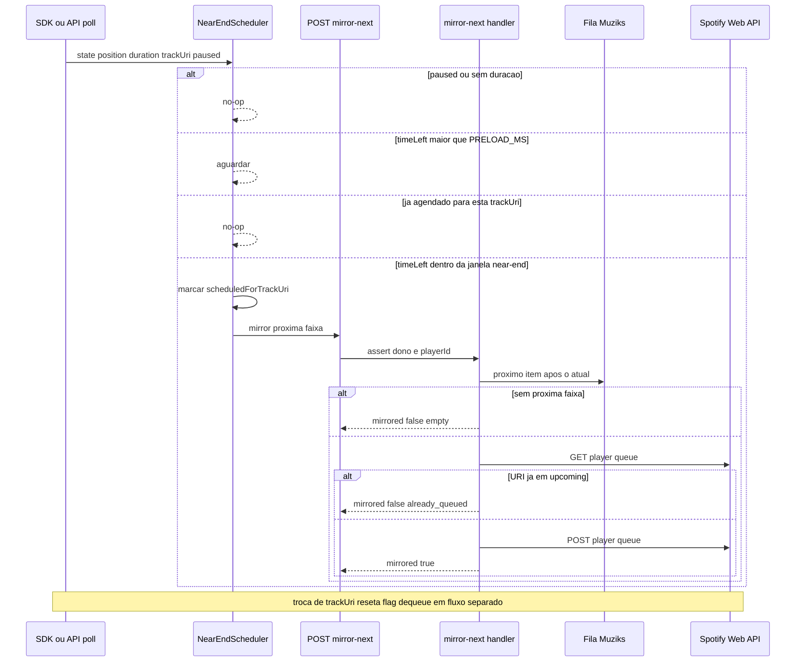
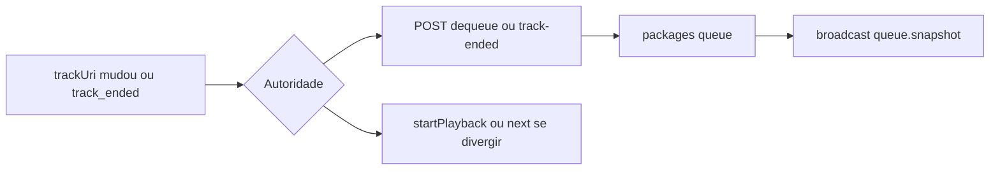

# Playback: preload near-end e espelho da fila Spotify

**Status:** normativo (alvo de implementação MVP-B)  
**Data:** 2026-05-19

**Propósito:** definir a arquitetura **sólida no Next.js** (`apps/player`) para transição quase gapless: precarregar a próxima faixa na **fila nativa do Spotify** com antecedência (~8–12 s), sem confundir preload com dequeue da fila Muziks.

Documentos irmãos:

- Regras de produto e fila dupla: [06-arquitetura-playback-spotify.md](../mvp/06-arquitetura-playback-spotify.md) §7.1, §8
- Estado e bridge: [ADR-spotify-state-sync.md](./ADR-spotify-state-sync.md)
- Sync cliente Master (SDK + API + fila Spotify UI): [PLAYBACK-MASTER-CLIENT-SYNC.md](./PLAYBACK-MASTER-CLIENT-SYNC.md)
- Fim de faixa / dequeue autoritativo: [ADR-librespot-playback-sidecar.md](./ADR-librespot-playback-sidecar.md)
- Integrações: [11-backend-and-integrations-open.md](../specs/11-backend-and-integrations-open.md) §4

---

## 1. Problema e decisão Spotify

O **Web Playback SDK** não expõe `preloadNextTrack()`. A forma **oficial** de obter preload/gapless é:

1. Manter a **queue nativa do Spotify** com pelo menos **uma faixa à frente** da atual.
2. Usar **`POST /v1/me/player/queue?uri=…`** ([Add Item to Playback Queue](https://developer.spotify.com/documentation/web-api/reference/add-to-queue)) — `uri` e `device_id` em **query string**, não body JSON.

O Muziks **não** reimplementa áudio nem buffer próprio; orquestra a **fila lógica** (Postgres) e espelha URIs no Spotify.

| Momento | Ação |
|---------|------|
| **Near-end** (~8–12 s antes do fim) | Garantir que a **próxima** faixa Muziks está na queue Spotify (preload) |
| **Track ended / troca de `trackUri`** | **Dequeue** na fila Muziks + opcional `next` / `play` (autoridade no servidor) |

**Regra de ouro:** preload **≠** dequeue.

---

## 2. Visão geral da arquitetura (Next.js)



### Princípios

| # | Princípio |
|---|-----------|
| 1 | **Serviço no cliente**, não lógica pesada em `usePlaybackSync` / componente de página |
| 2 | **Spotify só no servidor** — token via vault; cliente chama rotas Muziks |
| 3 | **Vertical Slice** — um handler por caso de uso (`mirror-next`, não “god control”) |
| 4 | **Idempotência** — uma tentativa de mirror por faixa (`scheduledForTrackUri`) |
| 5 | **Fila dupla** — espelhar **N = 2–3** faixas à frente, não só near-end |

---

## 3. Fluxo near-end (sequência)



### Constantes sugeridas

| Constante | Valor | Notas |
|-----------|-------|-------|
| `PRELOAD_MS` | `10_000` | Margem 8–12 s (rede + device) |
| `MIRROR_LOOKAHEAD_COUNT` | `3` | Faixas Muziks a espelhar na queue Spotify |
| Debounce near-end | 1 disparo / `trackUri` | Flag `scheduledForTrackUri` |

---

## 4. Camadas de implementação

### 4.1 Cliente — `NearEndScheduler`

**Onde:** `apps/player/src/features/playback/services/near-end-scheduler.ts` (nome sugerido).

**Entrada:** `NormalizedSpotifyPlayerState` + `slug` + `deviceId` opcional.

**Comportamento:**

```ts
// Pseudocódigo — contrato, não implementação obrigatória linha a linha
if (state.paused || !state.durationMs) return;
const timeLeft = state.durationMs - state.positionMs;
if (timeLeft <= 0 || timeLeft > PRELOAD_MS) return;
if (scheduledForTrackUri === state.trackUri) return;

scheduledForTrackUri = state.trackUri;
await queueMirrorService.mirrorNext(slug, { deviceId: state.deviceId });
```

**Reset:** quando `trackUri` muda → `scheduledForTrackUri = null`.

**Integração:** `PlaybackSyncCoordinator` chama o scheduler a partir de:

- `SdkPlaybackSource` → `onState` (modos `hybrid` / `sdk`);
- `SessionPlaybackPoller` → `onState` (modo `api_device`).

Não duplicar `player.addListener` fora do coordinator.

### 4.2 Cliente — `QueueMirrorService`

Encapsula `fetch` para a API:

```
POST /api/players/{slug}/playback/mirror-next
Body: { deviceId?: string, lookahead?: number }
```

Opcional: `mirrorAhead(slug, n)` no **início** de cada faixa (espelho de N itens, §6).

### 4.3 Servidor — slice `mirror-next-to-spotify-queue`

**Onde:** `apps/player/src/slices/playback/mirror-next-to-spotify-queue/handler.ts`  
**Rota:** `apps/player/app/api/players/[slug]/playback/mirror-next/route.ts`

**Passos (autoridade):**

1. `assertPlayerSlugAccess(slug)`.
2. `getAccessTokenForPlayer` / vault (mesmo padrão de `control-spotify-playback`).
3. Resolver **próxima** faixa na fila Muziks (item após o que está em playback — não confundir “head” UI com “próximo a tocar”).
4. `GET` queue Spotify normalizada (`getSpotifyPlaybackQueueHandler` ou `@muziks/spotify`).
5. Se `uri` já está em `upcoming` → `{ ok: true, mirrored: false, reason: "already_queued" }`.
6. Senão `addToQueue({ accessToken, uri, deviceId })` de `@muziks/spotify`.
7. Resposta tipada em `@muziks/types` (estender schemas se necessário).

**Não** chamar `dequeueNextQueueItem` neste handler.

### 4.4 Alternativa: estender `control-spotify-playback`

Adicionar `action: "queue"` ao schema existente é aceitável para MVP rápido; slice dedicada **`mirror-next`** é preferível para contrato claro e testes.

---

## 5. Dequeue e fim de faixa (fluxo separado)



| Evento | Quem dispara | Endpoint / slice |
|--------|--------------|------------------|
| Troca confirmada no Master | Cliente ou servidor após SDK | `POST .../queue/dequeue` (existente) + evoluir auto |
| Master offline / bridge | `spotify-bridge` / librespot | `POST /api/internal/playback/track-ended` |
| Backup poll | Edge / tick | `POST /api/internal/playback-tick` |

Ver [ADR-librespot-playback-sidecar.md](./ADR-librespot-playback-sidecar.md) para `near_end` vs `track_ended`.

---

## 6. Fila dupla (espelho de N faixas)

Além do near-end, ao **iniciar** uma faixa (ou após mutação da fila Muziks):

| Passo | Ação |
|-------|------|
| 1 | Ler snapshot Muziks (`GET .../queue`) |
| 2 | Pegar até **N** URIs seguintes à faixa atual |
| 3 | Comparar com `GET /api/spotify/playback/queue` |
| 4 | `addToQueue` só para URIs ausentes em `upcoming` |

Hook existente para leitura: `useSpotifyPlaybackQueue` — útil para UI e para evitar duplicatas; a **escrita** permanece no servidor.

Limitação documentada em `packages/types` — Spotify devolve lookahead **curto** (~2 faixas); o espelho proativo compensa.

---

## 7. Fallbacks (ordem)

| # | Situação | Ação |
|---|----------|------|
| 1 | Próxima URI **já** na queue Spotify | Nada (gapless nativo) ou `next` só no fim se necessário |
| 2 | `addToQueue` falhou | 1 retry; registrar `lastError` em `player_sessions` |
| 3 | Fim da faixa sem item na queue Spotify | `startPlayback` com URI da cabeça Muziks (servidor) |
| 4 | Último recurso | `skipToNext` — perde preload, evita silêncio |

---

## 8. Modos de sync

| Modo | Fonte de `positionMs` / `durationMs` | Scheduler |
|------|----------------------------------------|-----------|
| `hybrid` | SDK `player_state_changed` | Ativo |
| `sdk` | SDK | Ativo |
| `api_device` | Web API via `SessionPlaybackPoller` | Ativo (mesma classe) |

Em divergência SDK vs API, decisões de **device** e **trackUri** seguem [ADR-playback-hybrid-realtime.md](./ADR-playback-hybrid-realtime.md) (API vence).

---

## 9. Bridge librespot (camada 2 — só pagantes)

O bridge é **exclusivo de espaços pagantes**; freemium implementa near-end e fila via **Master (SDK)**. Política: [04-playback-bridge-e-tiering.md](../business/04-playback-bridge-e-tiering.md).

Quando `apps/spotify-bridge` estiver ativo **e** o espaço tiver tier elegível:

- Evento **`near_end`** → pode chamar o **mesmo** contrato `mirror-next` (HTTP interno) ou notificar o Master via WS.
- **`track_ended`** → somente `POST /api/internal/playback/track-ended` (dequeue + play next).
- Idempotência compartilhada com tick/sidecar para não avançar fila duas vezes.

---

## 10. Anti-padrões

| Não fazer | Por quê |
|-----------|---------|
| `fetch` direto à Spotify no browser com refresh token | Segurança; padrão vault + API |
| Body JSON em `POST /me/player/queue` | API oficial usa query `uri` |
| Dequeue no callback de preload | Corrompe fila e votos |
| Lógica inteira em `useSpotifyPlayer` / página | Dificulta teste e modos `api_device` |
| Rota `/api/player/queue-next` fora de `players/{slug}/` | Quebra VSA e auth por slug |
| Várias chamadas `addToQueue` sem checar queue | Rate limit + duplicatas |

---

## 11. Mapa de código (hoje vs alvo)

| Peça | Status |
|------|--------|
| `@muziks/spotify` → `addToQueue` | Implementado |
| `GET /api/spotify/playback/queue` | Implementado |
| `POST /api/spotify/playback/control` (play/pause/next) | Implementado |
| `PlaybackSyncCoordinator` + `SdkPlaybackSource` | Implementado (sem near-end) |
| `NearEndScheduler` + `QueueMirrorService` | **Alvo** |
| `POST .../playback/mirror-next` | **Alvo** |
| Dequeue automático no fim da faixa | Parcial (manual / tick / ADR sidecar) |

---

## 12. Critérios de aceite (MVP-B)

- [ ] Com faixa tocando no Master, **≤ 1** `addToQueue` por faixa na janela near-end.
- [ ] Próxima faixa Muziks aparece na queue Spotify antes do fim (verificável via `GET .../playback/queue`).
- [ ] Troca de faixa remove item correto da fila Muziks **sem** remover no preload.
- [ ] Modo `api_device` espelha com poller, não só SDK.
- [ ] Falha de mirror não trava UI; dono vê erro recuperável.

---

## Referências

- [06-arquitetura-playback-spotify.md](../mvp/06-arquitetura-playback-spotify.md) §7.1, §8
- [ADR-spotify-state-sync.md](./ADR-spotify-state-sync.md)
- [ADR-librespot-playback-sidecar.md](./ADR-librespot-playback-sidecar.md)
- [VERTICAL-SLICE-ARCHITECTURE.md](./VERTICAL-SLICE-ARCHITECTURE.md)
- Código: `apps/player/src/features/playback/services/playback-sync-coordinator.ts`, `packages/spotify/src/playback/control.ts`
