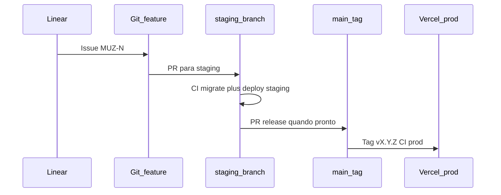

# Processo de desenvolvimento

**Propósito:** definir gestão de trabalho (Linear), modelos de branch (GitFlow vs trunk), automação CI/CD (GitHub Actions) e **matriz de ambientes** por superfície do Muziks.

**Normativo:** convenções marcadas com “deve” aplicam-se quando o monorepo de código existir.

Documentos irmãos: [STACK-E-FASES-DE-MIGRACAO.md](STACK-E-FASES-DE-MIGRACAO.md), [MONOREPO-TURBOREPO.md](MONOREPO-TURBOREPO.md), [ROADMAP.md](../ROADMAP.md).

---

## 1. Gestão de trabalho — Linear

### 1.1 Projeto

- Criar time/projeto **Muziks** no [Linear](https://linear.app) quando iniciar implementação de código.
- **Specs normativas** permanecem no git (`docs/specs/`); Linear é para **execução**, priorização e rastreio de entregas.

### 1.2 Convenções

| Item | Regra |
|------|--------|
| **Labels** | `spec`, `app`, `blog`, `infra`, `bug`, `debt` |
| **Vínculo PR** | Todo PR de código **deve** referenciar issue Linear (`MUZ-123`) |
| **Ciclos** | Alinhar ao [ROADMAP.md](../ROADMAP.md) (semanal time núcleo; mensal stakeholders) |
| **Specs → issues** | Ao fechar seção em spec, criar ou fechar issue correspondente |

### 1.3 O que não vai para o Linear

- Debate de redação de manifesto/spec sem entrega de código (pode ser issue `spec` se precisar de dono).
- Análises pontuais em `docs/analytics/` — rastrear no git/PR.

---

## 2. GitFlow vs GitHub Workflow (esclarecimento)

São conceitos **diferentes** e **complementares**:

| Termo | O que é | Exemplo no Muziks |
|-------|---------|-------------------|
| **GitFlow** | **Modelo de branches** no Git: `main`, `develop`, `feature/*`, `release/*`, `hotfix/*` | `apps/blog`, alterações em `docs/` |
| **GitHub Actions** (“GitHub Workflow”) | **Automação CI/CD**: build, lint, deploy, releases | `apps/web` — pipeline por ambiente + releases com tag |
| **Trunk-based** | `main` + feature flags; poucas branches long-lived | Opcional na Fase C; **não** na Fase A |

**GitFlow não substitui CI/CD** — define *como* ramificar; Actions define *o que* rodar em cada push/PR/tag.

---

## 3. Política por superfície

Filtros Turborepo: `turbo run build --filter=@muziks/web` (ou equivalente).

| Superfície | App | Domínio | Modelo de branch | Ambientes | CI/CD |
|------------|-----|---------|------------------|-----------|-------|
| **Blog** | `apps/blog` | **blog.muziks.com.br** | GitFlow: `main`, `develop`, `feature/*` | **dev** + **prod** | Lint + deploy preview (PR) / prod (`main`) |
| **Player (produto)** | `apps/web` | **player.muziks.app/{slug}** | `main` protegida; `staging` long-lived; `feature/*` | **dev** + **staging** + **prod** | Lint, `db:migrate` staging, deploy; **release** tag → prod |
| **Admin** (futuro) | `apps/admin` | TBD | Igual `web` quando existir | staging + prod | `--filter=admin` |
| **API** (futuro) | `apps/api` | TBD | Igual `web` quando extraído | staging + prod | Deploy Railway/Fly/AWS |
| **Docs** | `docs/` na raiz | — | PR → `main` (GitFlow leve) | só git | Opcional: link check markdown |

### 3.1 Branches — app produto (`apps/web`)

| Branch | Uso |
|--------|-----|
| `main` | Produção; protegida; só via PR ou release |
| `staging` | Integração contínua; deploy automático em staging |
| `feature/*` | Trabalho por issue Linear |
| `hotfix/*` | Correção urgente em prod → merge em `main` e `staging` |

**Releases:** tags semver `vMAJOR.MINOR.PATCH` no GitHub disparam deploy de produção e notas de release.

### 3.2 Branches — blog (`apps/blog`)

| Branch | Uso |
|--------|-----|
| `main` | Produção (`blog.muziks.com.br`) |
| `develop` | Integração de features do blog |
| `feature/*` | Posts, layout, SEO |

Sem ambiente **staging** dedicado — preview Vercel por PR cobre revisão.

---

## 4. Matriz de ambientes

| Ambiente | Blog (`muziks.com.br`) | Player (`muziks.app`) | Banco | URL típica |
|----------|------------------------|----------------------|-------|------------|
| **dev** | Vercel Preview / `pnpm dev` local | Local + **Cloudflare Tunnel** (OAuth, teste em celular) | Supabase projeto **dev** | `*.vercel.app`, URL do tunnel |
| **staging** | — | `staging.player.muziks.app` (ou preview dedicado) | Supabase projeto **staging** | subdomínio staging |
| **prod** | **blog.muziks.com.br** | **player.muziks.app/{slug}** | Supabase **prod** → futuro RDS | domínios finais |

**DNS (todos os ambientes):** zonas **muziks.app** e **muziks.com.br** na **Cloudflare** (já configurado). Produção e staging usam registros na CF apontando para o origin (**Vercel** na PoC); proxy laranja ativo para CDN/SSL/DDoS. Detalhe de recursos CF opcionais: [STACK-E-FASES-DE-MIGRACAO.md](STACK-E-FASES-DE-MIGRACAO.md) §1.4.

| Host (ex.) | Ambiente | Origin típico (PoC) |
|------------|----------|---------------------|
| `player.muziks.app` | prod | Projeto Vercel `apps/web` |
| `staging.player.muziks.app` | staging | Preview ou projeto Vercel staging |
| `blog.muziks.com.br` | prod | Projeto Vercel `apps/blog` |
| `*.vercel.app` | dev/preview | Deploy automático PR (pode ficar só na Vercel ou espelhar CNAME na CF) |

### 4.1 Cloudflare Tunnel (dev local do player)

**Deve** usar tunnel na PoC quando for necessário:

- Callbacks OAuth em dispositivo móvel.
- Teste de QR/link em rede local do estabelecimento.
- Webhooks de terceiros apontando para máquina de dev.

Configuração e URL estável documentadas no README de `apps/web` quando o app existir.

### 4.2 Cloudflare na operação (PoC)

| Uso | Onde configurar |
|-----|-----------------|
| DNS / SSL / proxy | Dashboard Cloudflare (zonas já existentes) |
| Tunnel (dev) | `cloudflared` + token no README de `apps/web` |
| Pages / Workers / R2 | Só se decisão em STACK §1.4 — issue Linear `infra` |

Deploy continua disparado pela **Vercel** (GitHub Actions → Vercel); Cloudflare **não** substitui o pipeline de build na Fase A, exceto se migrar para **Pages** (padrão B em STACK).

### 4.3 Secrets

- GitHub **Environments:** `development`, `staging`, `production`.
- **Produção:** approval gate para deploy e `db:migrate`.
- Variáveis por app (Vercel) e por projeto Supabase — não reutilizar `service_role` entre ambientes.

---

## 5. GitHub Actions (esboço)

Arquivos em `.github/workflows/` (a criar com o monorepo):

| Workflow | Gatilho | Ações |
|----------|---------|--------|
| `ci.yml` | PR em qualquer app | `turbo run lint` (filtro por paths alterados) |
| `deploy-blog-preview.yml` | PR tocando `apps/blog` | Deploy preview Vercel |
| `deploy-blog-prod.yml` | Push `main` + paths `apps/blog` | Deploy produção |
| `deploy-web-staging.yml` | Push `staging` + paths `apps/web` | Build, migrate staging, deploy |
| `release-web-prod.yml` | Tag `v*` | Migrate prod (approval), deploy prod, GitHub Release |

Path filters evitam rebuild do blog quando só o player mudou.

---

## 6. Fluxo de trabalho sugerido (issue → produção)

1. Criar issue no Linear.
2. Branch `feature/MUZ-N-descricao` a partir de `staging` (`web`) ou `develop` (`blog`).
3. PR → ambiente de preview/staging; revisão humana.
4. Merge; validar em staging (player) ou preview (blog).
5. Release tag (player) ou merge `develop` → `main` (blog).

---

## 7. Documentação no repositório

| Tipo | Onde | Processo |
|------|------|----------|
| Specs normativas | `docs/specs/` | PR → `main`; revisão humana; mencionar issue se houver |
| Stack / processo | `docs/tech/` | Idem |
| Analytics | `docs/analytics/` | PR com contexto; não bloqueia deploy de app |

---

## Manutenção

Mudanças de ambiente, domínio ou política de branch **devem** atualizar este arquivo e [STACK-E-FASES-DE-MIGRACAO.md](STACK-E-FASES-DE-MIGRACAO.md) se afetarem migração de dados ou deploy.
