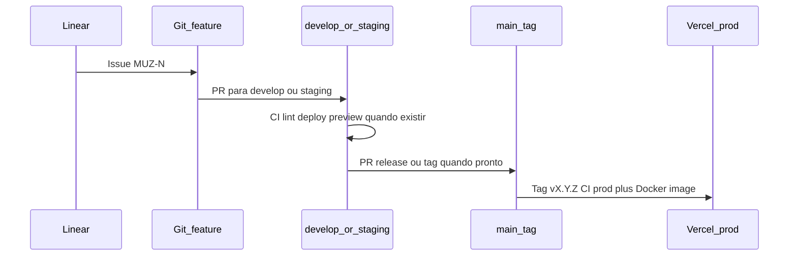

# Processo de desenvolvimento

**Propósito:** definir gestão de trabalho (Linear), modelos de branch (GitFlow vs trunk), automação CI/CD (GitHub Actions) e **matriz de ambientes** por superfície do Muziks.

**Normativo:** convenções de **git workflow** (branches, PRs, §0–§3) estão **em vigor** desde o início da implementação. **GitHub Actions** (§5, arquivos em `.github/workflows/`) é planejamento de CI/CD — **não** é o que se chama “git workflow” neste doc e **não** precisa existir para começar a codar.

Documentos irmãos: [STACK-E-FASES-DE-MIGRACAO.md](STACK-E-FASES-DE-MIGRACAO.md), [MONOREPO-TURBOREPO.md](MONOREPO-TURBOREPO.md), [MEIOS-DE-COMUNICACAO-E-OPERACAO.md](MEIOS-DE-COMUNICACAO-E-OPERACAO.md), [ROADMAP.md](../ROADMAP.md).

---

## 0. Bootstrap do monorepo (implementação)

Com o repositório saindo da fase só-`docs/`, o **git workflow** (GitFlow + regras no GitHub: `develop`, `feature/*`, PR, proteção de `main`) passa a valer para todo código em `apps/` e `packages/`. Specs e docs continuam via PR para `main` (§7). Automação **GitHub Actions** (§5) fica para quando o monorepo tiver apps a buildar/deployar.

### 0.1 Criar `develop` e primeira feature

| Passo | Ação |
|-------|------|
| 1 | A partir de `main` atualizada, criar branch long-lived **`develop`** e publicar (`git push -u origin develop`). |
| 2 | Para cada entrega, criar **`feature/MUZ-<n>-<slug-curto>`** a partir de **`develop`** (issue Linear `MUZ-<n>` no nome ou no PR). |
| 3 | Abrir PR **`feature/*` → `develop`**; revisão humana; merge após aprovação (checks de Actions, quando existirem, são adicionais). |
| 4 | Promoção periódica ou release: PR **`develop` → `main`** quando o incremento estiver estável (blog/docs) ou conforme §3.1 quando `staging` existir para o app produto. |

**Exemplos de nome:** `feature/MUZ-12-monorepo-scaffold`, `feature/MUZ-15-packages-db-drizzle`.

### 0.2 Branch de integração por fase

| Fase | Branch de integração | Features partem de |
|------|----------------------|-------------------|
| **Bootstrap** (scaffold Turborepo, `packages/*`, primeiros apps) | `develop` | `develop` |
| **`apps/web` / `apps/player` com deploy staging** | `staging` (criar a partir de `develop` quando houver ambiente staging, §4) | `staging` |
| **`apps/blog`** | `develop` (permanente) | `develop` |
| **Specs / `docs/`** | — | `main` (PR direto, sem `develop` obrigatório) |

Quando `staging` for criada para o app participante, **novas** features de `apps/web` e `apps/player` **devem** bifurcar de `staging`, não de `develop`. O bootstrap em `develop` permanece válido até esse corte.

### 0.3 O que ativa agora vs em seguida

| Regra | Quando |
|-------|--------|
| Nomes de branch, PR, vínculo Linear | **Imediato** |
| Proteção de `main` (sem push direto) | **Imediato** (configurar no GitHub) |
| GitHub Actions §5 (`ci.yml`, deploy, Docker) | **Depois** — quando houver app a buildar; opcional no bootstrap |
| Branch `staging` + deploy automático | Quando `apps/web` tiver ambiente staging (§4) |

### 0.4 Fase de entrega acelerada (solo, pré-piloto)

Enquanto o time for essencialmente **uma pessoa**, sem piloto externo em prod, e a meta for **versão estável para teste profundo** (ex.: marco interno **30/05/2026**), aplica-se o ciclo em **[`docs/tasks/CICLO-ENTREGA-E-FOCO.md`](../tasks/CICLO-ENTREGA-E-FOCO.md)**:

| Norma §0–§1 (futuro) | Exceção temporária |
|----------------------|-------------------|
| PR de código **deve** referenciar Linear `MUZ-n` | **Opcional** — backlog em `docs/tasks/backlog/` + comentários na PR |
| `feature/MUZ-<n>-slug` | `feature/<slug>` aceitável |
| Triagem Linear | Triagem no backlog git + PR |

**Não relaxado:** proteção de `main`, specs normativas, segredos fora do git. **Retomar** §1 integral quando houver 2+ contribuidores ou piloto em 1–2 espaços reais (ver §6 do doc de ciclo).

---

## 1. Gestão de trabalho — Linear

> **Fase solo (§0.4):** Linear permanece a direção de longo prazo; o backlog em git (`docs/tasks/backlog/`) é a fila operacional até o piloto.

### 1.1 Projeto

- Time/projeto **Muziks** no [Linear](https://linear.app) — **obrigatório** para rastrear features em código (§0).
- **Specs normativas** permanecem no git (`docs/specs/`); Linear é para **execução**, priorização e rastreio de entregas.

### 1.2 Convenções

| Item | Regra |
|------|--------|
| **Labels** | `spec`, `app`, `blog`, `infra`, `bug`, `debt` |
| **Vínculo PR** | Todo PR de código **deve** referenciar issue Linear (`MUZ-123`) |
| **Ciclos** | Alinhar ao [ROADMAP.md](../ROADMAP.md) (semanal time núcleo; mensal stakeholders) |
| **Specs → issues** | Ao fechar seção em spec, criar ou fechar issue correspondente |

### 1.3 O que não vai para o Linear

- Debate de redação de manifesto/spec sem entrega de código (pode ser issue `spec` se precisar de dono).
- Análises pontuais em `docs/analytics/` — rastrear no git/PR.

### 1.4 Comunidade e alertas (Discord)

- Servidor **Muziks** no Discord, centrais de notificação (`ops-*`, `community`) e agentes **MCP admin** (consulta/extração) estão definidos em [MEIOS-DE-COMUNICACAO-E-OPERACAO.md](MEIOS-DE-COMUNICACAO-E-OPERACAO.md).
- **Linear** permanece fonte de verdade para trabalho; Discord é **coordenação e alerta**, não substitui issue nem spec no git.

### 1.5 Feedback in-app → backlog (princípio de elegibilidade)

Norma de produto: [17-feedback-in-app-e-linear.md](../specs/17-feedback-in-app-e-linear.md).

| Regra | Aplicação |
|-------|-----------|
| **Nova issue de produto/bug** | Preferencialmente rastreável a feedback in-app (`feedback_id`), piloto, ou spec no git |
| **Criação automática** | `POST /api/feedback` abre issue Linear com label `feedback` + contexto técnico |
| **Triagem** | Antes de sprint: revisar fila `feedback` (produto + engenharia) |
| **PR de código** | Continua obrigatório `MUZ-n`; issue pode ter sido aberta pelo widget |

Issues `infra` / `debt` internos sem feedback são exceção documentada. Fechar feedback duplicado no Linear com link para issue canônica.

---

## 2. GitFlow, git workflow e GitHub Actions (esclarecimento)

Três coisas **distintas**. O que você configura **agora** no GitHub para começar a implementar é o **git workflow** (§2, coluna do meio) — **não** arquivos em `.github/workflows/`.

| Termo | O que é | No Muziks | Fase bootstrap |
|-------|---------|-----------|----------------|
| **GitFlow** | **Nomenclatura e papéis** das branches: `main`, `develop`, `feature/*`, `release/*`, `hotfix/*` | Blog, bootstrap do monorepo, docs | ✅ Em vigor |
| **Git workflow** (no GitHub) | **Como trabalhar no repositório:** branch padrão/integração (`develop`), PR `feature/*` → `develop`, `main` protegida, revisão antes de merge | Configuração do repo (branch rules, PR) alinhada ao §0 | ✅ **Em vigor** — é isto que “passa a valer” ao iniciar código |
| **GitHub Actions** | **CI/CD automatizado** — YAML em `.github/workflows/`: lint, build, deploy, releases | `apps/web` com staging + tag semver; ver §5 | ⏳ Futuro — **não** confundir com “git workflow” |
| **Trunk-based** | `main` + feature flags; poucas branches long-lived | Opcional na Fase infra C | ❌ Não na PoC |

**Não confundir:** no dia a dia, “workflow do processo de dev” = **git workflow** (branches + PR). **GitHub Actions** = pipelines de build/deploy (§5), complementares e posteriores.

**GitFlow não substitui CI/CD** — define *como* ramificar; Actions define *o que* rodar automaticamente em cada push/PR/tag, quando existir.

---

## 3. Política por superfície

Filtros Turborepo: `turbo run build --filter=@muziks/web` (ou equivalente).

| Superfície | App | Domínio | Modelo de branch | Ambientes | CI/CD |
|------------|-----|---------|------------------|-----------|-------|
| **Blog** | `apps/blog` | **blog.muziks.com.br** | GitFlow: `main`, `develop`, `feature/*` | **dev** + **prod** | Lint + deploy preview (PR) / prod (`main`) |
| **Participante (fila / PWA)** | `apps/web` | **muziks.app/{slug}** | `main` protegida; `staging` long-lived; `feature/*` | **dev** + **staging** + **prod** | Lint, `db:migrate` staging, deploy; **release** tag → prod |
| **Player master (Spotify)** | `apps/player` (placeholder) | **player.muziks.app/{slug}** | Igual `web` quando existir | **dev** + **staging** + **prod** | Lint + deploy; pode compartilhar pipeline com `web` |
| **Admin** (futuro) | `apps/admin` | TBD | Igual `web` quando existir | staging + prod | `--filter=admin` |
| **API** (futuro) | `apps/api` | TBD | Igual `web` quando extraído | staging + prod | Deploy Railway/Fly/AWS |
| **Docs** | `docs/` na raiz | — | PR → `main` (GitFlow leve) | só git | Opcional: link check markdown |

### 3.1 Branches — app produto (`apps/web`)

| Branch | Uso |
|--------|-----|
| `main` | Produção; protegida; só via PR ou release |
| `staging` | Integração contínua; deploy automático em staging |
| `feature/*` | Trabalho por issue Linear |
| `hotfix/*` | Correção urgente em prod → tag PATCH `vX.Y.Z+1`, imagem Docker, merge em `main` e `staging` — [DOCKER-REGISTRY-E-RELEASES.md](DOCKER-REGISTRY-E-RELEASES.md) §4.1 |

**Releases:** tags semver `vMAJOR.MINOR.PATCH` no GitHub disparam deploy de produção, **push de imagem Docker** versionada e notas de release — ver [DOCKER-REGISTRY-E-RELEASES.md](DOCKER-REGISTRY-E-RELEASES.md).

### 3.2 Branches — blog (`apps/blog`)

| Branch | Uso |
|--------|-----|
| `main` | Produção (`blog.muziks.com.br`) |
| `develop` | Integração de features do blog |
| `feature/*` | Posts, layout, SEO |

Sem ambiente **staging** dedicado — preview Vercel por PR cobre revisão.

---

## 4. Matriz de ambientes

| Ambiente | Blog (`muziks.com.br`) | Participante (`muziks.app`) | Master (`player.muziks.app`) | Banco | URL típica |
|----------|------------------------|----------------------------|------------------------------|-------|------------|
| **dev** | Vercel Preview / `pnpm dev` local | Local + **Cloudflare Tunnel** (OAuth, teste em celular) | Local ou preview | Supabase projeto **dev** | `*.vercel.app`, URL do tunnel |
| **staging** | — | `staging.muziks.app` (ou preview dedicado) | `staging-player.muziks.app` | Supabase projeto **staging** | subdomínios staging |
| **prod** | **blog.muziks.com.br** | **muziks.app/{slug}** | **player.muziks.app/{slug}** | Supabase **prod** → futuro RDS | domínios finais |

**DNS (todos os ambientes):** zonas **muziks.app** e **muziks.com.br** na **Cloudflare** (já configurado). Produção e staging usam registros na CF apontando para o origin (**Vercel** na PoC); proxy laranja ativo para CDN/SSL/DDoS. Detalhe de recursos CF opcionais: [STACK-E-FASES-DE-MIGRACAO.md](STACK-E-FASES-DE-MIGRACAO.md) §1.4.

| Host (ex.) | Ambiente | Origin típico (PoC) |
|------------|----------|---------------------|
| `muziks.app` | prod | Projeto Vercel `apps/web` |
| `staging.muziks.app` | staging | Preview ou projeto Vercel staging (`web`) |
| `player.muziks.app` | prod | Projeto Vercel `apps/player` (ou zona em `web` até app existir) |
| `staging-player.muziks.app` | staging | Preview staging do master |
| `blog.muziks.com.br` | prod | Projeto Vercel `apps/blog` |
| `*.vercel.app` | dev/preview | Deploy automático PR (pode ficar só na Vercel ou espelhar CNAME na CF) |

**Legado:** `app.muziks.com.br` foi host do produto antigo; o split **muziks.app** (visualização) + **player.muziks.app** (Spotify) está em [16-ui-player-e-fila.md](../specs/16-ui-player-e-fila.md).

### 4.1 Cloudflare Tunnel (dev local do player)

**Deve** usar tunnel na PoC quando for necessário:

- Callbacks OAuth em dispositivo móvel.
- Teste de QR/link em rede local do estabelecimento.
- Webhooks de terceiros apontando para máquina de dev.

Configuração e URL estável documentadas no README de `apps/web` quando o app existir.

### 4.2 Cloudflare na operação (PoC)

| Uso | Onde configurar |
|-----|-----------------|
| DNS / SSL / proxy | Dashboard Cloudflare (zonas já existentes) |
| Tunnel (dev) | `cloudflared` + token no README de `apps/web` |
| Pages / Workers / R2 | Só se decisão em STACK §1.4 — issue Linear `infra` |

Deploy continua disparado pela **Vercel** (GitHub Actions → Vercel); Cloudflare **não** substitui o pipeline de build na Fase A, exceto se migrar para **Pages** (padrão B em STACK).

### 4.3 Secrets

- GitHub **Environments:** `development`, `staging`, `production`.
- **Produção:** approval gate para deploy e `db:migrate`.
- Variáveis por app (Vercel) e por projeto Supabase — não reutilizar `service_role` entre ambientes.

---

## 5. GitHub Actions (esboço — CI/CD, não é git workflow)

Planejamento de **automação** em `.github/workflows/`. **Independente** do git workflow (§2): dá para codar e fazer PR só com branches + revisão; Actions entram quando fizer sentido operacional.

Arquivos a criar **quando** houver apps a buildar/deployar:

| Workflow | Gatilho | Ações |
|----------|---------|--------|
| `ci.yml` | PR em qualquer app | `turbo run lint` (filtro por paths alterados) |
| `deploy-blog-preview.yml` | PR tocando `apps/blog` | Deploy preview Vercel |
| `deploy-blog-prod.yml` | Push `main` + paths `apps/blog` | Deploy produção |
| `deploy-web-staging.yml` | Push `staging` + paths `apps/web` | Build, migrate staging, deploy |
| `release-web-prod.yml` | Tag `v*` | Migrate prod (approval), deploy prod, GitHub Release |
| `docker-build-staging.yml` | Push `staging` + paths app | Build e push `muziks/web:staging` (+ `sha-*`) — [DOCKER-REGISTRY-E-RELEASES.md](DOCKER-REGISTRY-E-RELEASES.md) |
| `release-docker-prod.yml` | Tag `v*` | Build imagem `muziks/web:vX.Y.Z`, push registry, deploy runtime (approval) |

Path filters evitam rebuild do blog quando só o player mudou.

**Artefato de release funcional:** tag Git + imagem Docker com o **mesmo** semver (sem `latest` em prod). Releases planejadas passam por **staging** validado; hotfix segue §4.1 do doc Docker.

---

## 6. Fluxo de trabalho sugerido (issue → produção)

1. Criar issue no Linear.
2. Branch `feature/MUZ-N-descricao` a partir de **`develop`** (bootstrap monorepo, blog) ou **`staging`** (`web`/`player`, após §0.2).
3. PR → `develop` ou `staging`; preview/staging quando CI existir; revisão humana.
4. Merge; validar em staging (player) ou preview (blog).
5. Release tag (`web`) → imagem `muziks/web:vX.Y.Z` + deploy; ou merge `develop` → `main` (blog / bootstrap).
6. Hotfix: branch da tag em prod → PATCH → mesma disciplina de imagem → merge `staging` + `main` (e `develop` se ainda integrar blog).

---

## 7. Documentação no repositório

| Tipo | Onde | Processo |
|------|------|----------|
| Specs normativas | `docs/specs/` | PR → `main`; revisão humana; mencionar issue se houver |
| Stack / processo | `docs/tech/` | Idem |
| Analytics | `docs/analytics/` | PR com contexto; não bloqueia deploy de app |

---

## Manutenção

Mudanças de ambiente, domínio, registry Docker ou política de branch **devem** atualizar este arquivo, [DOCKER-REGISTRY-E-RELEASES.md](DOCKER-REGISTRY-E-RELEASES.md) e [STACK-E-FASES-DE-MIGRACAO.md](STACK-E-FASES-DE-MIGRACAO.md) se afetarem migração de dados ou deploy.
