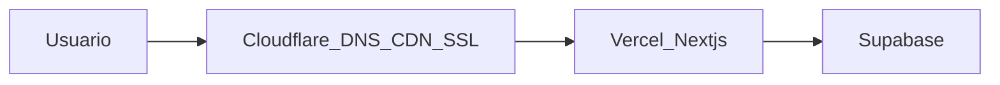
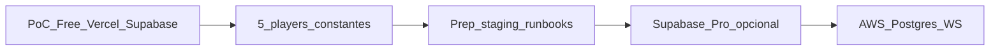

# Stack, fases de infraestrutura e migração

**Propósito:** documentar decisões **fechadas** de backend/infra para a PoC e o caminho até ambiente próprio (AWS), incluindo procedimentos de migração de dados no CI/CD. Complementa [congelamento-mvp-e-arquitetura.md](../mvp/congelamento-mvp-e-arquitetura.md) e [02-viabilidade-custos-comparativo.md](../mvp/02-viabilidade-custos-comparativo.md).

**Normativo:** trechos com “deve” descrevem requisitos acordados para implementação e operação.

---

## 1. Decisão de stack (PoC / Fase infra A)

### 1.1 Visão geral

| Camada | Tecnologia | Notas |
|--------|------------|--------|
| **Monorepo** | Turborepo + `pnpm` | Ver [MONOREPO-TURBOREPO.md](MONOREPO-TURBOREPO.md) |
| **App produto** | Next.js (App Router) em `apps/web` | Deploy Vercel; domínio `player.muziks.app/{slug}` |
| **Blog** | Next.js em `apps/blog` | Deploy Vercel separado; `blog.muziks.com.br` |
| **Banco** | PostgreSQL via **Supabase Free** | Auth, Storage; schema em `packages/db` |
| **API na PoC** | API Routes / Server Actions em `apps/web` | Sem `apps/api` até gatilho de extração |
| **Tempo real (fila)** | HTTP + polling **3–5 s** | Sem WebSocket por participante no salão |
| **Tempo real (playback MVP-B)** | **Supabase Realtime** (sessão + comandos) | Só dono/telão/Master — ver [06-arquitetura-playback-spotify.md](../mvp/06-arquitetura-playback-spotify.md) |
| **Escritas (voto)** | HTTP `POST` + rate-limit + fila de eventos | Ver §4 |
| **DNS + borda** | **Cloudflare** (já em uso) | DNS gerenciado; proxy/CDN/SSL na frente do origin; ver §1.4 |

**PoC 100% free tier:** Vercel (Hobby para testes internos; **Pro** quando piloto comercial — ver [02-viabilidade-custos](../mvp/02-viabilidade-custos-comparativo.md)) + Supabase Free + **Cloudflare Free** (DNS e borda; recursos adicionais conforme §1.4).

### 1.2 Portabilidade

- O schema **deve** viver em migrations versionadas em `packages/db/migrations` (Supabase CLI, Drizzle ou Prisma — escolher **uma** ferramenta no primeiro incremento de código e manter).
- Lógica crítica de domínio **não deve** existir apenas no Dashboard Supabase (triggers ad hoc sem migration).
- Contratos de API estáveis desde a PoC facilitam migração **strangler** para `apps/api` ou AWS sem reescrever o front.

### 1.3 O que fica fora da PoC

- `apps/api` dedicado, NestJS standalone, Redis, Kafka.
- WebSocket por cliente no salão.
- Infra AWS gerenciada (RDS, API Gateway WS) — alvo da Fase infra C.
- Adoção obrigatória de **D1**, **R2**, **Workers** ou **Cloudflare Pages** como host principal — permanecem **opcionais** (§1.4).

### 1.4 Cloudflare — DNS, borda e recursos opcionais

**Estado atual:** os domínios **muziks.app** e **muziks.com.br** já têm **DNS na Cloudflare**. Isso é a **base fixa** da stack; os demais produtos Cloudflare entram **sob demanda**, mapeados à necessidade.

#### 1.4.1 Padrão recomendado na PoC (Vercel + Cloudflare na frente)

| Papel | Serviço | Notas |
|-------|---------|--------|
| **Build e deploy** | **Vercel** (`apps/web`, `apps/blog`) | Melhor DX para Next.js (preview por PR, integração Turborepo) |
| **DNS** | **Cloudflare** | Registros `CNAME` para `*.vercel.app` ou custom domains Vercel |
| **Proxy (nuvem laranja)** | **Cloudflare** | CDN global, SSL/TLS, DDoS, cache de estáticos na borda |
| **Origin** | Vercel | Next.js App Router + Server Actions |
| **Dados / auth** | **Supabase** | Postgres, Auth, Storage (PoC) |
| **Dev local exposto** | **Cloudflare Tunnel** | OAuth, QR, webhooks — ver [PROCESSO-DESENVOLVIMENTO.md](PROCESSO-DESENVOLVIMENTO.md) §4.1 |

**Configuração mínima (prod):** SSL/TLS **Full (strict)** no Cloudflare; origin com certificado válido na Vercel; não duplicar cache agressivo em rotas dinâmicas de fila/voto (regras de cache por path quando necessário).

#### 1.4.2 Matriz de recursos Cloudflare (opções por necessidade)

Referência de *free tier* (validar limites atuais na [documentação Cloudflare](https://developers.cloudflare.com/)); valores são ordens de grandeza, não contrato.

| Recurso | O que resolve | Limites Free (ref.) | Quando considerar | PoC |
|---------|---------------|---------------------|-------------------|-----|
| **DNS** | Resolução rápida, gestão de registros | Ilimitado | **Sempre** — já em uso | ✅ Base |
| **CDN + proxy** | Cache estático, latência, proteção | Bandwidth generoso | **Sempre** na frente da Vercel | ✅ Recomendado |
| **SSL/TLS** | HTTPS automático | Incluso | Com proxy ativo | ✅ Base |
| **WAF / Bot Fight** | Mitigação básica de abuso | WAF limitado no Free | Rajada de votos, bots em QR público | Opcional |
| **Cloudflare Tunnel** | Expor `localhost` com URL HTTPS | Gratuito | Dev: OAuth, celular, webhooks | ✅ Dev |
| **Cloudflare Pages** | Deploy Next.js na edge CF | ~500 GB bandwidth/mês (ref.) | Reduzir custo de bandwidth vs Vercel; unificar tudo na CF | Alternativa |
| **Workers** | Funções serverless na borda | ~100k req/dia (ref.) | Rate-limit na borda, rewrite leve, BFF sem cold start Vercel | Fase B+ |
| **Workers KV** | Cache chave-valor global | ~100k reads/dia (ref.) | Cache de fila/telão de leitura (TTL curto) antes do origin | Fase B+ |
| **R2** | Object storage (S3-like) | 10 GB + egress grátis (ref.) | Capas de player, logos, assets estáticos; **menos egress** que Supabase Storage em escala | Quando Storage/egress do Supabase incomodar |
| **D1** | SQL SQLite na edge | Cotas de leitura (ref.) | **Não** substituir Postgres do Muziks na PoC; só micro-dados edge ou protótipo isolado | Não na PoC |
| **Queues** | Filas assíncronas | Disponível no Free (ref.) | Desacoplar processamento de votos pós-rajada (com Worker) | Fase B+ / `apps/api` |
| **Images** | Resize/WebP na borda | Incluso no proxy | Otimizar capas sem processar no Next | Quando lista de fila carregar muitas imagens |
| **Zero Trust** | Acesso a painéis internos | Limitado no Free | Proteger `staging` ou admin futuro | Secundário |

**Regra:** escolher recurso Cloudflare quando **Supabase ou Vercel** não cobrirem bem o caso (custo de egress, rate-limit na borda, storage barato) — não por padrão na Fase A.

#### 1.4.3 Padrões de arquitetura (escolha consciente)

| Padrão | Frontend | Borda | Dados | Melhor para |
|--------|----------|-------|-------|-------------|
| **A — Principal (PoC)** | Vercel | Cloudflare DNS + proxy | Supabase | Velocidade de entrega; previews; DNS já na CF |
| **B — Cloudflare-heavy** | **Cloudflare Pages** (Next.js) | Mesma conta CF | Supabase (ou D1 só para protótipo) | Unificar conta e bandwidth; aceitar DX diferente da Vercel |
| **C — Combo custo/escala** | Vercel ou Pages | Cloudflare | Supabase + **R2** para assets | Reduzir egress de imagens; manter Postgres no Supabase até AWS |

**Cloudflare Pages × Vercel (resumo):**

| Critério | Vercel | Cloudflare Pages |
|----------|--------|------------------|
| DX Next.js / monorepo | Forte (previews, Turborepo remoto) | Boa; conferir limites de build e SSR |
| Bandwidth free (ref.) | ~100 GB/mês (Hobby) | ~500 GB/mês (ref. pública) |
| Preview por branch | Nativo | Suportado |
| Já adotado no Muziks | **Deploy alvo PoC** | **Opção** se bandwidth ou conta única CF priorizar |

#### 1.4.4 Gatilhos para ativar opções Cloudflare (além de DNS/proxy)

| Gatilho | Recurso a avaliar |
|---------|-------------------|
| Egress Supabase Storage ou Vercel alto em **capas/imagens** | **R2** + CDN; cache longo em paths `/assets/*` |
| Rate-limit e 429 no origin durante rajada | **Workers** na borda + fila no Postgres (lógica continua no Supabase) |
| Leitura de fila/telão pressionando Vercel/Supabase | **Workers KV** com TTL 2–4 s (alinhar ao polling 3–5 s) |
| Custo ou termos Vercel Hobby/Pro | **Pages** como host alternativo do mesmo `apps/web` |
| Extração de `apps/api` com jobs assíncronos | **Queues** + Workers consumidores |
| Staging/admin exposto na internet | **Zero Trust** ou regras de acesso |

Inventário de quotas na **Fase infra B** (§2.1) **deve** incluir Cloudflare (requests Workers, R2, bandwidth Pages) além de Vercel e Supabase.

---

## 2. Fases de infraestrutura e gatilhos

Alinhamento com fases de produto em [13-kpis-fases-e-loops.md](../specs/13-kpis-fases-e-loops.md).

| Fase infra | Fase produto (ref.) | Infra típica | Gatilho / escala |
|------------|---------------------|--------------|------------------|
| **A — PoC free** | A — Validação | Vercel + Supabase Free + Cloudflare (DNS/proxy); polling | 3–5 pilotos ICP; custo R$ 0 |
| **B — Preparação** | B — Tração | Supabase Pro; **staging** obrigatório; runbooks | **5 players constantes** (§2.1) |
| **B+ — Pro estável** | B — Tração | Supabase Pro; backups PITR | 8–10 players reais ou exigência de SLA |
| **C — Escala própria** | C — Escala | AWS RDS Postgres + WS onde métrica justificar | Centenas+ *concurrent* ou compliance |

### 2.1 Player constante e gatilho dos 5 players

**Player constante** (definição operacional sugerida, ajustável com baseline próprio):

- Player com **pelo menos uma sessão com participação** (≥1 voto válido ou ação de fila aceita) em **≥3 das últimas 4 semanas** corridas.

**Gatilho Fase infra B (preparação):** ao atingir **5 players constantes**, o time **deve** iniciar a trilha de preparação (não exige migração imediata para AWS):

1. Inventário de quotas Vercel, Supabase e Cloudflare (egress, MAU, conexões, Workers/R2 se em uso).
2. Ambiente **staging** estável (`staging.player.muziks.app` + projeto Supabase staging).
3. Runbook de backup/restore testado em staging.
4. ADR curto: alvo AWS (RDS + serviço WebSocket ou equivalente).
5. Revisão de [02-viabilidade-custos-comparativo.md](../mvp/02-viabilidade-custos-comparativo.md) com números reais.

### 2.2 Fase infra C — AWS (alvo)

- **PostgreSQL** gerenciado (RDS).
- **WebSocket** para casos que polling não cobre (ex.: painel do dono, telão de latência mínima) — só quando métrica e custo justificarem.
- Migração **strangler**: extrair `apps/api` ou serviços em AWS mantendo contratos HTTP; migrar auth, fila de votos e realtime por etapas.
- Referência de custo e quando compensa: [02-viabilidade-custos § AWS](../mvp/02-viabilidade-custos-comparativo.md).

---

## 3. Rajada, tempo real e custo (PoC)

Contexto histórico: picos de centenas de pedidos por bar por dia ([03-ponte-pedidos-e-sazonalidade](../analytics/reports/03-ponte-pedidos-e-sazonalidade.md)).

| Caminho | Uso na PoC |
|---------|------------|
| **HTTP `POST` /vote** | Escrita com validação de política + identidade |
| **Rate-limit** | Por `participant_id`, IP e opcionalmente dispositivo |
| **Fila de votos** | Evento inserido; worker ou transação serializada aplica contagem |
| **HTTP `GET` /queue** + **Cache-Control** | Leitura para clientes e telão; polling **3–5 s** |
| **Supabase Realtime** | **Não** por participante no salão; reservar para dono/admin ou adiar |

Dimensionar quotas pelo cenário **“50 pessoas votam em 2 minutos no mesmo player”**, não pela média diária.

---

## 4. Procedimentos de migração de dados (CI/CD)

### 4.1 Matriz por procedimento

| Procedimento | Dev local | Staging | Produção | CI/CD |
|--------------|-----------|---------|----------|-------|
| **Schema** | `packages/db/migrations` | `migrate` no pipeline pós-merge em `staging` | `migrate` com aprovação manual ou **tag semver** | GitHub Actions: job `db:migrate` por environment |
| **Seed** | `pnpm db:seed` (dados sintéticos) | seed fixo de cenários de teste | **nunca** seed destrutivo | script versionado em `packages/db` |
| **Dados de teste** | fixtures SQL | cópia **anonimizada** opcional de prod (política LGPD) | — | `workflow_dispatch` manual |
| **Promoção** | — | deploy branch `staging` | tag `v*.*.*` → produção | ver [PROCESSO-DESENVOLVIMENTO.md](PROCESSO-DESENVOLVIMENTO.md) |
| **Rollback schema** | revert forward-only + restore local | restore snapshot staging | runbook + backup PITR (Pro) | documentar limite do Free: backup manual |

### 4.2 Regras

- Migrations **devem** ser aplicadas em **staging** antes de produção.
- Produção **não deve** receber `db push` destrutivo sem revisão e janela acordada.
- Secrets de banco **devem** ficar em GitHub Environments (`development`, `staging`, `production`); produção com approval gate.
- Projetos Supabase **separados** por ambiente (dev / staging / prod) — não compartilhar `service_role` entre ambientes.

### 4.3 Migração Supabase → AWS (futuro)

1. Congelar schema em `packages/db` (fonte da verdade).
2. `pg_dump` / replicação lógica para RDS (janela de manutenção).
3. Apontar `apps/web` ou `apps/api` para novo `DATABASE_URL`; validar leitura/escrita em staging primeiro.
4. Manter Supabase Auth temporariamente ou migrar para Cognito/Clerk — etapa separada, não big-bang.
5. Desligar projeto Supabase antigo só após período de observação.

---

## 5. Checklist operacional (PoC)

Derivado de [02-viabilidade-custos § POC](../mvp/02-viabilidade-custos-comparativo.md):

- [ ] Rajada simulada: ≥30 votos em &lt;2 min no mesmo player — sem 429 indevido, sem timeout no DB.
- [ ] Fila/telão estáveis com polling (sem WS por participante).
- [ ] Pico *concurrent* por player (≤50–80 no ICP) sem erro de leitura.
- [ ] *Egress* controlado (cache de imagens no cliente/CDN; Cloudflare proxy ou R2 se ativado).
- [ ] DNS Cloudflare: registros `player` / `blog` / `staging` apontando ao origin correto; SSL **Full (strict)**.
- [ ] Termos Vercel Hobby vs Pro alinhados ao tipo de piloto (interno vs comercial).
- [ ] Backup manual ou branch Supabase no free tier (sem PITR).
- [ ] Fluxo de logout, expiração de token e `participant_id` estável documentado.

---

## 7. Experimentos de disrupção (não PoC)

Trilhas documentadas em [`docs/disruption/`](../disruption/README.md) que **não alteram** a Fase infra A até conclusão de spike e ADR.

| Experimento | Objetivo | Estado |
|-------------|----------|--------|
| [Hub local WebRTC](../disruption/hub-local-webrtc-e-fanout.md) | Reduzir polls redundantes da fila no mesmo espaço físico; fan-out local da **leitura**; votos permanecem HTTP POST | E0 documentado; E1+ pendente |

A PoC **continua** com polling HTTP 3–5 s e sem WebSocket por participante (§3). WebSocket na Fase C (§2.2) é caminho distinto (painel/telão ↔ servidor), não substituto automático do Hub P2P.

---

## 6. Documentos relacionados

| Documento | Conteúdo |
|-----------|----------|
| [MONOREPO-TURBOREPO.md](MONOREPO-TURBOREPO.md) | Estrutura de apps e packages |
| [PROCESSO-DESENVOLVIMENTO.md](PROCESSO-DESENVOLVIMENTO.md) | Linear, branches, ambientes, GitHub Actions |
| [11-backend-and-integrations-open.md](../specs/11-backend-and-integrations-open.md) | Integrações ainda abertas (catálogo, fila, fichas) |
| [02-viabilidade-custos-comparativo.md](../mvp/02-viabilidade-custos-comparativo.md) | Tabela de custos Free / Pro / AWS |
| [hub-local-webrtc-e-fanout.md](../disruption/hub-local-webrtc-e-fanout.md) | Experimento Hub local (leitura P2P) |

---

## Manutenção

Mudanças de stack ou gatilho de fase **devem** atualizar este arquivo e propagar para [congelamento-mvp-e-arquitetura.md](../mvp/congelamento-mvp-e-arquitetura.md) e [11-backend-and-integrations-open.md](../specs/11-backend-and-integrations-open.md) quando normativas.
