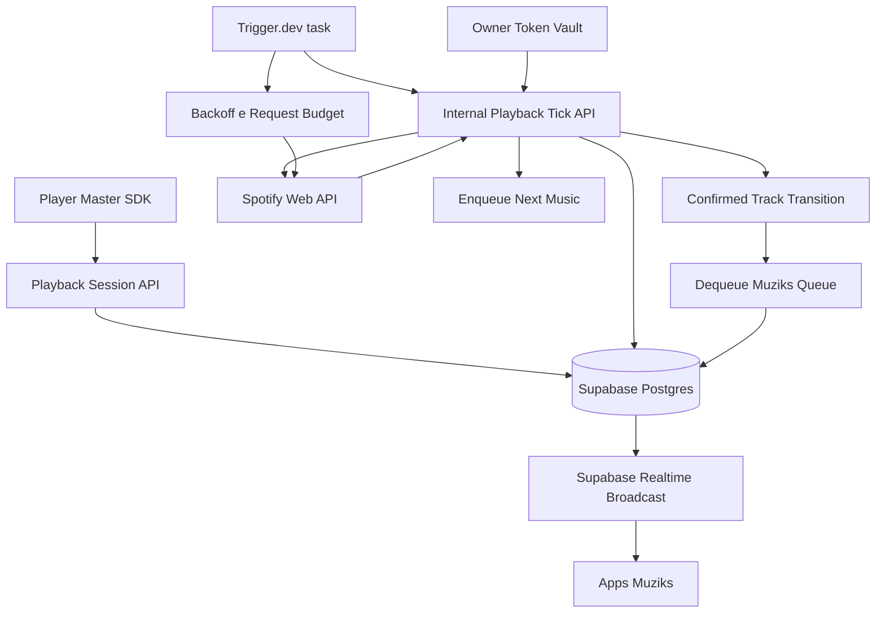

# Trigger.dev PoC — orquestração de playback

**Status:** proposto para validação de PoC  
**Data:** 2026-05-25  

**Propósito:** documentar como o Muziks pode usar Trigger.dev para sustentar processos de longa duração, controlar requests ao Spotify e reconciliar estado do player sem transformar jobs externos na fonte primária do playback.

Documentos relacionados:

- [ADR-spotify-state-sync.md](./ADR-spotify-state-sync.md) — Master, Realtime, bridge e fallback de tick
- [PLAYBACK-MASTER-CLIENT-SYNC.md](./PLAYBACK-MASTER-CLIENT-SYNC.md) — estado ao vivo no browser Master
- [PLAYBACK-NEAR-END-AND-QUEUE-MIRROR.md](./PLAYBACK-NEAR-END-AND-QUEUE-MIRROR.md) — near-end, mirror e dequeue
- [LIMITES-DE-USO-E-CONTINGENCIA.md](./LIMITES-DE-USO-E-CONTINGENCIA.md) — limites operacionais e runbook
- [11-backend-and-integrations-open.md](../specs/11-backend-and-integrations-open.md) — decisões abertas e integrações

---

## 1. Decisão para a PoC

Trigger.dev entra como **camada de worker/reconciliação em background** para:

1. Executar ticks server-side em players ativos cujo browser SDK não é a autoridade atual.
2. Controlar orçamento de chamadas Spotify por player e por endpoint.
3. Fazer backoff centralizado quando Spotify retornar `429` + `Retry-After`.
4. Reconciliar `player_sessions`, lifecycle de faixa e snapshots Realtime.
5. Validar caminho futuro self-hosted para reduzir custo operacional de players.

Trigger.dev **não** substitui o Player Master quando o Web Playback SDK está tocando no browser, nem assume votos, comandos do dono ou transições críticas como dependência única.

---

## 2. Invariantes

| Invariante | Regra |
| ---------- | ----- |
| Fonte viva | Master com SDK é autoridade quando o áudio toca no browser; worker assume somente background/device externo. |
| Autoridade de domínio | Tasks chamam rotas/slices internos; não escrevem direto no Postgres para contornar regras. |
| Fan-out | Estado compartilhado sai por Supabase Realtime Broadcast (`session.snapshot`, `queue.snapshot`). |
| Token | Playback sempre usa token do dono via vault + refresh server-side; nunca cookie de browser nem SDK. |
| Catálogo | Busca pública pode usar Client Credentials; playback/queue não pode. |
| Near-end | Prepara a fila Spotify, mas não faz dequeue da fila Muziks. |
| Dequeue | Só acontece após troca confirmada de `trackUri`, `track_ended` confiável ou amostra server-side idempotente. |
| Backoff | `429` é sinal operacional normal; respeitar `Retry-After` e suspender chamadas não essenciais. |
| Self-hosting | É caminho futuro, com custo/segurança/escala sob responsabilidade do operador. |

---

## 3. Fluxo conceitual



Este fluxo é compatível com o tick existente:

- `supabase/functions/playback-sync/index.ts`
- `apps/player/app/api/internal/playback-tick/route.ts`
- `apps/player/src/features/playback/services/playback-orchestrator-runner.ts`

Na PoC, Trigger.dev complementa o agendamento do tick para sessões `background`/`api_device`. O contrato interno continua sendo a API do `apps/player`, e o projeto do worker fica em `apps/playback-worker`.

---

## 4. Modelo de token

| Uso | Token permitido | Observação |
| --- | --------------- | ---------- |
| Busca/catálogo público | Client Credentials | Sem playback, sem fila do usuário, sem Premium. |
| `GET /me/player` | Token do dono | Exige vault + refresh token do owner. |
| `GET /me/player/queue` | Token do dono | Usado para confirmar fila nativa e evitar duplicatas. |
| `POST /me/player/queue` | Token do dono | Adiciona URI à fila nativa Spotify. |
| `next`, `play`, `pause`, `transfer` | Token do dono | Somente comandos do dono ou transição autoritativa. |

Regras:

- Worker não lê cookie do `player`.
- Worker não depende do Web Playback SDK.
- Worker resolve `access_token` pelo vault antes de cada operação.
- Se o token expirou, o servidor faz refresh com o `refresh_token` salvo.
- `service_role`, secret keys e refresh tokens nunca chegam ao cliente público.

---

## 5. Tasks permitidas na PoC

### 5.1 `playback-tick`

Objetivo: amostrar estado de players ativos e publicar snapshot quando houver mudança semântica.

Entradas mínimas:

- `playerId`
- `expectedEndAt`
- `lastKnownStatus`
- `lastKnownTrackUri`

Saídas:

- atualização em `player_sessions`
- eventos de lifecycle (`track_started`, `track_paused`, `track_resumed`, `track_ended`) quando idempotentes
- Broadcast `session.snapshot` quando necessário

### 5.2 `enqueue-next-music-in-spotify-queue`

Objetivo: garantir que a próxima música da fila Muziks esteja na fila nativa Spotify antes do fim.

Contrato Spotify:

```text
POST /v1/me/player/queue?uri={spotifyUri}&device_id={deviceId}
```

Limitações da Web API:

- não insere em posição exata;
- não remove item da fila;
- não limpa fila;
- não reordena fila nativa;
- não garante lookahead longo no retorno de queue.

Estratégia:

1. Ler próxima(s) URI(s) da fila Muziks.
2. Ler `GET /me/player/queue`.
3. Se a URI já aparece em `upcoming`, não fazer nada.
4. Se estiver ausente, chamar `POST /me/player/queue`.
5. Registrar idempotência por `playerId + currentTrackUri + nextTrackUri`.
6. Limitar lookahead a 2-3 faixas para evitar duplicatas e gasto de requests.

### 5.3 `confirmed-transition-reconcile`

Objetivo: confirmar que a faixa atual mudou e só então avançar a fila Muziks.

Gatilhos válidos:

- `trackUri` atual mudou para a próxima esperada;
- evento confiável `track_ended` do bridge/sidecar;
- amostra server-side passou do fim e confirmou posição/fim sem divergência.

Regra crítica: **near-end/preload não faz dequeue**.

### 5.4 Tarefas não críticas

Permitidas desde que sejam desligáveis:

- limpeza de eventos antigos;
- compactação/agregação de lifecycle;
- relatórios operacionais;
- backfills;
- enriquecimento de metadados;
- reconciliação tardia de snapshots.

---

## 6. Tasks proibidas no hot path

| Não usar Trigger.dev para | Motivo |
| ------------------------- | ------ |
| Voto por participante | Alta cardinalidade; HTTP + rate-limit próprio já é o contrato. |
| Comando do dono | Deve responder rápido e com feedback direto. |
| UX Realtime | Supabase Broadcast é o canal de tela/participante. |
| Dequeue no near-end | Corrompe fila lógica antes da confirmação de troca. |
| `mirror-next` como dependência única | Near-end precisa funcionar pelo Master quando possível. |
| Poll agressivo por progresso | Custo e risco de `429`; progresso vivo fica no Master. |

---

## 7. Poll adaptativo por player

| Estado | Cadência sugerida | Regra |
| ------ | ----------------- | ----- |
| `playing` longe do fim | 15-30 s | Só reconciliar e manter expected end. |
| `playing` perto do fim | 3-5 s | Janela curta para confirmar transição. |
| `paused` | 30-60 s | Não insistir em fim de faixa pausada. |
| `idle` | 2-5 min ou suspenso | Não consumir Spotify sem sessão ativa. |
| `429` | `Retry-After` + margem | Congelar chamadas não essenciais. |

Locks:

- uma task ativa por `playerId`;
- idempotência por evento (`playerId`, `trackUri`, `startedAt`, `transitionKey`);
- teto global de concorrência menor que o limite do plano Trigger.dev;
- fila de retry com jitter para não sincronizar picos.

---

## 8. Orçamento Spotify por operação

| Operação | Essencialidade | Orçamento PoC |
| -------- | -------------- | ------------- |
| `GET /me/player` | Alta | Adaptativo; máximo 1 chamada por player a cada 3-5 s apenas perto do fim. |
| `GET /me/player/queue` | Média | Antes de `addToQueue` e em refresh pontual; evitar polling contínuo. |
| `POST /me/player/queue` | Alta no near-end | 1 tentativa por próxima faixa + retry único com backoff. |
| `next` / `play` | Crítica, rara | Só comando do dono ou transição autoritativa. |
| Refresh token | Crítica | Sob demanda, com cache de access token e skew de expiração. |
| Search | Baixa | Preferir Client Credentials, cache/debounce e desligável. |

---

## 9. Cloud vs self-hosted

### Trigger.dev Cloud

Adequado para validar a PoC porque entrega dashboard, filas, retries, logs e deploy simples. Limitações relevantes:

- concorrência e schedules por plano;
- log retention curto no Free;
- TTL máximo de runs no Cloud;
- Realtime Trigger não é canal de UX do player;
- API rate limit e batch trigger limit devem ser considerados no design.

### Self-hosted futuro

Opção para reduzir custo e controlar workers quando houver players pagos suficientes.

Referências oficiais:

- [Trigger.dev Docker self-hosting](https://trigger.dev/docs/self-hosting/docker)
- [Trigger.dev Kubernetes self-hosting](https://trigger.dev/docs/self-hosting/kubernetes)

Premissas operacionais:

- Docker Compose serve para teste/infra pequena;
- Kubernetes/Helm serve para escala, mas exige segurança, secrets, observabilidade, backups e controle de custo;
- workers podem escalar separados do webapp;
- produção self-hosted precisa version locking, registry, object storage e política de logs;
- se o esforço operacional superar o ganho, Cloud volta a ser preferência.

---

## 10. Critérios de validação

- [ ] Documento diferencia token de catálogo e token de playback.
- [ ] Toda operação de playback usa vault + refresh server-side.
- [ ] `enqueue-next-music-in-spotify-queue` está separado de dequeue.
- [ ] Dequeue só ocorre após transição confirmada.
- [ ] Cada task tem idempotência e lock por player.
- [ ] Poll adaptativo reduz chamadas quando `paused`, `idle` ou em backoff.
- [ ] `429` respeita `Retry-After` e desliga chamadas não essenciais.
- [ ] Broadcast continua explícito após persistência aceita.
- [ ] Self-hosting fica documentado como opção futura, não requisito da PoC.

---

## 11. Referências

- [Trigger.dev limits](https://trigger.dev/docs/limits)
- [Trigger.dev Docker self-hosting](https://trigger.dev/docs/self-hosting/docker)
- [Trigger.dev Kubernetes self-hosting](https://trigger.dev/docs/self-hosting/kubernetes)
- [Supabase Realtime Broadcast](https://supabase.com/docs/guides/realtime/broadcast)
- [Supabase Realtime limits](https://supabase.com/docs/guides/realtime/limits)
- [Spotify rate limits](https://developer.spotify.com/documentation/web-api/concepts/rate-limits)
- [Spotify Add Item to Playback Queue](https://developer.spotify.com/documentation/web-api/reference/add-to-queue)
