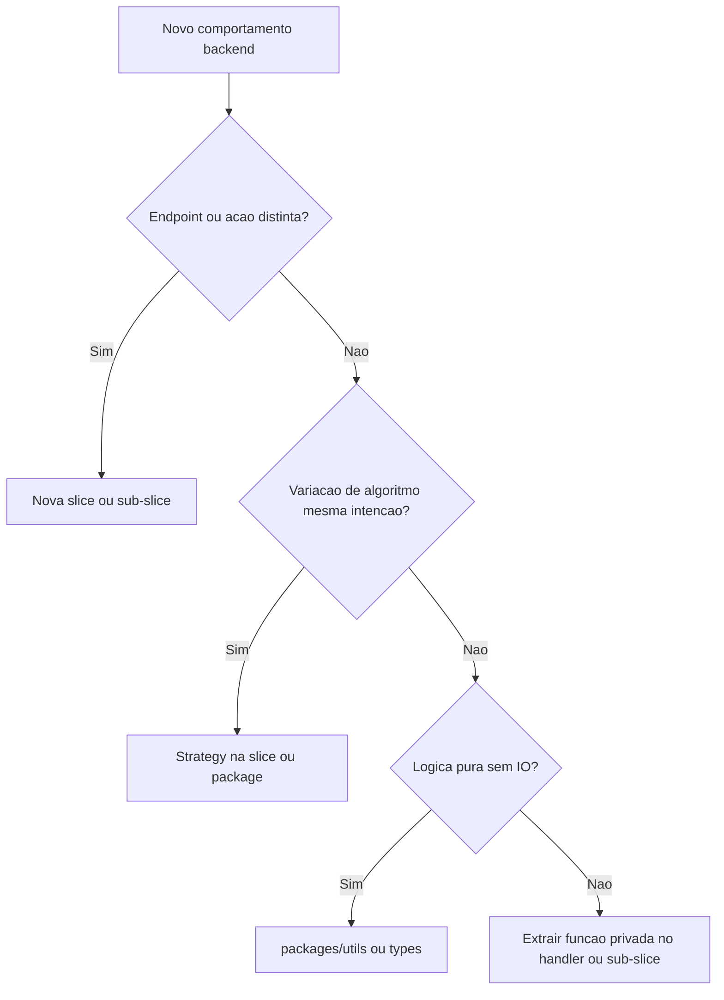

# Vertical Slice Architecture no Muziks (API e backend)

**Status:** convenção alvo para backend quando existir `apps/api` ou camada server estruturada em `apps/web` (ver [MONOREPO-TURBOREPO.md](MONOREPO-TURBOREPO.md)). As pastas abaixo são o **contrato de organização**, não uma árvore que precisa existir hoje.

Este documento fixa **o que é** Vertical Slice Architecture (VSA), **por que** o Muziks a adota no backend, e **como** decidir entre **sub-slices**, **strategies** (DDD) e **packages compartilhados** — espelhando o papel do [ATOMIC-DESIGN.md](ATOMIC-DESIGN.md) no frontend.

**Normativo:** convenções com “deve” aplicam-se na implementação de API/backend.

Documento irmão na pasta specs: [15-backend-architecture.md](../specs/15-backend-architecture.md).

---

## 1. O que é Vertical Slice Architecture

**Vertical Slice Architecture** organiza o código por **caso de uso** (feature, comando, query), não por **camada técnica** (controllers, services, repositories em pastas separadas).

Cada **slice** (fatia vertical) contém, no mesmo lugar lógico, tudo que aquele fluxo precisa:

- entrada HTTP / mensagem / Server Action;
- validação do pedido;
- regra de negócio daquele fluxo;
- acesso a persistência necessário **para aquele fluxo**;
- resposta / eventos emitidos.

Uma slice é delimitada por **intenção do usuário ou do sistema** (“registrar voto na fila”, “aplicar firewall ao pedido”), não por tipo de arquivo.

Referências:

- Jimmy Bogard — [Vertical Slice Architecture](https://www.jimmybogard.com/blogs/vertical-slice-architecture/)
- Comunidade: “feature folders”, “use-case driven structure”

---

## 2. Por que o Muziks usa VSA no backend

| Problema de camadas clássicas | Como a VSA ajuda no Muziks |
|------------------------------|----------------------------|
| Alterar “votar” exige navegar `controllers/`, `services/`, `repositories/` | Tudo do voto fica em **uma fatia** — alinhado a issues Linear e specs ([06-queue-voting-and-chips.md](../specs/06-queue-voting-and-chips.md)) |
| Serviços genéricos viram “deus” (`QueueService` com 40 métodos) | Cada comando/query **pequeno** e nomeado (`VoteOnQueueItem`, `GetPublicQueue`) |
| Difícil para agentes/contribuidores saberem onde mexer | Pasta = capacidade de produto; espelha `features/` do front ([09-frontend-architecture.md](../specs/09-frontend-architecture.md)) |
| Extração `apps/web` → `apps/api` | Slices movem **inteiras**; contrato HTTP estável ([STACK-E-FASES-DE-MIGRACAO.md](STACK-E-FASES-DE-MIGRACAO.md)) |
| Domínio rico (política, fila, playback, catálogo) | Várias slices **independentes** evoluem em paralelo sem acoplamento por camada |

**Princípio:** o backend implementa **comportamentos** descritos nas specs; a unidade de código deve ser **encontrável pelo nome do comportamento**.

**O que a VSA não é:** abandono de modelo de domínio — entidades e invariantes continuam em [03-domain-model.md](../specs/03-domain-model.md). VSA é **organização do código de aplicação**, não substituto do modelo conceitual.

---

## 3. Paralelo com Atomic Design (frontend)

| Frontend (Atomic Design) | Backend (Vertical Slice) |
|--------------------------|---------------------------|
| **Átomo** — botão, input, token | **Kernel compartilhado** — `packages/db` (client Drizzle), `packages/utils`, tipos puros |
| **Molécula** — combinação UI com um propósito | **Valor / validador reutilizável** — ex. `Isrc`, `ParticipantId`, schema Zod compartilhado |
| **Organismo** — bloco de tela (fila completa) | **Handler de um caso de uso** — orquestra um fluxo ponta a ponta |
| **Template** — layout sem dados | **Contrato HTTP** — rota, método, DTO request/response |
| **Página** — rota + dados reais | **Slice completa** — pasta do feature com 1+ casos de uso relacionados |

**Regra espelhada:** se algo é **reutilizável e genérico**, vai para `packages/*`. Se é **um comportamento de produto**, vive numa **slice** (ou sub-slice).

---

## 4. O que fica fora das slices (compartilhado)

| Local | Conteúdo | Motivo |
|-------|----------|--------|
| `packages/db` | Schema Drizzle, migrations, client Postgres | Uma fonte de verdade de persistência |
| `packages/types` | Tipos **estáveis** cruzando apps (PlayerId, DTO público) | Contrato front ↔ API |
| `packages/spotify` | Cliente HTTP, mapeamento ISRC, **sem secrets** | Adaptador de infra compartilhado |
| `packages/utils` | Funções puras (datas, normalização de string) | Sem regra de negócio de fluxo |

**Não** criar `packages/services/QueueService` monolítico — isso recria camada horizontal disfarçada.

Secrets e config de runtime ficam no **app** (`apps/web`, `apps/api`), nunca em packages publicáveis ([MONOREPO-TURBOREPO.md](MONOREPO-TURBOREPO.md)).

---

## 5. Anatomia de uma slice

Estrutura **sugerida** por caso de uso (nomes podem variar; manter **co-localização**):

```
slices/<feature-area>/<use-case-name>/
  route.ts          # ou handler.ts — entrada HTTP / tRPC / Server Action
  command.ts        # input tipado (Command / Query)
  handler.ts        # orquestração do fluxo (único lugar com “story”)
  validator.ts      # regras de entrada (Zod, etc.)
  result.ts         # tipo de saída / erros de domínio deste fluxo
  README.md         # opcional: 5 linhas — spec link, invariantes, side effects
```

**Handler** — contém a sequência legível: carregar player → checar política → persistir voto → enfileirar evento. Sem “service” genérico intermediário.

**Persistência** — o handler chama `packages/db` (repositories finos **por slice** ou queries Drizzle inline no handler se simples). Se a query crescer demais, extrair para `queries/get-queue-for-player.ts` **dentro da mesma slice**, não para pasta global `repositories/`.

---

## 6. Árvore de pastas (alvo)

### 6.1 `apps/api` (futuro)

```
apps/api/src/
  slices/
    queue/
      vote-on-queue-item/
      get-public-queue/
      propose-track/              # sub-slice se “propor” for fluxo distinto
    policy/
      evaluate-track-against-firewall/
    playback/
      publish-session-state/
      dequeue-playback-command/
    catalog/
      search-tracks/
    player/
      create-player/
  shared/                         # só o que 3+ slices usam E não cabe em packages/
    middleware/
    auth/
    errors/
```

### 6.2 PoC em `apps/web` (antes de `apps/api`)

Mesma convenção sob rota server, para não reescrever depois:

```
apps/web/src/
  slices/                         # ou server/slices/
    queue/vote-on-queue-item/     # Server Action + handler
  app/api/...                     # Route Handler fino que delega para slice
```

**Regra:** Route Handler / Server Action **delega** para `handler.ts` da slice; não embute regra de negócio em `app/api/route.ts`.

---

## 7. Feature area vs caso de uso vs sub-slice

| Nível | Nome | Exemplo | Critério |
|-------|------|---------|----------|
| **Feature area** | Pasta agrupadora | `slices/queue/` | Mesmo vocabulário de spec ([06-queue-voting-and-chips.md](../specs/06-queue-voting-and-chips.md)) |
| **Caso de uso (slice)** | Pasta folha com handler | `vote-on-queue-item/` | **Um** endpoint/ação com contrato estável |
| **Sub-slice** | Subpasta ou slice irmã | `queue/vote-on-queue-item/`, `queue/apply-vote-weight/` | Passos **distintos** com contratos ou invariantes diferentes, mas mesmo domínio “fila” |

**Sub-slice é preferível a strategy** quando:

- o fluxo ganha **nome próprio** na documentação ou API;
- pode evoluir, ser versionado ou ter rate-limit **diferente**;
- outro time/agente pode implementar **sem** abrir handler gigante.

---

## 8. Strategies (DDD) — quando e onde documentar

**Strategy** = família de algoritmos **intercambiáveis** atrás da **mesma porta** (interface), escolhidos em runtime ou config.

| Usar **strategy** | Usar **sub-slice** |
|-------------------|---------------------|
| Várias formas de **calcular ranking** (`VotesOnlyRanking`, `ChipsWeightedRanking`) | “Votar” vs “listar fila” vs “remover item” — **intenções** diferentes |
| Provedor de catálogo (`SpotifyCatalog`, `DeezerCatalog`) | Buscar vs resolver ISRC vs importar metadados — se APIs públicas distintas |
| Política de desempate configurável **dentro** do mesmo comando | Cada comando com POST/GET próprio |
| Serialização de evento outbound (outbox) | — |

### 8.1 Onde colocar no código

```
slices/queue/vote-on-queue-item/
  handler.ts
  strategies/
    ranking.strategy.ts       # interface
    votes-only.ranking.ts
    chips-weighted.ranking.ts
```

Ou, se **2+ slices** usam o mesmo port:

```
packages/catalog/
  search.strategy.ts          # interface + tipos
  spotify.search.ts
  deezer.search.ts
```

**Regra:** strategy em `packages/` só quando **≥2 feature areas** consomem a mesma abstração sem duplicar.

### 8.2 O que documentar (validação doc vs código)

| Abordagem | Melhor para documentação | Melhor para código |
|-----------|-------------------------|-------------------|
| **Sub-slice** | Specs e Linear por **capacidade** (“Votar na fila”); README por pasta; mapa 1:1 spec ↔ pasta | Handlers menores; rotas explícitas |
| **Strategy** | Uma seção na spec do domínio (“Ranking”) listando variantes; tabela de config do player | Troca de algoritmo sem novos endpoints |
| **Package compartilhado** | [11-backend-and-integrations-open](../specs/11-backend-and-integrations-open.md), integrações Spotify/Deezer | Clientes HTTP, ISRC |

**Recomendação Muziks (fechada):**

1. **Documentação de produto** ([`docs/specs/`](../specs/README.md)) — descreve **comportamentos** (casos de uso), não strategies internas.
2. **README da slice** (opcional, 5–15 linhas) — link para spec, invariantes, eventos colaterais.
3. **Strategies** — documentar na spec **só** quando afetam **contrato ou config visível ao dono** (ex.: modo de ranking: votos puros vs fichas). Detalhe de implementação fica no código + comentário mínimo na interface.
4. **Sub-slice** — quando o comportamento merece issue Linear ou endpoint próprio; **preferir** a handler com 300 linhas.

---

## 9. Árvore de decisão (complexidade)



**Anti-padrões:**

- Pasta global `services/` com classes por entidade — **evitar**.
- Slice `queue` única com `if (action === 'vote')` gigante — **dividir** em sub-slices.
- Strategy para cada `if` — **over-engineering**; usar função privada primeiro.

---

## 10. Exemplos Muziks (mapa spec → slices)

| Spec / domínio | Feature area | Slices (casos de uso) |
|----------------|--------------|------------------------|
| [06-queue-voting-and-chips](../specs/06-queue-voting-and-chips.md) | `queue/` | `vote-on-queue-item`, `get-public-queue`, `reorder-queue-owner` |
| [04-rules-firewall](../specs/04-rules-firewall.md) | `policy/` | `evaluate-track-against-firewall` |
| [06-arquitetura-playback-spotify](../mvp/06-arquitetura-playback-spotify.md) | `playback/` | `publish-session-state`, `enqueue-playback-command`, `consume-playback-command` |
| [05-discovery-and-access](../specs/05-discovery-and-access.md) | `player/` | `resolve-player-by-slug`, `create-access-channel` |
| Catálogo / ISRC [11](../specs/11-backend-and-integrations-open.md) | `catalog/` | `search-tracks` (+ strategies Spotify/Deezer **dentro** ou em `packages/spotify`) |

**Eventos (EDA):** slice pode publicar `VoteRecorded` após persistir; consumidor Spotify é **outra slice** ou worker — não método em `EventService` global ([03-viabilidade-integracao-spotify-eda](../mvp/03-viabilidade-integracao-spotify-eda.md)).

---

## 11. Integração com processo e qualidade

- Issue Linear **deve** nomear a slice alvo quando possível (`MUZ-42: slice queue/vote-on-queue-item`).
- PR **deve** limitar mudanças a 1 feature area quando viável (review mais fácil).
- `pnpm lint` no escopo do app alterado — sem testes automatizados neste repo ([AGENTS.md](../../AGENTS.md)).
- Ao extrair `apps/api`, copiar árvore `slices/` de `apps/web` **sem** renomear casos de uso (strangler).

---

## 12. PoC vs API dedicada

| Fase | Onde vivem as slices |
|------|----------------------|
| **PoC** | `apps/web/src/slices/` + Route Handlers / Server Actions |
| **Fase B+** | `apps/api/src/slices/`; `apps/web` chama HTTP interno |
| **Packages** | `db`, `types`, `spotify` inalterados |

Contratos request/response **devem** ser tipados em `packages/types` quando front e API forem processos separados.

---

## 13. Checklist — nova slice

- [ ] Nome em **verbo + substantivo** (`vote-on-queue-item`, não `queue-service`)
- [ ] Link para parágrafo da spec em README opcional
- [ ] Handler único legível (&lt; ~150 linhas; senão sub-slice ou strategy)
- [ ] Sem import de outra slice “por dentro” — compartilhar via `packages/` ou eventos
- [ ] Migrations só em `packages/db`
- [ ] Rate-limit e auth explícitos na entrada da slice

---

## Documentos relacionados

| Documento | Uso |
|-----------|-----|
| [15-backend-architecture.md](../specs/15-backend-architecture.md) | Entrada normativa na pasta specs |
| [ATOMIC-DESIGN.md](ATOMIC-DESIGN.md) | Paridade frontend |
| [MONOREPO-TURBOREPO.md](MONOREPO-TURBOREPO.md) | Apps e packages |
| [03-domain-model.md](../specs/03-domain-model.md) | Entidades e invariantes |
| [11-backend-and-integrations-open.md](../specs/11-backend-and-integrations-open.md) | Pendências de catálogo/fila |

---

## Manutenção

Nova feature area ou mudança de critério strategy vs sub-slice **deve** atualizar este arquivo e, se normativo, [15-backend-architecture.md](../specs/15-backend-architecture.md).
