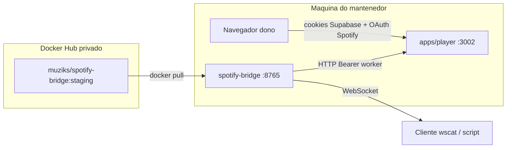

# Rotina E2E — imagem Docker `muziks/spotify-bridge`

Valida pull do registry privado, health do bridge, ligação com `apps/player`, identificação do **player** (`playerId` / slug) e envio de **comandos** nas três camadas do Muziks (WebSocket bridge, API interna com worker secret, API do dono com sessão + Spotify OAuth).

> **Só quer rodar agora?** Use [INICIO-RAPIDO.md](INICIO-RAPIDO.md) (passo a passo em 6 etapas). Este arquivo é a referência completa.

**Pré-requisitos:** Docker, conta com acesso ao repo privado `muziks/spotify-bridge`, Supabase + Postgres do projeto, Spotify Developer app (Premium no dono), `apps/player` rodando localmente (porta **3002** por padrão).

---

## 1. Visão da stack de teste



| Peça | Papel no teste |
|------|----------------|
| **Imagem** | Binário do bridge (Node); **não** inclui librespot — ver §7 |
| **`apps/player`** | API, sessão do dono, fila, controle Spotify, rotas internas |
| **`PLAYBACK_WORKER_SECRET`** | “Assinatura” bridge → player (`Authorization: Bearer …`) |
| **Sessão Muziks (cookie)** | Dono autenticado — dequeue, publicar sessão, controle Spotify |
| **OAuth Spotify (vault)** | Token do dono no Postgres — `POST /api/spotify/playback/control` |

---

## 2. Preparar secrets compartilhados

### 2.1 `PLAYBACK_WORKER_SECRET` (obrigatório)

Mesmo valor em **dois** lugares (mín. 8 caracteres):

1. `apps/player/.env` → `PLAYBACK_WORKER_SECRET=…`
2. `docs/tests/spotify-bridge/.env` → idem (após copiar do `.env.example`)

Gere um valor forte (ex.: `openssl rand -hex 32`). O bridge recusa subir sem ele ([`apps/spotify-bridge/src/config.ts`](../../../apps/spotify-bridge/src/config.ts)).

### 2.2 Docker Hub (pull)

```bash
docker login
# usuário da org muziks + token read (pull) ou read/write
```

### 2.3 `apps/player`

```bash
cp apps/player/.env.example apps/player/.env
# Preencher: Supabase, DATABASE_URL, Spotify, PLAYBACK_WORKER_SECRET, etc.
pnpm install
pnpm --filter @muziks/player dev
```

Confirme: `GET http://127.0.0.1:3002/api/health/env` (se existir) ou abra `http://127.0.0.1:3002/login`.

---

## 3. Pull e subir o bridge (imagem do registry)

```bash
cd docs/tests/spotify-bridge
cp .env.example .env
# Editar MUZIKS_PLAYER_API_URL e PLAYBACK_WORKER_SECRET

docker compose -f docker-compose.test.yml pull
docker compose -f docker-compose.test.yml up -d
docker compose -f docker-compose.test.yml logs -f
```

**Tag específica** (release semver):

```bash
IMAGE_TAG=v0.1.0 docker compose -f docker-compose.test.yml pull
IMAGE_TAG=v0.1.0 docker compose -f docker-compose.test.yml up -d
```

**Porta diferente no host:**

```bash
BRIDGE_PORT=9876 docker compose -f docker-compose.test.yml up -d
```

### 3.1 Health check

```bash
curl -s http://127.0.0.1:8765/health | jq .
```

Resposta esperada:

```json
{ "ok": true, "librespot": false }
```

`librespot: false` é normal sem binário no container e com `LIBRESPOT_AUTOSTART=false`.

### 3.2 Parar

```bash
docker compose -f docker-compose.test.yml down
```

---

## 4. Disponibilizar um player e obter tokens / IDs

### 4.1 Criar conta e player (UI)

1. Abra `http://127.0.0.1:3002/register` e crie o usuário (Supabase Auth).
2. Acesse `http://127.0.0.1:3002/create` e crie um espaço, ex.: slug `bar-teste`, nome exibido qualquer.
3. Anote o **slug** (`bar-teste`).

### 4.2 `playerId` (UUID)

**Opção A — API de sessão (com cookie do dono)**

No navegador logado, DevTools → Application → Cookies → copie os cookies do host `127.0.0.1:3002` (sessão Supabase).

```bash
curl -s http://127.0.0.1:3002/api/auth/session \
  -H "Cookie: <cole-os-cookies-aqui>" | jq .
```

Com player criado, espere `status: "authenticated"` e use o slug em `playerSlug`. O `playerId` não vem neste payload — use a opção B ou C.

**Opção B — SQL (Supabase SQL editor / psql)**

```sql
SELECT id, slug, owner_id FROM players WHERE slug = 'bar-teste';
```

Guarde `id` como **`PLAYER_ID`** (UUID).

**Opção C — Resposta da fila / sessão**

Após passos §4.3, `GET /api/players/{slug}/playback/session` devolve objeto com `playerId` quando há sessão persistida.

### 4.3 Conectar Spotify do dono (OAuth)

No navegador, logado como dono:

```
http://127.0.0.1:3002/api/spotify/login?slug=bar-teste
```

Complete o fluxo Spotify (conta **Premium**). Confirme:

```bash
curl -s http://127.0.0.1:3002/api/auth/session \
  -H "Cookie: <cookies>" | jq .spotify
# esperado: "connected"
```

O **refresh token** fica no vault (`spotify_connections`) — não é copiado para o bridge. O bridge usa apenas `PLAYBACK_WORKER_SECRET` nas rotas internas ([ADR-librespot-playback-sidecar.md](../../tech/ADR-librespot-playback-sidecar.md) §2).

### 4.4 Resumo das credenciais no teste

| Variável / artefato | Onde obter | Uso |
|---------------------|------------|-----|
| `PLAYBACK_WORKER_SECRET` | `.env` compartilhado | Header `Authorization: Bearer` → rotas `/api/internal/*` |
| `PLAYER_ID` | SQL ou sessão playback | WebSocket `subscribe`, body JSON interno |
| `SLUG` | Criação do player | URLs `/api/players/{slug}/…` |
| Cookies Supabase | Browser após login | Rotas do **dono** (dequeue, control, publish session) |
| Imagem Docker | `muziks/spotify-bridge:staging` | Container bridge |

---

## 5. WebSocket do bridge (subscribe e eventos)

Instale [wscat](https://github.com/websockets/wscat) (`npm i -g wscat`) ou use o script Node em §5.3.

### 5.1 Handshake e subscribe

```bash
wscat -c ws://127.0.0.1:8765
```

Envie (substitua `PLAYER_ID`):

```json
{"type":"subscribe","playerId":"00000000-0000-4000-8000-000000000001"}
```

Respostas esperadas:

```json
{"type":"bridge.ready","version":"0.0.0"}
{"type":"subscribed","playerId":"00000000-0000-4000-8000-000000000001"}
```

Keepalive:

```json
{"type":"ping"}
```

→ `{"type":"pong"}`

**Segurança (v0):** o WebSocket **não** valida sessão Muziks ainda — use só em rede de teste. Produção exigirá token de curta duração por player ([ADR-spotify-state-sync.md](../../tech/ADR-spotify-state-sync.md)).

### 5.2 Eventos `playback.event`

Com **librespot** no host e `LIBRESPOT_AUTOSTART=true` (ou processo manual), linhas `--onevent` aparecem como:

```json
{"type":"playback.event","event":{...}}
```

Sem librespot, esta fase valida apenas WS + health.

### 5.3 Script alternativo (Node)

Na raiz do monorepo:

```bash
node docs/tests/spotify-bridge/scripts/ws-subscribe.mjs \
  --url ws://127.0.0.1:8765 \
  --player-id "<PLAYER_ID>"
```

---

## 6. Enviar comandos (três camadas)

### 6.1 API interna — worker secret (“assinatura” bridge → player)

O bridge assina pedidos com:

```http
Authorization: Bearer <PLAYBACK_WORKER_SECRET>
Content-Type: application/json
```

#### `POST /api/internal/playback-tick` (implementado)

Orquestrador server-side (poll backup). Corpo opcional com `playerId` no cliente bridge; a rota atual processa **todos** os players elegíveis.

```bash
export PLAYER_API=http://127.0.0.1:3002
export PLAYBACK_WORKER_SECRET="seu-secret"

curl -s -X POST "$PLAYER_API/api/internal/playback-tick" \
  -H "Authorization: Bearer $PLAYBACK_WORKER_SECRET" \
  -H "Content-Type: application/json" \
  -d '{}' | jq .
```

Resposta típica: `{ "playersProcessed": N, "eventsEmitted": M }`.

Teste **via container** (rede bridge → host):

```bash
docker exec muziks-spotify-bridge-test wget -qO- \
  --header="Authorization: Bearer $PLAYBACK_WORKER_SECRET" \
  --header="Content-Type: application/json" \
  --post-data='{}' \
  http://host.docker.internal:3002/api/internal/playback-tick
```

(`wget` pode não existir na imagem Alpine — prefira `curl` do host apontando para o player.)

#### `POST /api/internal/playback/track-ended` (contrato ADR — verificar implementação)

Payload conforme [ADR-librespot-playback-sidecar.md](../../tech/ADR-librespot-playback-sidecar.md):

```bash
curl -s -X POST "$PLAYER_API/api/internal/playback/track-ended" \
  -H "Authorization: Bearer $PLAYBACK_WORKER_SECRET" \
  -H "Content-Type: application/json" \
  -d '{
    "playerId": "'"$PLAYER_ID"'",
    "spotifyTrackId": "4uLU6hMCjMI75M1A2tKUQC",
    "trackUri": "spotify:track:4uLU6hMCjMI75M1A2tKUQC",
    "endedAt": "'"$(date -u +%Y-%m-%dT%H:%M:%SZ)"'",
    "idempotencyKey": "test-track-ended-001",
    "reason": "track_ended"
  }' | jq .
```

Se retornar **404**, a rota ainda não foi implementada no `apps/player` — o cliente já existe em [`muziks-api-client.ts`](../../../apps/spotify-bridge/src/muziks-api-client.ts). Registre o resultado no issue Linear da entrega.

**Secret inválido** → `401 { "error": "unauthorized" }`.

### 6.2 API do dono — controle Spotify (cookie + vault)

Requer dono logado + Spotify `connected`. Use cookies do browser (§4.2).

```bash
# Pausar
curl -s -X POST http://127.0.0.1:3002/api/spotify/playback/control \
  -H "Cookie: <cookies-dono>" \
  -H "Content-Type: application/json" \
  -d '{"action":"pause"}' | jq .

# Retomar (opcional: deviceId, uris)
curl -s -X POST http://127.0.0.1:3002/api/spotify/playback/control \
  -H "Cookie: <cookies-dono>" \
  -H "Content-Type: application/json" \
  -d '{"action":"play"}' | jq .

# Próxima faixa
curl -s -X POST http://127.0.0.1:3002/api/spotify/playback/control \
  -H "Cookie: <cookies-dono>" \
  -H "Content-Type: application/json" \
  -d '{"action":"next"}' | jq .
```

Erro comum: `401 spotify_not_connected` — refaça §4.3.

Outras rotas úteis no teste:

| Método | Rota | Auth |
|--------|------|------|
| GET | `/api/spotify/playback/state` | Cookie dono |
| GET | `/api/spotify/playback/devices` | Cookie dono |
| POST | `/api/spotify/playback/transfer` | Cookie dono |
| GET | `/api/players/{slug}/playback/session` | Público (leitura) |
| POST | `/api/players/{slug}/playback/session` | Cookie dono (publicar estado Master) |

### 6.3 Fila Muziks

| Ação | App | Rota | Auth |
|------|-----|------|------|
| Ler fila | player ou web | `GET /api/players/{slug}/queue` | Público |
| Votar | web (`:3000`) | `POST /api/players/{slug}/vote` | Sessão participante |
| Dequeue (dono) | player | `POST /api/players/{slug}/queue/dequeue` | Cookie dono |

Exemplo dequeue:

```bash
curl -s -X POST "http://127.0.0.1:3002/api/players/bar-teste/queue/dequeue" \
  -H "Cookie: <cookies-dono>" \
  -H "Content-Type: application/json" \
  -d '{"reason":"manual_test"}' | jq .
```

---

## 7. librespot (opcional nesta rotina)

A imagem publicada **não** inclui librespot. Para testar `playback.event` de ponta a ponta:

1. Instale librespot no **host** (ou estenda o Dockerfile em branch separada).
2. Monte credenciais Connect do espaço (fora do OAuth browser — ver ADR).
3. No `.env` do teste: `LIBRESPOT_AUTOSTART=true` e `LIBRESPOT_BIN` apontando para o binário **dentro** do container só se você customizar a imagem.

Para validar só **registry + integração API**, §3–§6 bastam.

---

## 8. Checklist de aceite

- [ ] `docker login` + `pull` da tag esperada (`staging` ou `vX.Y.Z`)
- [ ] `GET /health` → `ok: true`
- [ ] `PLAYBACK_WORKER_SECRET` idêntico player ↔ bridge
- [ ] Player criado; `PLAYER_ID` e `SLUG` anotados
- [ ] Spotify dono `connected`
- [ ] WebSocket: `bridge.ready` → `subscribe` → `subscribed` → `pong`
- [ ] `POST /api/internal/playback-tick` → 200 com worker secret
- [ ] (Quando existir rota) `POST /api/internal/playback/track-ended` → 200 + fila avança
- [ ] `POST /api/spotify/playback/control` com cookie dono → `ok: true`
- [ ] Logs do container sem crash de env inválido

---

## 9. Problemas comuns

| Sintoma | Causa provável | Ação |
|---------|----------------|------|
| `pull` negado | Sem login ou sem permissão no repo privado | `docker login`; conferir org `muziks` |
| Bridge sai ao iniciar | `PLAYBACK_WORKER_SECRET` ausente ou &lt; 8 chars | Corrigir `.env` |
| `ECONNREFUSED` do bridge ao player | `MUZIKS_PLAYER_API_URL` errado no container | Usar `host.docker.internal:3002` (compose de teste já adiciona `extra_hosts`) |
| `401` no tick | Secret diferente entre player e bridge | Alinhar `.env` |
| `403` no dequeue | Cookie de outro usuário ou slug errado | Login como **dono** do player |
| WS sem eventos | Sem librespot | Esperado; ver §7 |

---

## 10. Referências

- Registry e tags: [DOCKER-REGISTRY-E-RELEASES.md](../../tech/DOCKER-REGISTRY-E-RELEASES.md)
- App bridge: [apps/spotify-bridge/README.md](../../../apps/spotify-bridge/README.md)
- Tiering bridge (pagante): [04-playback-bridge-e-tiering.md](../../business/04-playback-bridge-e-tiering.md)
